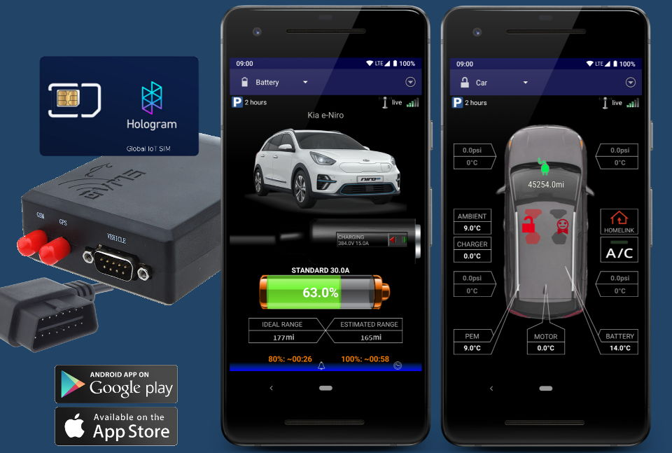
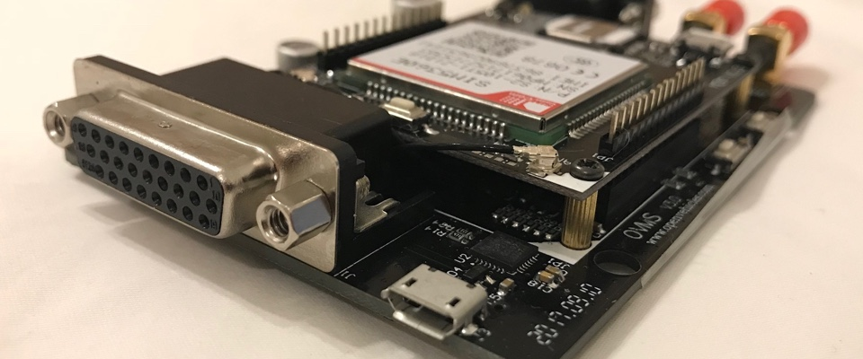
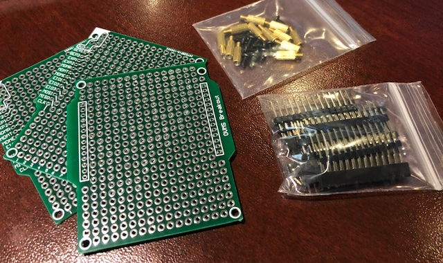

# Open-Vehicle-Monitoring-System-3 (OVMS3)

## Introduction

The OVMS is an **all open source** vehicle remote monitoring, diagnosis and control system.

The system provides **live monitoring** of vehicle metrics like state of charge, temperatures, tyre pressures 
and diagnostic fault conditions. It will **alert** you about critical conditions and events like a charge 
abort, battery cell failure or potential theft. Depending on the vehicle integration it allows you to **take 
control** over the charge process, climate control, tuning parameters of the engine and more. OVMS developers 
are enthusiasts trying hard to provide as **detailed information** about the internals of a vehicle as 
possible.

While most new vehicles now include some kind of remote control system, very few allow deep insight, some will 
not work in all regions and none will give you **control over your personal data**. The OVMS fills that gap, 
and also enables you to add all these features to existing vehicles of any kind.

The OVMS can also be used for **fleet monitoring**. It allows a fleet manager to not only track the vehicle 
locations but also to monitor the vehicle's vitals, remotely check for fault conditions, offer services like 
automatic preheating for users and take active control in case of abusive use. As the system is open source 
and fully scriptable, it can easily integrate custom access and control systems.

For **developers and technicians**, the OVMS includes a range of CAN tools including multiple logging 
formats, a configurable OBD2 translator, a DBC decoder, a reverse engineering toolkit and a CANopen client. 
The module provides SSH access and WebSocket streaming and can stream and inject CAN frames via TCP. Both the 
module and the web frontend can be customized by plugins. The module has three builtin CAN buses and [can be 
extended by a fourth one](https://github.com/mjuhanne/OVMS-SWCAN).

The **OVMS base component** is a small and inexpensive hardware module that connects to the vehicle **OBD2** 
port. The standard kit includes a 3G modem to provide **GSM** connectivity and **GPS** and comes with a 
ready-to-use [Hologram.io](https://hologram.io/) SIM card. The US kit has been **FCC certified**, the EU kit
**CE certified**.

The module provides a **built-in Web App** user interface and remote control via native cellphone Apps 
available for **Android** and **iOS**. It integrates into home/process automation systems via **MQTT** and 
provides data logging to SD card and to a server.

## Vehicle Support

- _Native Integration_
  - Chevrolet Volt / Opel Ampera
  - [Fiat 500e](https://docs.openvehicles.com/en/latest/components/vehicle_fiat500/docs/index.html)
  - [Kia e-Niro / Hyundai Kona](https://docs.openvehicles.com/en/latest/components/vehicle_kianiroev/docs/index.html)
  - [Kia Soul EV](https://docs.openvehicles.com/en/latest/components/vehicle_kiasoulev/docs/index.html)
  - [Mitsubishi Trio (i-MiEV et 
  al)](https://docs.openvehicles.com/en/latest/components/vehicle_mitsubishi/docs/index.html)
  - [Nissan Leaf](https://docs.openvehicles.com/en/latest/components/vehicle_nissanleaf/docs/index.html)
  - [Renault Twizy](https://docs.openvehicles.com/en/latest/components/vehicle_renaulttwizy/docs/index.html)
  - [Renault Zoe](https://docs.openvehicles.com/en/latest/components/vehicle_renaultzoe/docs/index.html)
  - [Smart ED Gen.3](https://docs.openvehicles.com/en/latest/components/vehicle_smarted/docs/index.html)
  - [Smart ED/EQ Gen.4 
  (453)](https://docs.openvehicles.com/en/latest/components/vehicle_smarteq/docs/index.html)
  - [Tesla Model S](https://docs.openvehicles.com/en/latest/components/vehicle_teslamodels/docs/index.html)
  - [Tesla Roadster](https://docs.openvehicles.com/en/latest/components/vehicle_teslaroadster/docs/index.html)
  - Think City
- _General Support_
  - [DBC File Based](https://docs.openvehicles.com/en/latest/components/vehicle_dbc/docs/index.html)
  - [GPS Tracking](https://docs.openvehicles.com/en/latest/components/vehicle_track/docs/index.html)
  - [OBD-II Standard](https://docs.openvehicles.com/en/latest/components/vehicle_obdii/docs/index.html)
  - Zeva BMS

## Links

- _User Ressources_
  - [User and Developer Guides](https://docs.openvehicles.com/en/latest/)
  - [User Support Forum](https://www.openvehicles.com/forum)
  - [Android App](https://play.google.com/store/apps/details?id=com.openvehicles.OVMS&hl=en_US)
  - [iOS App](https://apps.apple.com/us/app/open-vehicles/id490098531)
- _Distributors_
  - [FastTech (global)](https://www.fasttech.com/search?ovms)
  - [OpenEnergyMonitor (UK/Europe)](https://shop.openenergymonitor.com/ovms/)
- _Servers_
  - [Asia-Pacific](https://www.openvehicles.com/)
  - [Germany/Europe](https://dexters-web.de/)
- _Developers_
  - [Developer Guide](https://docs.google.com/document/d/1q5M9Lb5jzQhJzPMnkMKwy4Es5YK12ACQejX_NWEixr0)
  - [Developer Mailing List & Archive](http://lists.openvehicles.com/mailman/listinfo/ovmsdev)
  - [Server Source](https://github.com/openvehicles/Open-Vehicle-Server)
  - [Android App Source](https://github.com/openvehicles/Open-Vehicle-Android)
  - [iOS App Source](https://github.com/openvehicles/Open-Vehicle-iOS)

## Hardware

- [Module Schematics and PCB Layouts](https://github.com/openvehicles/Open-Vehicle-Monitoring-System-3/tree/master/vehicle/hardware)  

- **Base Module**
  - Black injection-moulded plastic enclosure, approximately 99x73x29 mm excl. plugs
  - ESP32 WROVER processor (16MB flash, 4MB SPI RAM, 520KB SRAM, dual core 160/240MHz Xtensa LX6 processor)
  - WIFI 802.11 b/g/n
  - Bluetooth v4.2 BR/EDR and BLE
  - 3x CAN buses
  - 1x Micro USB connector (for flash download and serial console)
  - 1x Micro SD card slot
  - 1x Internal expansion slot
  - 8x EGPIO, 2x GPIO
  - 1x GSM antenna connector
  - 1x GPS antenna connector
  - 1x DB9 vehicle connector
  - 1x DB26 expansion connector
- **Modem Module**
  - US edition is SIM5360A (Dual-Band UMTS/HSPA+ 850/1900MHz, Quad-Band GSM/GPRS/EDGE 850/900/1800/1900MHz)
  - EU edition is SIM5360J(E) (Dual-Band UMTS/HSPA+ 900/2100MHz, Quad-Band GSM/GPRS/EDGE 850/900/1800/1900MHz)
  - 3G (EV-DO/HSPA+) dual band modem
  - Includes 2G (GSM/GPRS) and 2.5G (EDGE) quad band
  - GPS/GNSS
  - Nano (4FF) SIM slot
  - HOLOGRAM.IO nano sim included (can be exchanged if necessary)

### Extensions

The external DB26 DIAG connector provides access to the three CAN buses and offers some free extension ports. 
The internal PCB expansion connector allows stacked additions of further modules and serves for routing GPIO 
ports to the external DIAG connector. See schematics for details.

A very nice first extension module has been developed by Marko Juhanne: 
[OVMS-SWCAN](https://github.com/mjuhanne/OVMS-SWCAN)

If you plan on developing a hardware extension or just want to do some custom adaptations, have a look at our 
prototyping PCB kit. It's available in packs of 3 PCBs and includes headers and mounting material:

If the kit isn't available at the distributors, please contact Mark Webb-Johnson <mark@webb-johnson.net>.

## Development and Contributions

**New developers are very welcome on any part of the system, and we will gladly provide any help needed to
get started.**

The purpose of this project is to get the community of vehicle hackers and enthusiasts to be able to expand 
the project. We can't do it all, and there is so much to do. What we are doing is providing an affordable and 
flexible base that the community can work on and extend.

Everything is open, and APIs are public. Other car modules can talk to the server, and other Apps can show the 
status and control the car. This is a foundation that others hopefully will interface to and and build upon.

**If you'd like to contribute, please accept our code of conduct:**

- Introduce yourself on the developer mailing list
- Be kind & polite
- Understand the framework concepts
- Ask if you need help
- Present your plans if in doubt
- Write decent code
- If you extend modules, stick to their code style
- Write brief but descriptive commit comments
- Add user level descriptions to the change history
- Provide documentation in the user guide
- Use pull requests to submit your code for inclusion

## Donations

The OVMS is a non-profit community project. Hardware production and service can normally be financed by sales, 
but some things (e.g. prototype development and certifications) need extra money. To help the project, you can 
make a donation on the OVMS website: https://www.openvehicles.com/forum

Please also consider supporting the vehicle developers directly. Check out their web sites and support
addresses for their respective donation channels.

**Thank you!**

## License

The project includes some third party libraries and components to which their respective licenses
apply, see component sources for details.

The project itself is published under the MIT license:

Copyright (c) 2011-2019 Open Vehicles

Permission is hereby granted, free of charge, to any person obtaining a copy
of this software and associated documentation files (the "Software"), to deal
in the Software without restriction, including without limitation the rights
to use, copy, modify, merge, publish, distribute, sublicense, and/or sell
copies of the Software, and to permit persons to whom the Software is
furnished to do so, subject to the following conditions:

The above copyright notice and this permission notice shall be included in all
copies or substantial portions of the Software.

THE SOFTWARE IS PROVIDED "AS IS", WITHOUT WARRANTY OF ANY KIND, EXPRESS OR
IMPLIED, INCLUDING BUT NOT LIMITED TO THE WARRANTIES OF MERCHANTABILITY,
FITNESS FOR A PARTICULAR PURPOSE AND NONINFRINGEMENT. IN NO EVENT SHALL THE
AUTHORS OR COPYRIGHT HOLDERS BE LIABLE FOR ANY CLAIM, DAMAGES OR OTHER
LIABILITY, WHETHER IN AN ACTION OF CONTRACT, TORT OR OTHERWISE, ARISING FROM,
OUT OF OR IN CONNECTION WITH THE SOFTWARE OR THE USE OR OTHER DEALINGS IN THE
SOFTWARE.

Software which uses other licenses will be annotated appropriately.
