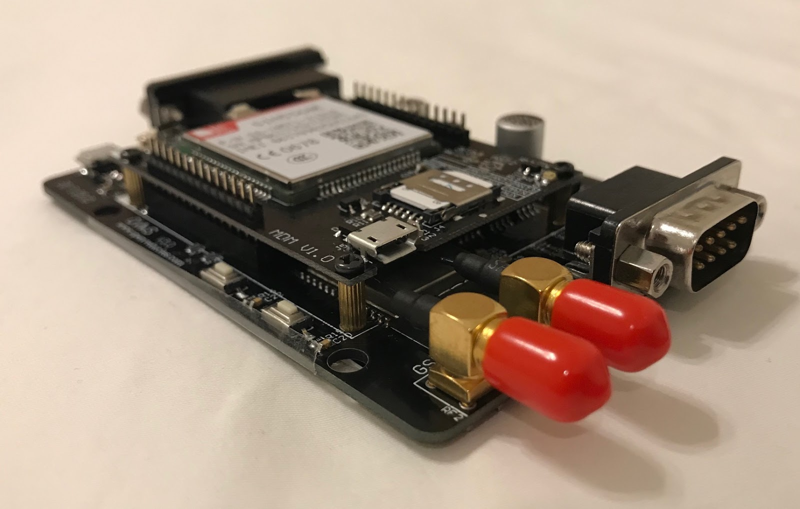
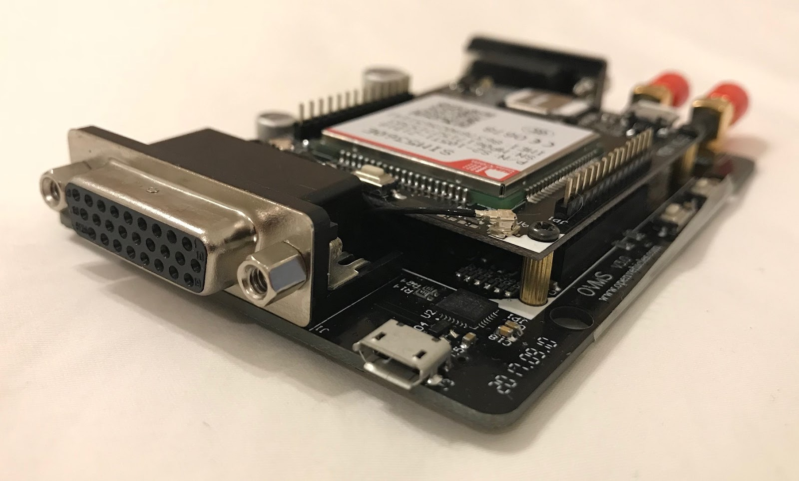

==========
Components
==========

---------------
The OVMS Module
---------------

The OVMS v3 module is housed in a plastic enclosure; held secure by four small screws. Once open, you can see the main OVMS v3 motherboard, and an optional modem board.

At one end of the module is the main DB9 connector you will use to connect to the vehicle, as well as GSM (cellular) and GPS (positioning) antenna connections.

At the other end of the module is the DA26 expansion connector, the USB diagnostic connector, and a Micro SD card slot.

|clearfix|

.. warning::
  The **USB port** is a fragile PCB socket without reinforcement. Handle it carefully, do not apply force
  when plugging or unplugging cables, to not bend the plug. If you need to use the port frequently, two dots
  of hot glue at the port sides on the PCB can help to avoid breaking it off.
  
  If you open the module and take out the board, take care to guide the port carefully and correctly into it's case
  hole when inserting the board into the casing again. Insert the board USB port side first.

If removing/installing optional expansion boards (such as used for cellular connectivity), please take care to ensure you secure screw down the expansion board using the four pillar posts provided. Also, please ensure that the cellular modem connections are correct (follow the printed table on the modem board to know which antenna is which).

.. image:: warning.png
  :width: 100px
  :align: left

| **Warning!**
| The OVMS v3 enclosure is not waterproof, and the components can be damaged by water. Do not get the module wet, and do not connect it to your vehicle if it is wet.

-------------------------------------
Cellular Modem Option and GSM Antenna
-------------------------------------

The cellular modem option allows you to control your vehicle when out of wifi coverage range. The majority of OVMS users choose this option, and you will require it if you want to monitor your vehicle when away from home or office.

OVMS modules sold in USA and Europe are provided with a Hologram SIM card pre-installed. This low cost service allows you to get cellular connectivity simply. It also allows you to roam between countries without worry. For modules purchased from China, we recommend you purchase a Hologram SIM directly from the hologram.io store (also available on Amazon).

Depending on settings, verbosity towards the OVMS server, rhythm of GPS tracking, etc, OVMS v3 will use between 1 and 3 Megabytes per month of data (when using the v2 server protocol).

You do not have to use the Hologram service. If you use another cellular provider, the Sim Card format required is 4FF Nano. Micro Sim cards are hard to recut into the smaller format, so please be careful to not damage the socket; otherwise, ask your operator for a swap (some do it for free).

If you are using the cellular option, you should attach a suitable cellular antenna to the module, using the antenna connector labeled "GSM".

----------------
GPS/GNSS Antenna
----------------

Some OVMS vehicles can read the GPS signals from the car communication networks directly, and do not require any additional hardware. For others, the OVMS v3 modem option also includes a GNSS/GPS satellite tracking receiver.

If you are using this option, you should connect a suitable active GPS antenna to the connector labelled "GPS".

------------------
Vehicle Connection
------------------

The connection to the vehicle is by the DB9 connector labelled "VEHICLE". This provides power to the OVMS module, as well as connection to the vehicle communication networks.

Different vehicles require different cables, so you should refer to the appropriate vehicle section of this user guide to determine which is correct for yours.

--------------
OVMS Server v2
--------------

The OVMS Server v2 protocol is a proprietary protocol used to communicate between the vehicle and an OVMS v2 server, as well as from that server to the cellphone apps. To provide compatibility with existing OVMS v2 cellphone apps and servers, OVMS v3 includes full support for the OVMS v2 protocol.

--------------
OVMS Server v3
--------------

The OVMS Server v3 protocol is MQTT. This is an industry standard protocol, and means an OVMS v3 module can communicate with any standard MQTT server. While this is the future of OVMS, support for this is experimental at the moment and production users should use OVMS Server v2 protocol.

-------------------------------
Upgrading from OVMS v1/v2 to v3
-------------------------------

The antenna and vehicle connectors for OVMS v3 are the same as for OVMS v2, and existing cables/antennas can generally be re-used for OVMS v3. Note, however, that the frequency ranges supported by individual 3G networks may be different than 2G, so may benefit from an antenna specifically designed for the 3G frequency ranges used

