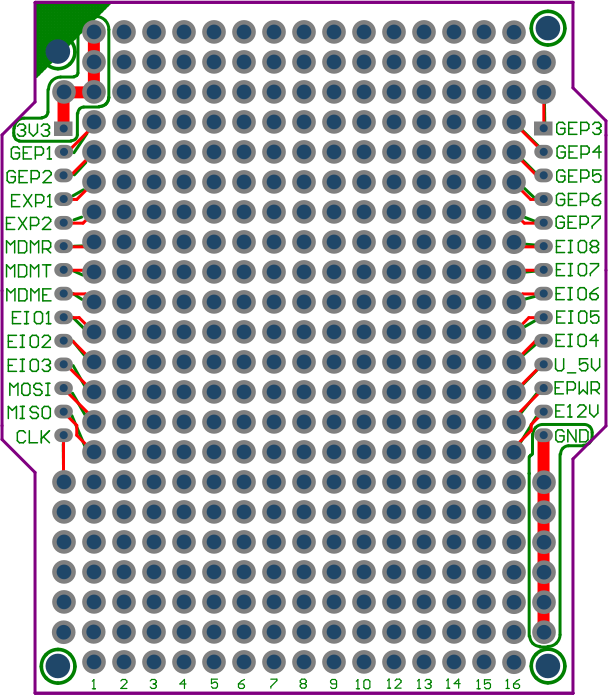
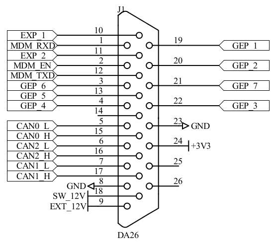

EGPIO
=====

Hardware
--------

The OVMS has 10 general purpose I/O ports, provided by a MAX7317 I/O expander
(`datasheet <https://datasheets.maximintegrated.com/en/ds/MAX7317.pdf>`_).

The MAX7317 ports can be individually configured as either an open-drain output, or an 
overvoltage-protected Schmitt input. Being open-drain, you need to add pull-up resistors for 
input and output switch uses to get a defined high level (e.g. 10K to 3.3V). See 
the datasheet for details on maximum current & voltage ratings.

Depending on your hardware configuration, up to 4 ports may be used by the module. 6 are 
generally free to use.

==== ================ ======= ==========================
Port Signal(s)        Exp.Pin Default usage
==== ================ ======= ==========================
0    MDM_EN           15      Modem enable
1    SW_CTL           --      Ext12V control (SW_12V)
2    CAN1_EN + EIO_1  17      CAN1 transceiver enable
3    MDM_DTR + EIO_2  19      Modem sleep control
4    EIO_3            21      -free-
5    EIO_4            20      -free-
6    EIO_5            18      -free-
7    EIO_6            16      -free-
8    EIO_7            14      -free-
9    EIO_8            12      -free-
==== ================ ======= ==========================

The EGPIO (EIO) ports are not connected directly to the DA26 connector but are available at the internal 
expansion port. To route an EGPIO port to the DA26 connector, connect it to one of the 
``GEP_1…7`` lines at the expansion port, either directly or via some additional driver.

   
   Expansion Port (Prototype PCB)

   DA26 Connector

|clearfix|

Example: to route EIO_8 (port 9) to GEP_7 (pin 21 on the DA26), set a jumper on pins 10+12 on the
expansion port.

Commands
--------

EGPIO control is provided by the ``egpio`` command set:

- ``egpio output <port> <level> [<port> <level> …]`` -- set output level(s)
- ``egpio input <port> [<port> …]`` -- query input level(s)
- ``egpio status`` -- show output, input & monitor status
- ``egpio monitor <on|off> [ports]`` -- enable/disable monitoring
- ``egpio monitor status`` -- show current monitoring status

To configure a port for input, it needs to be switched to output level high (1). That is done 
automatically by the ``input`` and ``monitor`` commands.

If you set multiple outputs, the ports will be set one at a time, so output levels will change
with a slight delay. You can use this behaviour to set data lines before a clock line, e.g.
when sending bits serially into a shift register.

.. note::
  The MAX7317 needs active polling to detect input state changes. Monitoring is disabled by default, 
  it can be enabled manually or configured to start automatically on module init.
  Without monitoring, only manual input queries will update the input state, trigger input events
  and input metric updates.

Configuration
-------------

========= =================== ===========================================================
Parameter Instance            Description
========= =================== ===========================================================
auto      egpio               yes = Start monitoring on boot (default: no)
egpio     monitor.ports       List of ports to monitor by default (space separated)
egpio     monitor.interval    Polling interval in milliseconds (min 10, default 50)
========= =================== ===========================================================

The default interval of 50 ms (= 20 Hz) means an input signal needs to be at least 50 ms long to be
detected. This polling frequency produces a CPU load of ~0.5% on core 1 and is normally sufficient
to detect even very short button pushes.

Metrics
-------

======================================== ======================== ============================================
Metric name                              Example value            Description
======================================== ======================== ============================================
m.egpio.input                            0,1,2,3,4,5,6,7,9        EGPIO input port state (ports 0…9, present=high)
m.egpio.monitor                          8,9                      EGPIO input monitoring ports
m.egpio.output                           4,5,6,7,9                EGPIO output port state
======================================== ======================== ============================================

Hint: to process these metrics from Javascript, read them into an array using ``eval()``
and test for the presence of a port number using e.g. the ``includes()`` method in a browser plugin.
Duktape does not support ``includes()``, you can test ``indexOf(port)`` instead.

Example:

.. code-block:: javascript

  var input = eval(OvmsMetrics.AsJSON("m.egpio.input"));
  if (input.indexOf(9) < 0)
    print("Input port 9 (EIO8) is currently low\n");

Events
------

=================================== ========= =======
Event                               Data      Purpose
=================================== ========= =======
egpio.input.<port>.<state>          --        EGPIO input port change (port=0…9, state=high/low)
egpio.output.<port>.<state>         --        EGPIO output port change (port=0…9, state=high/low)
=================================== ========= =======

Hint: to listen to events from Javascript, bind to ``msg:event`` on a ``.receiver`` object
from browser context or use ``PubSub`` from module context.

Example:

.. code-block:: javascript

  PubSub.subscribe("egpio.input.9.low", function(){
    print("Input port 9 (EIO8) is now low\n");
  });

