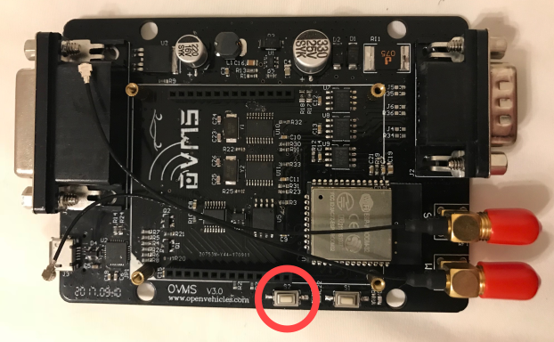

=============
Factory Reset
=============

--------------------
Module Configuration
--------------------

A standard factory reset erases the configuration store. After a factory reset, you will be able to 
access the USB console with an empty module password and the “OVMS” wifi access point with the 
initial password “OVMSinit”. We recommend using the setup wizard to configure the module or 
restoring a configuration backup as soon as possible, as the module is accessible by anyone knowing 
the initial password.

The standard factory reset does not revert OTA firmware installs. See below for methods to switch 
back to and optionally replace the factory firmware.

^^^^^^^^^^^^^^^^^
Method 1: Command
^^^^^^^^^^^^^^^^^

If you have console command access, a factory reset can be accomplished with this command::

  OVMS# module factory reset
  Reset configuration store to factory defaults, and lose all configuration data (y/n): y
  Store partition is at 00c10000 size 00100000
  Unmounting configuration store...
  Erasing 1048576 bytes of flash...
  Factory reset of configuration store complete and reboot now...

That command will erase all configuration store, and reboot to an empty configuration.

Note: to issue this command from the web shell or a remote shell (App, Server, …), you need 
to skip the confirmation step by adding the option ``-noconfirm``, i.e.::

  OVMS# module factory reset -noconfirm

^^^^^^^^^^^^^^^^^
Method 2: SD card
^^^^^^^^^^^^^^^^^

If you don’t have console access, you can perform a factory reset by placing an empty file named 
``factoryreset.txt`` in the root directory of an SD card and insert that SD into the (running) 
module. The file will be deleted and the module will reboot within about 30 seconds.

^^^^^^^^^^^^^^^^^^^
Method 3: Switch S2
^^^^^^^^^^^^^^^^^^^

You can also open the module case, remove any SD card (important!), power on the module, wait 10 
seconds, then push and hold switch “S2” for 10 seconds. “S2” is located here:

^^^^^^^^^^^^^
Method 4: USB
^^^^^^^^^^^^^

If you don’t have console access and don’t have an SD card, you can perform a factory reset from a 
PC via USB using the ``esptool.py`` tool from the Espressif ESP-IDF toolkit (see below for 
installation)::

  esptool.py \
    --chip esp32 --port /dev/tty.SLAB_USBtoUART --baud 921600 \
    erase_region 0xC10000 0x100000

Note: the port needs to be changed to the one assigned by your system, i.e. ``/dev/ttyUSB0`` on a 
Linux system or ``COMx`` on Windows. After using esptool.py to manually erase the config region, 
you should go into the console and do the ``module factory reset`` step to properly factory reset.

.. note:: Methods 1, 2 and 3 need a running system, i.e. will not work if your module cannot 
  boot normally. In this case first try method 4. If that doesn't help also switch back to the 
  factory firmware as shown below.

-----------------------
Module Factory Firmware
-----------------------

You can switch back to factory firmware with this command::

  OVMS# ota boot factory
  Boot from factory at 0x00010000 (size 0x00400000)

Or, without console access (lost module password), using the esptool.py from the Espressif ESP-IDF 
toolkit::

  esptool.py \
    --chip esp32 --port /dev/tty.SLAB_USBtoUART --baud 921600 \
    erase_region 0xd000 0x2000

Note: the device needs to be changed to the one assigned by your system, i.e. ``/dev/ttyUSB0`` on a 
Linux system or ``COMx`` on Windows.

------------------------------
Flash Factory Firmware via USB
------------------------------

``esptool.py`` can also be used to flash a new factory firmware. Download the firmware file 
``ovms3.bin`` you want to flash, then issue::

  esptool.py \
    --chip esp32 --port /dev/tty.SLAB_USBtoUART --baud 921600 \
    --before "default_reset" --after "hard_reset" \
    write_flash --compress --flash_mode "dio" --flash_freq "40m" --flash_size detect \
    0x10000 ovms3.bin

Note: if you were running an OTA partition before, you also need to switch back to the factory 
partition as shown above.

---------------------
Installing esptool.py
---------------------

The esptool.py package and installation instructions can be found here:

	https://github.com/espressif/esptool

The package normally can be installed without manual download using the python package manager 
“pip”, i.e. on Unix/Linux::

  sudo pip install esptool

.. warning:: You can brick your module using the esptool. Only use the commands shown above.

.. note:: If you accidentally did an ``erase_flash`` or erased the wrong region, you will need to 
  do a full reflash of your module (including the boot loader and paritioning scheme). Post a log 
  of the boot process on the OVMS user forum and ask for help, or install the developer environment 
  and do a ``make flash``.
