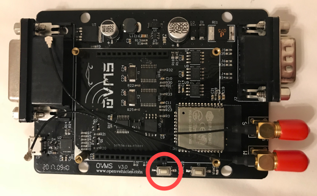

=============
Factory Reset
=============

.. highlight:: none

--------------------
Module Configuration
--------------------

A standard factory reset erases the configuration store. After a factory reset, you will be able to 
access the USB console with an empty module password and the “OVMS” wifi access point with the 
initial password “OVMSinit”. We recommend using the setup wizard to configure the module or 
restoring a configuration backup as soon as possible, as the module is accessible by anyone knowing 
the initial password.

The factory reset does not revert OTA firmware installs, and it does not change the boot partition, so
the module will boot into the same firmware version you had been running before. See below for methods
to optionally reflash the firmware.

There are four methods to perform a factory reset.

.. note:: Methods 1, 2 and 3 need a running system, i.e. will not work if your module cannot 
  boot normally. In this case first try method 4. If that doesn't help also switch back to the 
  factory firmware as shown below.

^^^^^^^^^^^^^^^^^
Method 1: Command
^^^^^^^^^^^^^^^^^

If you still have some shell/command access, a factory reset can be accomplished with this
command on a **USB/SSH console**::

  OVMS# module factory reset

To issue the command from the **web shell or a remote shell** (App, Server, …), you need 
to skip the confirmation step by adding the option ``-noconfirm``, i.e.::

  OVMS# module factory reset -noconfirm

The command will erase all configuration store, and reboot to an empty configuration.

^^^^^^^^^^^^^^^^^
Method 2: SD card
^^^^^^^^^^^^^^^^^

If you don’t have console access, you can perform a factory reset by placing an empty file named 
``factoryreset.txt`` (case is important) in the root directory of an SD card and insert that SD into
the (running) module. The file will be deleted and the module will reboot within about 30 seconds.

^^^^^^^^^^^^^^^^^^^
Method 3: Switch S2
^^^^^^^^^^^^^^^^^^^

You can also open the module case, remove any SD card (important!), power on the module, wait 10 
seconds, then push and hold switch “S2” for 10 seconds. “S2” is located here:

^^^^^^^^^^^^^
Method 4: USB
^^^^^^^^^^^^^

If you don’t have console access and don’t have an SD card, you can perform a factory reset from a 
PC via USB using the ``esptool.py`` tool from the Espressif ESP-IDF toolkit (see below for 
installation).

The command arguments **differ depending on the partitioning scheme** in place:

**a) Old 4MB partitioning (OTA type v3-30 / pre-3.3.006):**

  esptool.py \
    --chip esp32 --port /dev/tty.SLAB_USBtoUART --baud 921600 \
    erase_region 0xC10000 0x100000

**b) New 7MB partitioning (OTA type v3-35):**

  esptool.py \
    --chip esp32 --port /dev/tty.SLAB_USBtoUART --baud 921600 \
    erase_region 0xE10000 0x1f0000

**Note**: the port needs to be changed to the one assigned by your system, e.g. ``/dev/ttyUSB0`` on a 
Linux system or ``COMx`` on Windows. After using ``esptool.py`` to manually erase the config region, 
you should go into the console and do the ``module factory reset`` step to properly factory reset.

-----------------------
Module Factory Firmware
-----------------------

For modules running the **new 7MB partitioning scheme** introduced with release 3.3.006, there is no
longer a dedicated "factory" firmware. To switch back to the previously used firmware version, you
need to first check which ``ota`` partition is currently running::

  OVMS# ota
  …
  Running partition: ota_0
  Boot partition:    ota_0

You can also see the versions installed and verify you actually have the correct version installed in
the other partition.

Then set the boot partition to the respective other ``ota`` partition, i.e. switch from ``ota_0`` to
``ota_1`` and vice versa::

  OVMS# ota boot ota_1
  (check output for errors, then do:)
  OVMS# module reset

**If** still running the **old 4MB partitioning scheme** (OTA partition type ``v3-30``), you can switch back 
to the factory firmware with this command::

  OVMS# ota boot factory
  Boot from factory at 0x00010000 (size 0x00400000)

**Without console access** (lost module password), you can use the ``esptool.py`` from the Espressif ESP-IDF 
toolkit to reset the boot partition to the first firmware partition present. This will be ``factory``
on a ``v3-30`` partitioned module, and ``ota_0`` on a ``v3-35`` partitioned module::

  esptool.py \
    --chip esp32 --port /dev/tty.SLAB_USBtoUART --baud 921600 \
    erase_region 0xd000 0x2000

**Note**: the device needs to be changed to the one assigned by your system, e.g. ``/dev/ttyUSB0`` on a 
Linux system or ``COMx`` on Windows.

----------------------
Flash Firmware via USB
----------------------

``esptool.py`` can also be used to flash a new firmware. Download the firmware file ``ovms3.bin`` you want
to flash, then issue::

  esptool.py \
    --chip esp32 --port /dev/tty.SLAB_USBtoUART --baud 921600 \
    --before "default_reset" --after "hard_reset" \
    write_flash --compress --flash_mode "dio" --flash_freq "40m" --flash_size detect \
    0x10000 ovms3.bin

This flashes into the **primary** firmware partition (i.e. ``factory`` on a ``v3-30`` module, ``ota_0`` on a
``v3-35`` module, as explained above). So if you were booting from another partition before, you also need
to switch the boot partition back to the primary firmware partition as shown above.

.. _full-reflash-via-usb:

--------------------
Full Reflash via USB
--------------------

If you accidentally did an ``erase_flash``, erased the wrong region, or if something went wrong when
performing the 3.3.006 OTA :doc:`partitioning upgrade <partitioning>` (7MB firmware image size support),
you will need to do a full reflash of your module (including the boot loader and partitioning scheme).

The need for a full reflash will typically show by the USB output of the module boot being
just something like::

  rst:0x10 (RTCWDT_RTC_RESET),boot:0x3f (SPI_FAST_FLASH_BOOT)
  flash read err, 1000
  ets_main.c 371
  ets Jun  8 2016 00:22:57

To do a full reflash, download the three ``.bin`` files from the release you want to flash, e.g. from

  https://ovms.dexters-web.de/firmware/ota/v3.3-5/edge/

Then issue::

  esptool.py \
    --chip esp32 --port /dev/tty.SLAB_USBtoUART --baud 921600 \
    --before "default_reset" --after "hard_reset" \
    write_flash --compress --flash_mode "dio" --flash_freq "40m" --flash_size detect \
    0x1000 bootloader.bin 0x10000 ovms3.bin 0x8000 partitions.bin

…replacing the port and file paths accordingly for your system.

If this fails, open a support ticket on https://www.openvehicles.com and attach a log of the
boot process, or install the developer environment and do a ``make flash``.

---------------------
Installing esptool.py
---------------------

The esptool.py package and installation instructions can be found here:

	https://github.com/espressif/esptool

The package normally can be installed without manual download using the python package manager 
“pip”, i.e. on Unix/Linux::

  sudo pip install esptool

.. warning:: You can brick your module using the esptool. Only use the commands shown above.
