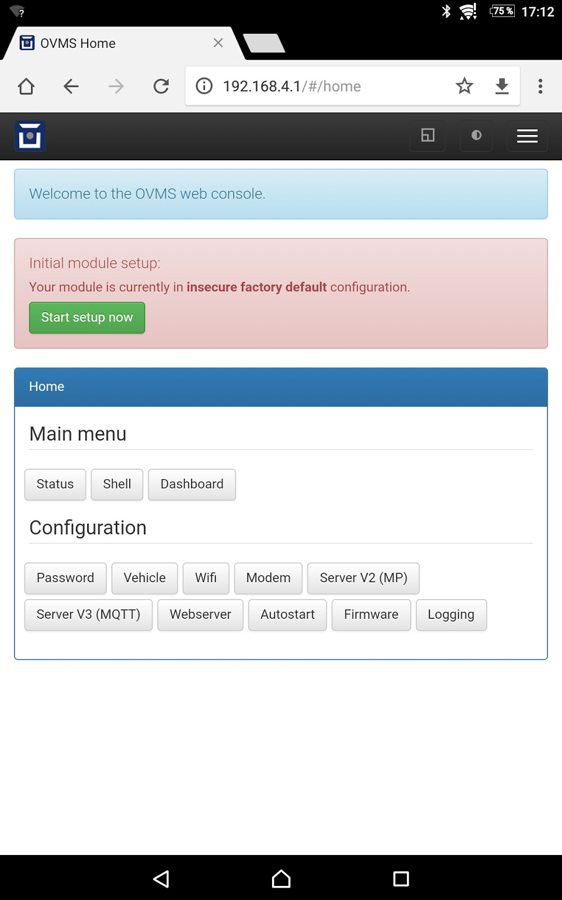
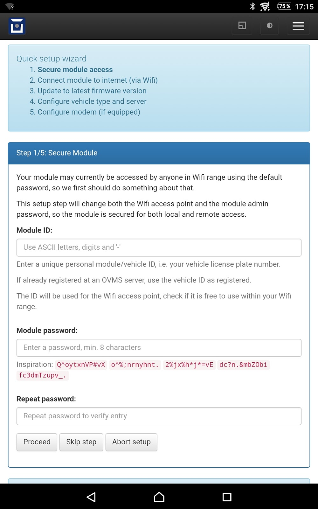
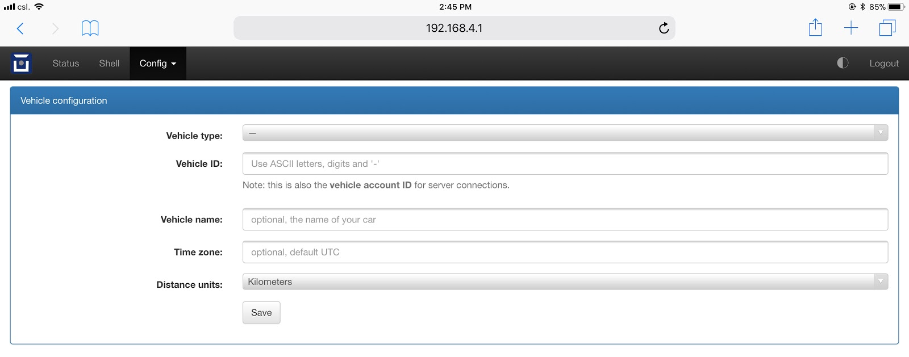
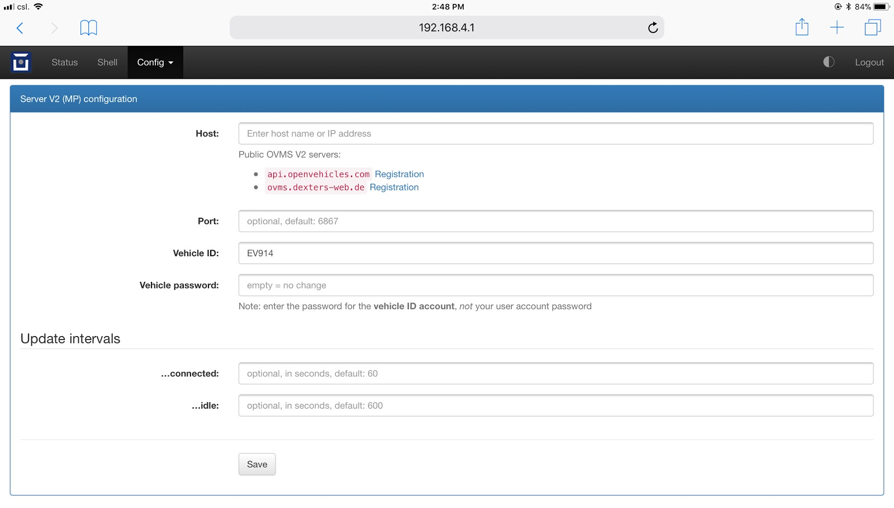
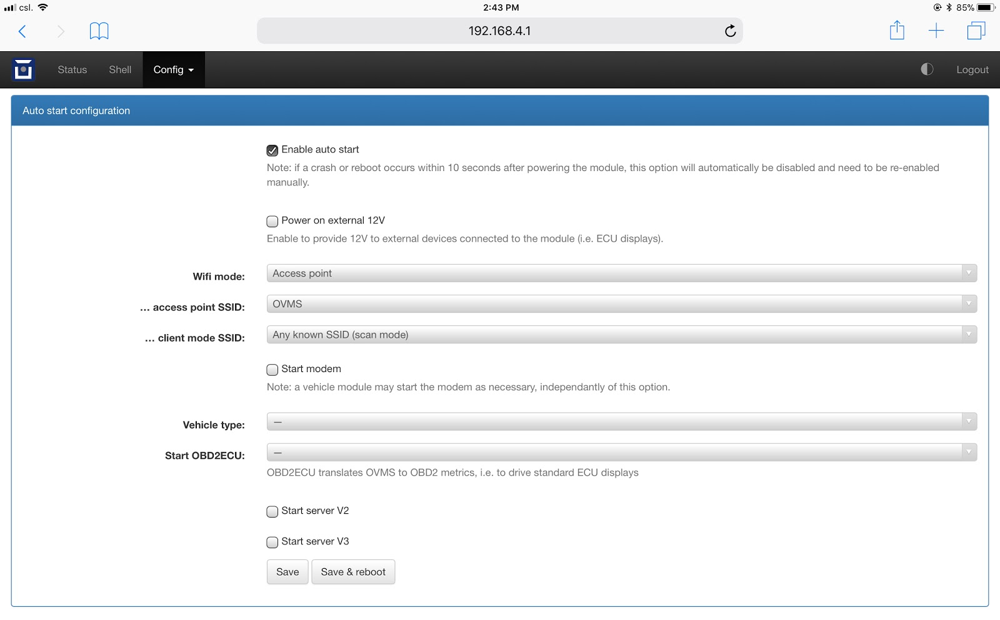
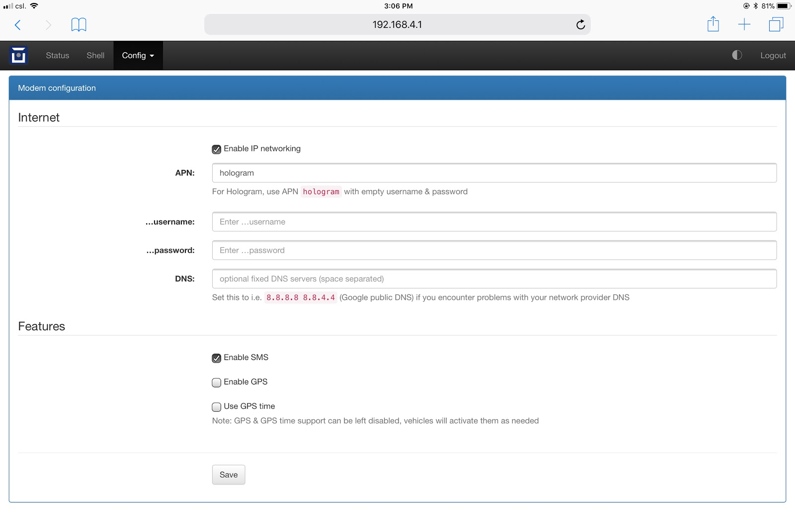
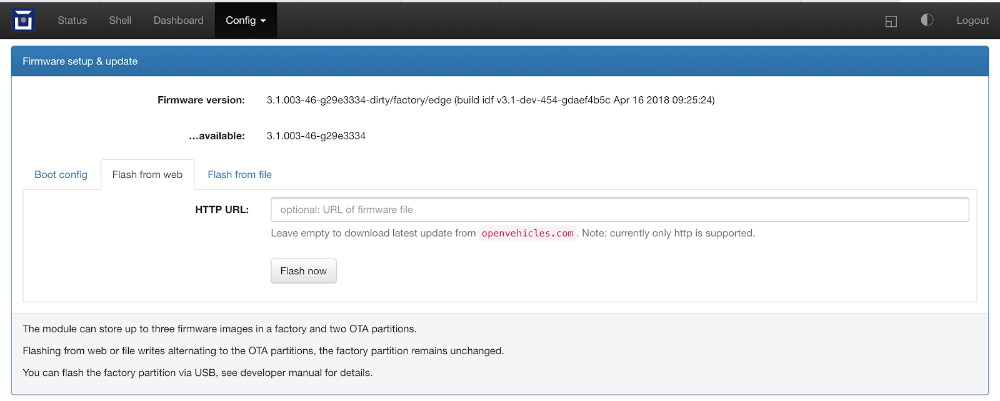

============
Installation
============

----------------------
Pre-Installation Steps
----------------------

.. image:: warning.png
  :width: 100px
  :align: left

| **Warning!**
| Prior to connecting the OVMS module to the vehicle, or computer via USB, if you have the GSM cellular option we recommend you connect a GSM antenna. GSM systems are designed to always operate with an antenna, and powering on one without could damage the equipment.

Prior to installation, please make sure you have the following available:

#. The OVMS v3 module in it's enclosure.
#. A micro-usb cable suitable for connecting to your computer.
#. A laptop or desktop computer (if necessary).
#. A cable suitable for connecting to your vehicle.
#. A GSM antenna (if you are using the cellular option).
#. A GPS antenna (if your vehicle type requires one).

You should also have ready access to this User Guide, and wifi connectivity to the Internet.

------------------------
OVMS Module Installation
------------------------

^^^^^^^^^^^^^^^^^^^
Powering the module
^^^^^^^^^^^^^^^^^^^

If you intend to configure the module on your desk before connecting it to the vehicle, make sure your USB port delivers power (around 500mA, depending on modem and wifi activity). We recommend using a USB hub with a separate power supply or a direct port of your laptop / PC.

^^^^^^^^^^^^^^^^^^^
OVMS Server account
^^^^^^^^^^^^^^^^^^^

If you want to use the OVMS App and/or server based telemetry services, you'll need an OVMS v2 server account. If you have not registered for an OVMS server account yet, you can do so before starting the wizard to avoid needing to switch networks in between. There are currently two public v2 OVMS servers:

#. Asia-Pacific: https://www.openvehicles.com/

#. Europe:	https://dexters-web.de/

You will need to create a user account first. Within your user account you then need to create a vehicle account. You'll need to pick a unique vehicle ID for this, e.g. your vehicle license plate number.

^^^^^^^^^^^^^^^^^^^^^^^^^^^^^^^^^^^^^
Initial Connection (Wifi and Browser)
^^^^^^^^^^^^^^^^^^^^^^^^^^^^^^^^^^^^^

From the factory, or after a factory reset, your OVMS module will be running an access point, with the following credentials:

SSID:		OVMS
Password:	OVMSinit

As this is insecure, you should take care not to leave the module running unconfigured.

Using your laptop/tablet/phone, establish a wifi connection to the module. You should see an IP address in the range 192.168.4.x allocated, with a gateway at 192.168.4.1.

Note: Some smartphones (e.g Android) require mobile data to be switched off to use a WiFi connection without a interent connectivity. 

Launch your web browser, and connect as follows:

URL:		http://192.168.4.1/

Once connected, you will be presented with a screen as follows:

^^^^^^^^^^^^
Setup wizard
^^^^^^^^^^^^

The first thing to do is run the setup wizard. Click **Start setup now**. The wizard takes you through the initial setup in five simple steps, telling you what it is doing and what to expect for each step.

The wizard will need to reconfigure the module for the Wifi setup, read the notes and be prepared to reconnect to the module as necessary.

Note: we recommend not to use a password manager during the setup process. Some browsers, e.g. Chrome, will fill in the module ID as the username, which is wrong. The login username needs to be **admin**.

The wizard should be able to restore access after problems occurring in the process. As a last resort if it fails to recover at some point, you can always do a factory reset and start over again.

^^^^^^^^^^^^^^^^^^^^
Manual configuration
^^^^^^^^^^^^^^^^^^^^

After finishing the wizard or if you prefer to do a manual setup, the configuration menus will provide single pages for each module function. These also contain advanced options for the features, so it's worth having a look.

^^^^^^^^^^^^^^^^^^^^^
Vehicle Configuration
^^^^^^^^^^^^^^^^^^^^^

Go to Config / Vehicle:

You'll want to enter your vehicle type, Vehicle ID (the same as you registered on the OVMS server), and distance units. You can also optionally enter your timezone (see https://www.gnu.org/software/libc/manual/html_node/TZ-Variable.html for an article on GLIBC timezones for information on the format of this, a list of suitable zone strings can also be found here: https://remotemonitoringsystems.ca/time-zone-abbreviations.php).

^^^^^^^^^^^^^^^^^^^^^^^^^^^^
OVMS Server v2 Configuration
^^^^^^^^^^^^^^^^^^^^^^^^^^^^

Go to Config / Server V2 to configure the connection to the OVMS v2 server you will be using:

You should enter the server host (api.openvehicles.com, or ovms.dexters-web.de, usually), and vehicle password (aka *server password* - as entered on the server when you registered your vehicle). The Vehicle ID field should already be there, and the other parameters are optional.

^^^^^^^^^^^^^^^^^^^^^^^^
Auto Start Configuration
^^^^^^^^^^^^^^^^^^^^^^^^

OVMS has a powerful scripting language that can be used for complex configurations, but to get started it is simplest to use the Auto Start system. You get to this from the web interface by clicking Config / Autostart.

You will usually want to click to **Enable auto start**, and **Start server v2**. The other fields should have been populated correctly automatically for you. If you are using the optional modem module, you should also click **Start modem** to enable the modem.

Once complete, you can **Save & reboot** to activate your new configuration.

.. image:: warning.png
  :width: 100px
  :align: left

| **Warning!**
| Do not set the Wifi mode to **AP+Client** or **Client** before having configured your Wifi network. Also, do not use client scan mode with **AP+Client**, as this is not supported! The web interface will prevent these combinations.
 
If you have configured this combination manually, the Wifi network will not start automatically. You need to log in using a USB terminal and either do a factory reset (see Module Factory Reset) or (better) issue **enable** to enter secure mode, then issue **config set auto wifi.mode ap** and reboot.

^^^^^^^^^^^^^^^^^^
Networking Options
^^^^^^^^^^^^^^^^^^

OVMS v3 has a number of networking options to choose from. You can either use these individually, or combine them to provide failover and alternative network connectivity arrangements.

#. Wifi Client. OVMS can connect to a WiFi Access Point, using standard WiFi (802.11 b/g/n) protocols, to connect to a SSID (Access Point name) with associated password. In simple client mode, you can connect only to a single pre-specified SSID. Alternatively, you can use the scanning client mode to connect to any known WiFi Access Point when within range (note, however, that this is not possible when you run both client and access point on the same OVMS device).

#. Wifi Access Point. OVMS can operate as a WiFi Access Point itself, using standard WiFi (802.11 b/g/n) protocols. This allows users to connect to the OVMS module itself. Note that OVMS v3 is not intended to be a hotspot and users cannot access the Internet via the OVMS module. Wifi Access Point mode can be combined with simple Wifi Client mode, to provide an access point for maintenance of the module, as well as a client to access the Internet via another Access Point within range.

#. Cellular Data. OVMS supports optional modems to provide cellular connectivity. These are configured via Config / Modem.

-----------------------------
GSM SIM Activation (Hologram)
-----------------------------

OVMS has partnered with Hologram and to provide a Hologram GSM SIM pre-installed in every OVMS modem board. In addition, Hologram have provided OVMS a coupon code valid for US$5 off data usage:

Hologram Coupon Code: **OVMS**

To activate your Hologram SIM, register at https://dashboard.hologram.io/, then invoke "Activate SIM" in the dashboard.

.. note::
  You don't need to purchase a phone number for your SIM right now, as there is no SMS support in V3 yet.
  For the current status of SMS support, see…

  - `Issue #62 SMS Notifications <https://github.com/openvehicles/Open-Vehicle-Monitoring-System-3/issues/62>`_
  - `Issue #63 SMS Command Gateway <https://github.com/openvehicles/Open-Vehicle-Monitoring-System-3/issues/63>`_

When activating your Hologram SIM, you'll need to enter the ICCID written on the SIM itself. You can also get that electronically (without having to open up the enclosure) from the OVMS web or terminal shell (Tools > Shell) with the following command:

``OVMS# metric list m.net.mdm.iccid``

The ICCID is also displayed during the setup process and on the modem configuration page when using the web user interface.

---------------
Firmware Update
---------------

.. image:: warning.png
  :width: 100px
  :align: left

The factory firmware that is provided with the module may be quite out of date. You should perform a firmware update to ensure that you have the latest firmware. You can do this either over Wifi client connections, or via an SD CARD.

We recommend using the auto update system. This will be preconfigured if you have used the setup wizard. The automatic updates are done within a selectable hour of day, and only if Wifi connectivity is available at the time.

^^^^^^^^^^^^^^
Flash from Web
^^^^^^^^^^^^^^

You can typically just press the **Flash now** button and wait for completion.

^^^^^^^^^^^^^^^
Flash from File
^^^^^^^^^^^^^^^

Using an SD CARD formatted as FAT, download the firmware update and place it in a file called **ovms3.bin** in the root directory of the SD CARD. Once the SD CARD is inserted the firmware update will start immediately.

--------------
12V Monitoring
--------------

.. note::
  Since release 3.2.006 the 12V calibration and alert setup can be done from the
  web UI's vehicle configuration page.

As 12V batteries tend to die without warning and need to handle an additional unplanned constant 
load from the OVMS, the module includes a 12V monitoring and alert system.

^^^^^^^^^^^
Calibration
^^^^^^^^^^^

The 12V voltage is measured using the incoming voltage that powers the OVMS. As the sensor used 
by the module has some manufacturing tolerances you should do an initial calibration. Use a 
voltage meter to measure the actual voltage somewhere suitable (e.g. at a 12V auxiliary equipment 
plug), calibrate the OVMS to show the same. The calibration factor is set by…::

  config set system.adc factor12v <factor>

Calculate the <factor> using: ``oldFactor * (displayedVoltage / actualVoltage)``

  * oldFactor is the old value set. If you have not changed it yet it is ``195.7``.
  * displayedVoltage is the Voltage as displayed by the OVMS.
  * actualVoltage is the Voltage as measured by hand using a voltmeter.

The voltage is read once per second and smoothed over 5 samples, so after changing the factor, wait 
5-10 seconds for the new reading to settle.

^^^^^^^^^^^^^
Configuration
^^^^^^^^^^^^^

The default 12V reference voltage (= fully charged & calmed down voltage level) can be set by…::

  config set vehicle 12v.ref <voltage>

This config value initializes metric ``v.b.12v.voltage.ref`` on boot. The metric will then be 
updated automatically if your vehicle supports the ``v.e.charging12v`` flag. The measured reference 
voltage reflects the health of the 12V battery and serves as the reference for the 12V alert, if 
it's higher than the configured default.

The 12V alert threshold can be set by…::

  config set vehicle 12v.alert <voltagediff>

The 12V alert threshold is defined by a relative value to the 12v reference voltage. If the actual 
12V reading drops below ``12v.ref - 12v.alert``, the 12V alert is raised.

The default reference voltage is 12.6V, the default alert threshold 1.6V, so the alert will be 
triggered if the voltage drops below 11.0V. This is suitable for standard lead-acid type batteries. 
If you've got another chemistry, change the values accordingly.

^^^^^^^^^^^^^^^
Related Metrics
^^^^^^^^^^^^^^^

===================== ============= =======
Metric                Example Value Meaning
===================== ============= =======
v.b.12v.current       0.6A          Momentary current level at the 12V battery
v.b.12v.voltage       13.28V        Momentary voltage level at the 12V battery
v.b.12v.voltage.ref   12.51V        Reference voltage of the fully charged & calmed down 12V battery
v.b.12v.voltage.alert no            If the 12V critical alert is active (yes/no).
v.e.charging12v       yes           If the 12V battery is charging or not (yes/no)
===================== ============= =======

^^^^^^^^^^^^^^
Related Events
^^^^^^^^^^^^^^

=================================== ========= =======
Event                               Data      Purpose
=================================== ========= =======
vehicle.alert.12v.on                          12V system voltage is below alert threshold
vehicle.alert.12v.off                         12V system voltage has recovered
vehicle.charge.12v.start                      Vehicle 12V battery is charging
vehicle.charge.12v.stop                       Vehicle 12V battery has stopped charging
=================================== ========= =======
