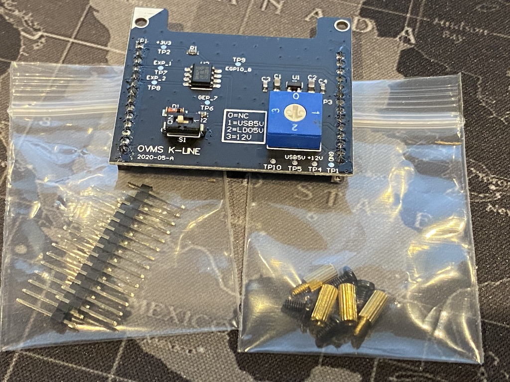
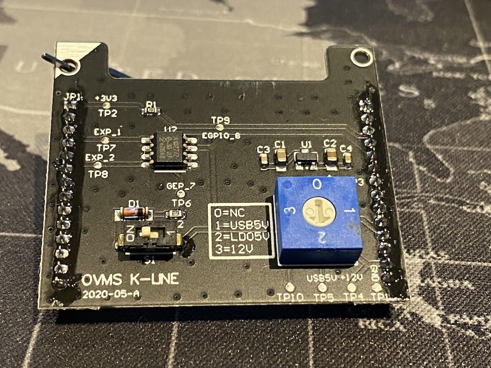

===============================
Optional K-Line Expansion Board
===============================

The optional K-Line Expansion Board is available to extend the capabilities of the OVMS system. It can be used to talk to vehicle ECUs using K-Line communication standards.

There are two installation options:

#. If you are using a modem module, you install the K-Line Expansion Board on top of the modem. Unscrew the four black screws holding the modem in place.
   In your K-Line expansion board kit you will find four brass stand offs with holes at one end and small bolts at the other.
   Use these to screw down the modem. Now, orient the K-line Expansion Board so the top left corner (marked with a white triangle) matches the white triangle on the modem board.
   Carefully push the K-Line Expansion Board into place (making sure that the pins align and are not bent). Once done, the four black screws can be used to secure it in place.

#. If you are not using a modem module, you install the K-Line Expansion Board directly onto the main OVMS board. Screw the provided standoffs into the main board, and Carefully
   attach the provided pin headers into the main OVMS board.
   Now, orient the K-line Expansion Board so the top left corner (marked with a white triangle) matches the white triangle on the main OVMS board.
   Carefully push the K-Line Expansion Board into place (making sure that the pins align and are not bent). Once done, the four black screws can be used to secure it in place.

Next, the K-Line expansion board will need to be configured to match your vehicle's K-Line bus and ECU hardware requirements. Refer to your vehicle specific guide for
information on what your vehicle requires:

* S1 is used to turn on/off the extra 'master' mode components. For most vehicles, this should be OFF.

* SW1 is used to select the power source for the K-Line bus.
  It can be #0 (no power connected), #1 (5v power from USB bus), #2 (5v power converted from vehicle's 12v power), or #3 (12v power direct from the vehicle).
  For most vehicles, either #2 or #3 is used.

The K-Line bus from the vehicle is connected via a vehicle specific cable. This connection is usually to pin #1 on the DB9 connector.
In OVMS modules v3.2 and later (as well as some late v3.1 boards), this is internally connected to GEP7 (General Expansion Pin #7). This is necessary
to bring the K-Line bus up to the internal expansion pins (for the K-Line Expansion Board to be able to reach it).

If you have an earlier board, there is a relatively simply wiring modification that can be made to upgrade to this:

#. You will need a soldering iron, solder, and a small length of insulated wire.
#. Pin #1 on the DB9 connector is the K-Line pin from the vehicle.
#. Pin #21 on the DA26 connector is GEP 7 (which is also connected to a pin on internal expansion connector).
#. On the underside of the board you can solder a jumper wire between DB9 pin #1 and DA26 pin #21 to make this connection.

Please refer to the vehicle specific guides for further information on this.
