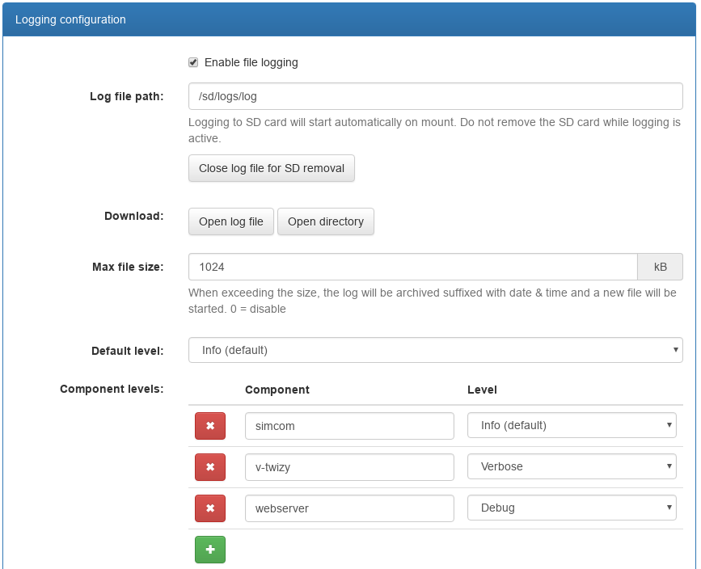

=======
Logging
=======

.. highlight:: none

----------------------
Logging to the Console
----------------------

Components of the OVMS system output diagnostic logs (information, warnings, etc). You can choose
to display these logs on your connected console with the ‘log monitor yes/no’ command::

  OVMS# log monitor ?
  Usage: log monitor [no|yes]
  no                   Don't monitor log
  yes                  Monitor log

By default, the **USB console** will have log monitoring ‘yes’, **SSH** (and telnet if enabled)
‘no’.

The **web shell** does not use the ``log monitor`` command but has a checkbox in the upper right
corner of the shell panel instead. The keyboard shortcut for the checkbox is ``L`` (Alt-L or
Alt-Shift-L depending on your browser). The web frontend gets the continuous stream of log messages
independent of the shell panel or the monitoring being active, and shows the last 100 messages
received when opening the shell panel.

Logs are output at various levels of verbosity, and you can control what is shown both globally and
on a per-component basis::

  OVMS# log level ?
  none                 No logging (0)
  error                Log at the ERROR level (1)
  warn                 Log at the WARN level (2)
  info                 Log at the INFO level (3)
  debug                Log at the DEBUG level (4)
  verbose              Log at the VERBOSE level (5)

(Note: sorted here for level clarity)

The syntax of this command is ``log level <level> [<component>]``. If the component is not
specified, the level applies to all components that don’t get a level set explicitly afterwards.
The levels increase in verbosity, and setting a particular level will also include all log output at
a lower level of verbosity (so, for example, setting level *info* will also include *warn* and
*error* output).

A log line typically looks like this::

  I (32244049) ovms-server-v2: One or more peers have connected
  │  │         │               └─ Log message
  │  │         └─ Component name
  │  └─ Timestamp (milliseconds since boot)
  └─ Log level (I=INFO)

Log levels are applied on log message generation, so a later change to a higher level will not
reveal messages generated previously.

------------------
Logging to SD CARD
------------------

You can also choose to store logs on SD CARD. This is very useful to capture debugging information
for the developers, as the log will show what happened before a crash or misbehaviour.

We recommend creating a directory to store logs, i.e.::

  OVMS# vfs mkdir /sd/logs

To enable logging to a file, issue for example::

  OVMS# log file /sd/logs/20180420.log

The destination file can be changed any time. To disable logging to the file, issue ``log close``,
to restart logging after a close issue ``log open``. You may choose an arbitrary file name, good
practice is using some date and/or bug identification tag. Note: logging will append to the file if
it already exists. To remove a file, use ``vfs rm …``.

File logging does not persist over a reboot or crash (unless configured as shown below), you can use
a script bound to the ``sd.mounted`` event to re-enable file logging automatically or configure
automatic logging (see below).

You can use the webserver to view and download the files. The webserver default configuration
enables directory listings and access to files located under the document root directory, which is
``/sd`` by default. Any path not bound to an internal webserver function is served from the
document root. So you can get an inventory of your log files now at the URL::

  http://192.168.4.1/logs/

…and access your log files from there or directly by their respective URLs. Another option to
retrieve the files without unmounting the SD card is by ``scp`` if you have configured SSH
access.

---------------------
Logging Configuration
---------------------

Use the web UI or config command to configure your log levels and file setup to be applied
automatically on boot::

  OVMS# config list log
  log (readable writeable)
    file.enable: yes
    file.keepdays: 7
    file.maxsize: 1024
    file.path: /sd/logs/log
    file.syncperiod: 3
    level: info
    level.modem: info
    level.v-twizy: verbose
    level.webserver: debug

The ``log`` command can be used for temporary changes, if you change the configuration, it will be
applied as a whole, replacing your temporary setup.

If a maximum file size >0 is configured, the file will be closed and archived when the size is
reached. The archive name consists of the log file name with added suffix of the timestamp, i.e.
``/sd/logs/log.20180421-140356``. Using a logs directory will keep all your archived logs
accessible at one place. If ``file.keepdays`` is defined, older archived logs will automatically be
deleted on a daily base.

Take care not to remove an SD card while logging to it is active (or any running file access). The
log file should still be consistent, as it is synchronized after every write, but the SD file
system currently cannot cope with SD removal with open files. You will need to reboot the module. To
avoid this, always use the “Close” button or the ``log close`` command before removing the SD card.

You don’t need to re-enable logging to an SD path after insertion, the module will watch for the
mount event and automatically start logging to it.

------------------
Performance Impact
------------------

SD card I/O has an impact on the module performance. So file logging should generally be switched
off or run on a low level (i.e. "info" or "warn") unless you're hunting some bug or checking
some details of operation. We also recommend using a fast SD card for logging (check the speed with
``sd status``, check if you can raise config ``sdcard maxfreq.khz`` to 20000 kHz).

File logging is done by a separate task, but flushing the file buffers to the SD card still may
block the logging CPU core or even both CPU cores for a short period. To reduce the impact of this,
the log task by default only flushes the buffer after 1.5 seconds of log inactivity. This means you
may lose the last log messages before a crash.

To change the flush behaviour, set config ``file.syncperiod`` to…

  - 0 = never flush (i.e. only at ``log close`` / log cycle)
  - < 0 = flush every n log messages (i.e. -1 = flush after every message)
  - > 0 = flush after n/2 seconds idle

The log task counts the time spent for flushes and outputs it with the ``log status`` command::

  OVMS# log status
  Log listeners      : 3
  File logging status: active
    Log file path    : /sd/logs/log
    Current size     : 817.0 kB
    Cycle size       : 1024 kB
    Cycle count      : 8
    Dropped messages : 0
    Messages logged  : 70721
    Total fsync time : 651.1 s

This is an example for the default configuration of ``file.syncperiod: 3``, the logging here
has on average taken 651.1 / 70721 = 9 ms per message.
