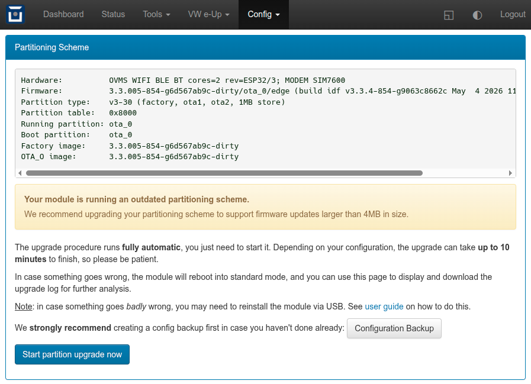
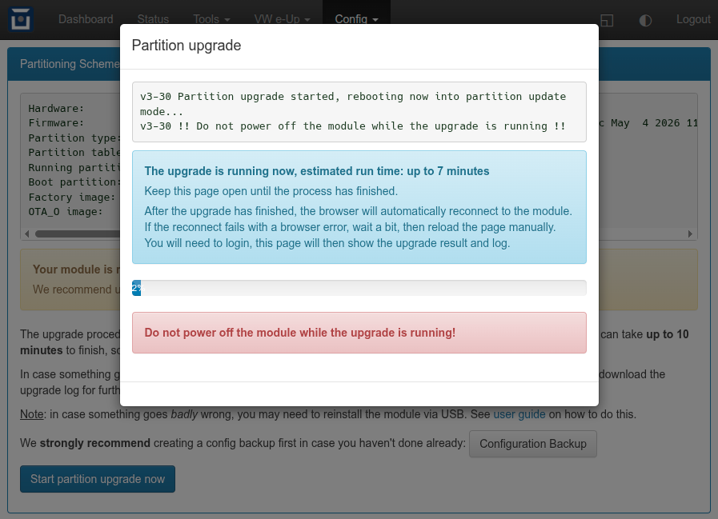
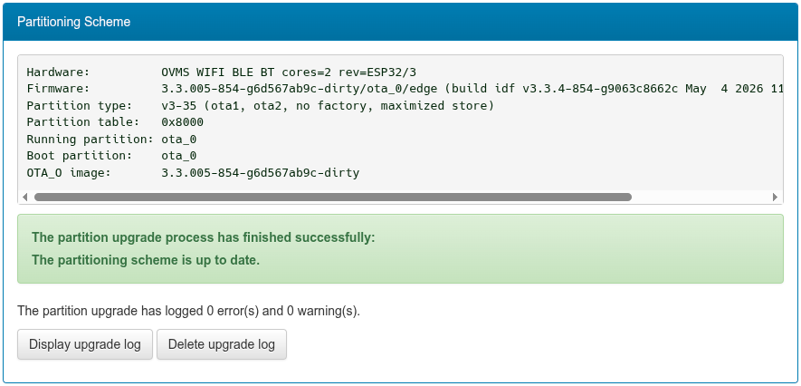

===================
Partitioning Scheme
===================

.. highlight:: none

**Release 3.3.006** or higher may ask you to perform a **partitioning scheme upgrade**:

.. note::
  | The module is running an outdated flash partitioning scheme.
  | OTA updates will soon stop working due to its 4MB size limit.
  | Upgrading is recommended to leverage the limit to 7MB.
  | To upgrade, open the web UI, menu Config -> Partitioning.

You can of course decide to keep the old partitioning, the module will continue to work using that. But release 
3.3.006 will be the **last release** to fit into the old partitioning scheme, so you will not be able to install 
any future releases without upgrading.

For details, see: `Technical Background`_

------------
Upgrade Tool
------------

The upgrade can be done **online** on the running module; release 3.3.006 includes an easy to use upgrade tool
that can be run from the **shell** or the module's **web UI**.

~~~~~~
Web UI
~~~~~~

Open the tool's web UI via ``Config → Partitioning``. The tool shows the current state of your system, and
offers to start the upgrade process if necessary:

To prepare for any problem, backup your configuration first, in case you didn't do so lately.

Then click "Start partition upgrade now" and confirm the operation. The UI will display a time estimate with
a progress bar and some additional info:

Expect the process to finish earlier than estimated, the estimation is on the conservative side.

Keep the page open until the browser reconnects, after login the page will show the process result, and you'll
be able to download the process log:

In case the tool encounters an issue with copying the configuration, it will offer to retry copying or perform
a factory reset. The upgrade process will automatically continue after the factory reset.

~~~~~~~~~~~
Shell Usage
~~~~~~~~~~~

To prepare for any problem, backup your configuration first, in case you didn't do so lately. For example::

  OVMS# config backup /sd/backup.zip

Change the path as desired. If the backup fails, chances are your config store partition is corrupted. It's then 
recommended to do a :doc:`factory reset <factory>` first, perform the partition upgrade, then restore your 
latest backup or setup the module from scratch onto the upgraded system.

To start the partition upgrade, issue::

  OVMS# ota partitions upgrade autocont -noconfirm

Note: the ``-noconfirm`` option is needed for any remote shell or command channel. With an interactive shell
(USB/SSH), you can omit the parameter, the command will then ask you to confirm.

The command can be run again if needed, it starts by inspecting the current state and then continues to do
the next step necessary according to the upgrade plan.

If running this in the **USB console**, you'll be able to follow the whole upgrade process by monitoring the USB
log output. Once finished, the module reboots into normal operation mode as configured.

If running from a **remote shell**, you need to wait until the process has finished or aborted (can take up to 
ten minutes). When the module is back online, check the process result by inspecting the OTA status::

  OVMS# ota

If the "partition type" shown is ``v3-35``, the upgrade has finished successfully. If the type is ``v3-30``
or ``v3-34``, or if the module doesn't come back online, see `Troubleshooting`_.

The upgrade process logs the steps and operations performed in file ``/store/partition-update.log``. To view
the file, issue::

  OVMS# vfs cat /store/partition-update.log

In case you need support, copy the log and send it to us, including the ``ota`` output and possibly relevant
details on your setup.

--------------------
Technical Background
--------------------

The module's flash memory has a size of 16 MB and is divided into system, firmware and configuration
partitions.

**Up to release 3.3.005**, the partitioning scheme was designed to store **three firmware images**, with a 
dedicated "factory" partition to hold the original firmware version flashed during module production, and two 
"ota" partitions for downloaded updates.

This partition layout supported **firmware images up to 4MB in size**. This limit was finally reached with 
**release 3.3.006**, making 3.3.006 the last release to fit in the old partitioning scheme. To continue being 
able to install new firmware updates after 3.3.006, the partitioning scheme needs to be changed.

When first booting into 3.3.006 or when trying to install an OTA update that doesn't fit, the module will send a 
**notification** about the necessary partitioning upgrade. The web UI's entry page also displays a warning when 
an outdated partitioning scheme is detected.

The partitioning can be changed **online** by the running module itself, the module doesn't need to be unmounted
unless the online upgrade process fails -- see below for details.

~~~~~~~~~~~~~~~~~~~~~~~~
Leveraging the 4MB Limit
~~~~~~~~~~~~~~~~~~~~~~~~

While the "factory" partition could still be booted from if manually requested, it wouldn't receive any updates
in normal operation, as it could only be reflashed via USB.

With OTA updates, the module boots alternating from ``ota_0`` and ``ota_1``. New images downloaded or installed 
from SD card are only activated after validation, so after successful OTA initialization, one of the OTA 
partitions always holds a valid firmware, and ``factory`` becomes obsolete.

The **new partition layout** designed to accomodate **updates after 3.3.006** removes the ``factory`` firmware 
partition and distributes the space gained evenly onto the ``ota`` partitions. Unused reserved space of the 4MB 
partitioning is also added to the ``ota`` and the ``store`` partitions to maximize flash memory usage.

This results in **two** ``ota`` firmware partitions supporting **image sizes up to 7MB** and a ``store`` partition
supporting **user configuration data up to 1,984 KB** in size.

The upgrade process takes care of all necessary steps, including rebooting into maintenance mode, copying the 
running firmware image, changing the partition table and copying the configuration store. The process needs to 
perform multiple reboots and normally takes around 5 minutes, but can take up to 10 minutes depending on the 
configuration. The web UI tries to estimate the maximum time needed, the actual process normally will finish
earlier than estimated.

~~~~~~~~~~~~~~~~~~~
Old Partition Table
~~~~~~~~~~~~~~~~~~~

The ``ota`` command identifies this as::

  Partition type:    v3-30 (factory, ota1, ota2, 1MB store)

================ ==== ============ ========== =====================
Label            Type Subtype      Address    Size
================ ==== ============ ========== =====================
nvs              data nvs          0x00009000 16 KB
otadata          data ota          0x0000d000 8 KB
phy_init         data phy          0x0000f000 4 KB
factory          app  factory      0x00010000 4 MB
ota_0            app  ota_0        0x00410000 4 MB
ota_1            app  ota_1        0x00810000 4 MB
store            data fat          0x00c10000 1 MB
================ ==== ============ ========== =====================

Hint: use ``ota partitions list`` to show the partition table.

~~~~~~~~~~~~~~~~~~~
New Partition Table
~~~~~~~~~~~~~~~~~~~

The ``ota`` command identifies this as::

  Partition type:    v3-35 (ota1, ota2, no factory, maximized store)

================ ==== ============ ========== =====================
Label            Type Subtype      Address    Size
================ ==== ============ ========== =====================
nvs              data nvs          0x00009000 16 KB
otadata          data ota          0x0000d000 8 KB
phy_init         data phy          0x0000f000 4 KB
ota_0            app  ota_0        0x00010000 7 MB
ota_1            app  ota_1        0x00710000 7 MB
store            data fat          0x00e10000 1984 KB
================ ==== ============ ========== =====================

---------------
Troubleshooting
---------------

~~~~~~~~~~~~~~~~~~~~~~~
Config Store Corruption
~~~~~~~~~~~~~~~~~~~~~~~

If the upgrade process **fails while copying the configuration**, the module will reboot into the previous
setup, with OTA partition type ``v3-34 (factory, ota1, ota2, dual store)``. This means the upgrade
hasn't finished yet and needs manual intervention.

You can inspect the process log to see where (on which file/directory) the error was encountered::

  OVMS# vfs cat /store/partition-update.log

You may then be able to delete the corrupted file and simply restart the upgrade. This may only work for
auxiliary data files or configuration elements you can easily restore later on.

If the corruption is in the protected system configuration directory, or affects more than one file, you'll
need to perform a :doc:`factory reset <factory>` (clearing and reformatting the ``store`` partition).
The module will automatically reboot from there and continue with the partition upgrade.

**Be aware** the module will boot into the **initial setup mode** after a factory reset, so you will need to
connect to the init Wifi network ``OVMS`` using password ``OVMSinit`` after the upgrade has finished. You can 
then restore a backup or, if no backup is available, reconfigure the module from scratch.

~~~~~~~~~~~~
Boot Failure
~~~~~~~~~~~~

If the module **fails to reboot** into normal operation after the upgrade, something went badly wrong when
writing the new partition table into the flash memory.

In this case, first try to power cycle the module. If the module still doesn't recover, you will need to do a
:ref:`full reflash of the module via USB <full-reflash-via-usb>`.

We recommend using the most recent firmware image for the full reflash. That way you will automatically get
the new partitioning scheme, so no further upgrade is needed.

A full reflash also erases your configuration, so the module will boot into the initial setup mode with Wifi
network ``OVMS``, password ``OVMSinit``. You can then simply restore your latest backup, or reconfigure from
scratch.

~~~~~~~~~~~~~~~~~
Firmware Download
~~~~~~~~~~~~~~~~~

When looking for a **specific image** to be installed OTA on a module, you now need to choose the right download
directory for the module's partitioning. On the OTA servers, there are now two firmware directories for each
hardware version, with the one suffixed by ``-5`` for the upgraded partitioning scheme:

- ``v3.3`` -- Hardware 3.3, firmware images with max size 4MB
- ``v3.3-5`` -- Hardware 3.3, firmware images possibly exceeding 4MB

Release 3.3.006 and newer will check the image size and cease to install an image exceeding the available
partition size. Earlier releases will try to install the image and fail when reaching the partition end.

Standard OTA updates do not need to be changed, they automatically choose the correct directory.

When intending to do a full reflash via USB, you can choose any image, as that includes the partitioning.
