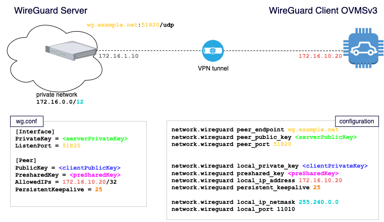

.. highlight:: none

=============================
Virtual Private Network (VPN)
=============================

.. warning:: **WireGuard VPN support is only available on (upcoming) ESP-IDF v5+ builds** - unfortunately there is no
  easy way to make it work with (current) ESP-IDF v3.3.4 builds.

The OVMS module can be (optionally) configured with a `WireGuard <https://www.wireguard.com/>`_ VPN tunnel.
This allows your module to connect (attach) to a private network as if it were part of this network, like
a local node.
In addition WireGuard VPN natively supports roaming, thus if your module changes network, or source IP address
for whatever reason, it will still be connected and visible from your private network.

Possible use cases :
  - securing the (incoming) connection to your module, so that it's not publicly visible (and scannable) on a public IP address, thus reducing the attack surface
  - have an always-on SSH connexion to your module - even if it's roaming
  - being able to (securely) send files and data, back and forth, from / to your module to / from your private network

----------------------
Principle of operation
----------------------

At the moment, only one connexion is supported. When configured the VPN tunnel will connect as soon as the
network is ready, and your module will be able to communicate with other nodes of your private network.

.. note:: **WireGuard VPN needs the time to be monotonic**, i.e. always goes forward. While not mandatory, it's best to have
  a time/date properly setup (NTP, GPS, ...)

.. note::  You will need a properly configured (and tested) WireGuard peer that we will refer to as **the server** (WireGuard VPN has no
  such distinction between clients and servers, but in our case it's easier to grasp), while we will consider that our
  module is **the client**.

The **server** needs to be properly configured to accept incoming WireGuard traffic (i.e. UDP packets) on a public interface - we will
call the address of this public interface the **Peer Endpoint**.

-------------
Configuration
-------------

New configuration items are introduced to configure this VPN tunnel, organised using the :doc:`configuration system<configuration>`::

  <parameter> <instance> = <value>

Where **parameter** is always ``network.wireguard``, and **instance** is as follow:

========================= =====
Instance (in OVMS)        Comment
========================= =====
``local_ip_address``      The IP address of your module IN YOUR PRIVATE NETWORK
``local_ip_netmask``      The netmask of your module IN YOUR PRIVATE NETWORK
``local_private_key``     The PRIVATE key of your module for your WireGuard VPN tunnel
``local_port``            The UDP port from which your module will communicate with the WireGuard server
``peer_endpoint``         The IP address or hostname of the WireGuard server
``peer_public_key``       The PUBLIC key of the WireGuard server
``peer_port``             The UDP port on which the WireGuard server listens
``preshared_key``         A (recommended) pre-shared symmetric key for additional protection
``persistent_keepalive``  A keep-alive if your module is behind NAT (recommended for NAT)
========================= =====

Example::

  OVMS# config set network.wireguard local_ip_address 192.168.4.58
  OVMS# config set network.wireguard local_ip_netmask 255.255.255.0
  OVMS# config set network.wireguard local_private_key "IsvT72MAXzA8EtV0FSD1QT59B4x0oe6Uea5rd/dDzhE="
  OVMS# config set network.wireguard local_port 11010
  OVMS# config set network.wireguard peer_endpoint demo.wireguard.com
  OVMS# config set network.wireguard peer_public_key "FjrsQ/HD1Q8fUlFILIasDlOuajMeZov4NGqMJpkswiw="
  OVMS# config set network.wireguard peer_port 12912
  OVMS# config set network.wireguard preshared_key "0/2H97Sd5EJ9LAAAYUglVjPYv7ihNIm/ziuv6BtSI50="
  OVMS# config set network.wireguard persistent_keepalive 25

.. note:: The preceding values are for documentation only, they won't work as is. If you need to test the tunnel
  on a demo server, have a look at `WireGuard Demo <http://demo.wireguard.com/>`_, download the shell script
  and adapt it to your needs.

``local_ip_address`` and ``local_ip_netmask`` are used to decide:
  - what will be the IP address of the module in your private network (``local_ip_address``). A new (local) network interface will be configured with this IP address.
  - which routing will be allowed through the VPN tunnel (using ``local_ip_address`` + ``local_ip_netmask``)

In general, ``local_ip_netmask`` will be the netmask of your private network to enable packets from/to your other network nodes to cross the tunnel.
(In opposite, when setting the reciprocate configuration, you would define only the)

Correspondance with WireGuard's `Configuration file format <https://git.zx2c4.com/wireguard-tools/about/src/man/wg.8>`_

========================= =========================================== ============================================================
OVMS                      Wireguard Client                            Wireguard Server
========================= =========================================== ============================================================
``local_ip_address``      Peer / AllowedIPs (one address only)        (address of the server in the private network)
``local_ip_netmask``      Peer / AllowedIPs (one address only)        (netmask of the private network)
``local_private_key``     Interface / PrivateKey                      Peer / PublicKey
``local_port``            Interface / ListenPort                      N/A
``peer_endpoint``         Peer / Endpoint (before colon)              (public IP address of the server)
``peer_public_key``       Peer / PublicKey                            Interface / PrivateKey
``peer_port``             Peer / Endpoint (port number, after colon)  Interface / ListenPort
``preshared_key``         Peer / PresharedKey                         Peer / PresharedKey
``persistent_keepalive``  Peer / PersistentKeepalive                  Peer / PersistentKeepalive
========================= =========================================== ============================================================

^^^^^^^^^^^
Quick start
^^^^^^^^^^^
.. note:: for configuring the different keys (private keys, publics keys, shared key) you will need to access a computer with the proper WireGuard
  VPN tools installed. In this documentation we will assume that the command line tool ``wg`` is installed on this computer.

The example configuration is the following:

* The server listens on ``wg.example.net``, on UDP port ``51820``
* The private network is ``172.16.0.0/12`` (corresponding netmask ``255.240.0.0``)
* In this private network:

  * the OVMS module has a reserved IP of ``172.16.10.20``
  * the server has a reserved IP of ``172.16.1.10`` (for information purposes, not used in the configuration)
* The OVMS module uses UDP port ``11010`` for its WireGuard VPN purposes.

Steps::

  # Generate the server private key
  $ wg genkey
  SGfeKo9cmhIJ5tpDOjOimnEKi3M+3mJ21+jJ7otllHI=

  # Generate the corresponding server public key
  $ echo 'SGfeKo9cmhIJ5tpDOjOimnEKi3M+3mJ21+jJ7otllHI=' | wg pubkey
  r5xRjMaiu1apmP6YzRviL8djtBfjcWGnOd2mmHNOqm4=

  # Generate the ovms module private key
  $ wg genkey
  kI2/adVWRseT2ZtYxn/5lTzQsPKK8F7YHWcIo3iwgHk=

  # Generate the corresponding ovms module public key
  $ echo 'kI2/adVWRseT2ZtYxn/5lTzQsPKK8F7YHWcIo3iwgHk=' | wg pubkey
  hi0SNx8JJVLWIOuIfeQW5Ea5SK/41g4DeXJ2eJR9R3Y=

  # Generate the pre-shared key
  $ wg genpsk
  JUvxtI5sFm9n0zY6N4Z8rz/nSnww2DaeFKsOPGnC1WA=

Server configuration::

  [Interface]
  PrivateKey = SGfeKo9cmhIJ5tpDOjOimnEKi3M+3mJ21+jJ7otllHI=
  ListenPort = 51820
  
  [Peer]
  PublicKey = hi0SNx8JJVLWIOuIfeQW5Ea5SK/41g4DeXJ2eJR9R3Y=
  PresharedKey = JUvxtI5sFm9n0zY6N4Z8rz/nSnww2DaeFKsOPGnC1WA=
  AllowedIPs = 172.16.10.20/32
  PersistentKeepalive = 25

OVMS configuration::

  OVMS# config set network.wireguard local_ip_address 172.16.10.20
  OVMS# config set network.wireguard local_ip_netmask 255.240.0.0
  OVMS# config set network.wireguard local_port 11010
  OVMS# config set network.wireguard local_private_key "kI2/adVWRseT2ZtYxn/5lTzQsPKK8F7YHWcIo3iwgHk="
  OVMS# config set network.wireguard peer_endpoint wg.example.net
  OVMS# config set network.wireguard peer_port 51820
  OVMS# config set network.wireguard peer_public_key "r5xRjMaiu1apmP6YzRviL8djtBfjcWGnOd2mmHNOqm4="
  OVMS# config set network.wireguard preshared_key "JUvxtI5sFm9n0zY6N4Z8rz/nSnww2DaeFKsOPGnC1WA="
  OVMS# config set network.wireguard persistent_keepalive 25

.. note:: The preceding values are for documentation only, they won't work as is.

^^^^^^^^^^^^^^^
Troubleshooting
^^^^^^^^^^^^^^^

If the module doesn't find your WireGuard server, you can use the following tools for diagnostic::

  OVMS# wireguard status

  OVMS# network status

  OVMS# wireguard stop
  OVMS# wireguard start
  OVMS# wireguard restart

  OVMS# network ping X.Y.Z.T

Set the logs to debug, and every 10s the wireguard subsystem will print if the peer is 'up' or 'down'.

When neither the WireGuard VPN nor the WiFi client are active, the output of ``network status`` looks like this::

  OVMS# network status
  Interface#2: ap2 (ifup=1 linkup=1)
    IPv4: 192.168.4.1/255.255.255.0 gateway 192.168.4.1

  Interface#1: st1 (ifup=0 linkup=0)
    IPv4: 0.0.0.0/0.0.0.0 gateway 0.0.0.0

  DNS: None

  Default Interface: ap2 (192.168.4.1/255.255.255.0 gateway 192.168.4.1)

As soon as the WiFi client is connected, the WireGuard VPN interface appears, but not connected (``linkup=0``)::

  OVMS# network status
  Interface#3: wg3 (ifup=1 linkup=0)
    IPv4: 172.16.10.20/255.255.255.0 gateway 0.0.0.0

  Interface#2: ap2 (ifup=1 linkup=1)
    IPv4: 192.168.4.1/255.255.255.0 gateway 192.168.4.1

  Interface#1: st1 (ifup=1 linkup=1)
    IPv4: 192.168.1.12/255.255.255.0 gateway 192.168.1.1

  DNS: 192.168.1.1

  Default Interface: st1 (192.168.1.12/255.255.255.0 gateway 192.168.1.1)

The status is::

  OVMS# wireguard status
  Connection status:  started
  Peer status:  down

After a little while, the WireGuard VPN interface connects (``linkup=1``) and the status is ``up``::

  OVMS# network status
  Interface#3: wg3 (ifup=1 linkup=1)
    IPv4: 172.16.10.20/255.255.255.0 gateway 0.0.0.0

  Interface#2: ap2 (ifup=1 linkup=1)
    IPv4: 192.168.4.1/255.255.255.0 gateway 192.168.4.1

  Interface#1: st1 (ifup=1 linkup=1)
    IPv4: 192.168.1.12/255.255.255.0 gateway 192.168.1.1

  DNS: 192.168.1.1

  Default Interface: st1 (192.168.1.12/255.255.255.0 gateway 192.168.1.1)

  OVMS# wireguard status
  Connection status:  started
  Peer status:  up

And you can ping another host on the private network::

  OVMS# network ping 172.16.1.2
  PING 172.16.1.2 (172.16.1.2): 64 data bytes
  64 bytes from 172.16.1.2: icmp_seq=0 ttl=64 time=2 ms
  64 bytes from 172.16.1.2: icmp_seq=1 ttl=64 time=2 ms
  64 bytes from 172.16.1.2: icmp_seq=2 ttl=64 time=5 ms
  64 bytes from 172.16.1.2: icmp_seq=3 ttl=64 time=3 ms

  --- 172.16.1.2 ping statistics ---
  4 packets transmitted, 4 received, 0% packet loss, time 12ms
  round-trip avg = 3.00 ms

-----------------------
Firewall considerations
-----------------------

WireGuard is an UDP-based protocol.
There is one UDP port to consider for each node (one for the server, one for the module).
By convention, the UDP port is often **51820** but can be changed with no issue.

For the **server**, the firewall needs to accept incoming UDP packets on a public interface from the possible source addresses of your module. (In case of a WiFi network you manage, this can be a certain range. However if your module is either roaming or using a mobile network with unknown source
addresses you may have to open this UDP port to the whole internet).

------------------------
Bandwidth considerations
------------------------
If you use the ``persistent_keepalive`` setting, it will send an UDP packet each ``persistent_keepalive`` seconds.
The recommended value for systems behind NATs is 25s, so it can make your module send a lot of (small) packets many time per hour.

If this is a concern you may want to disable the tunnel when you don't need it (``wireguard stop``) and only enable it when needed (``wireguard start``)
