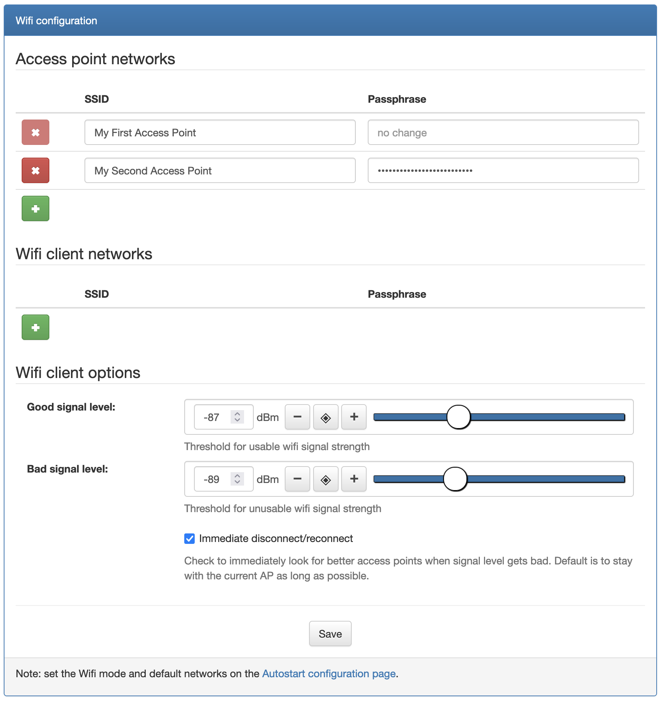
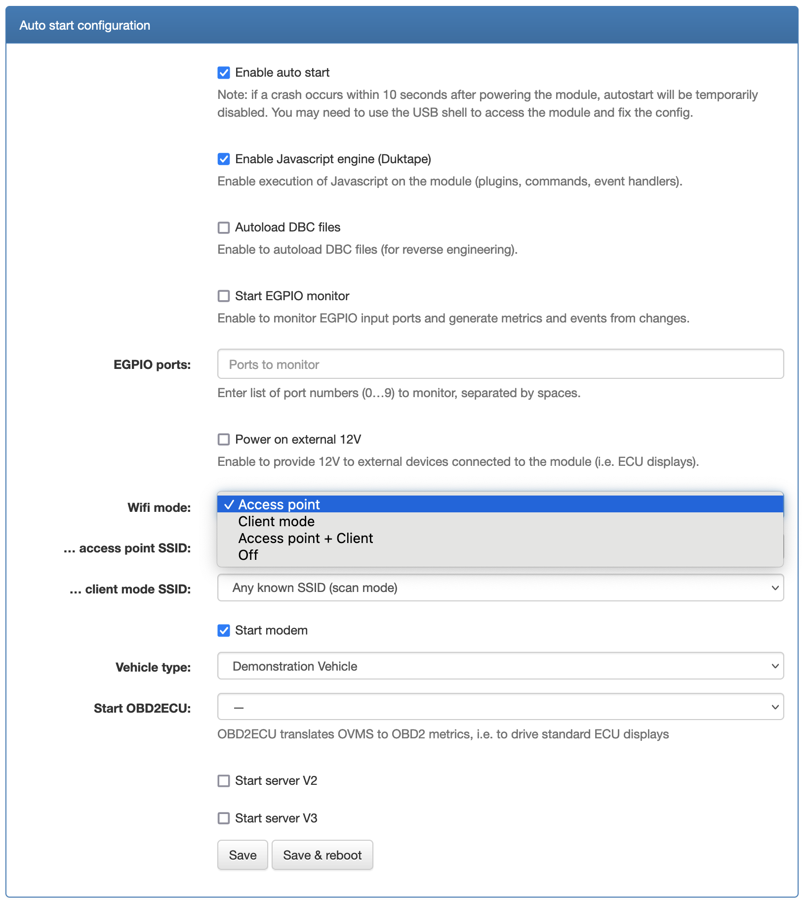
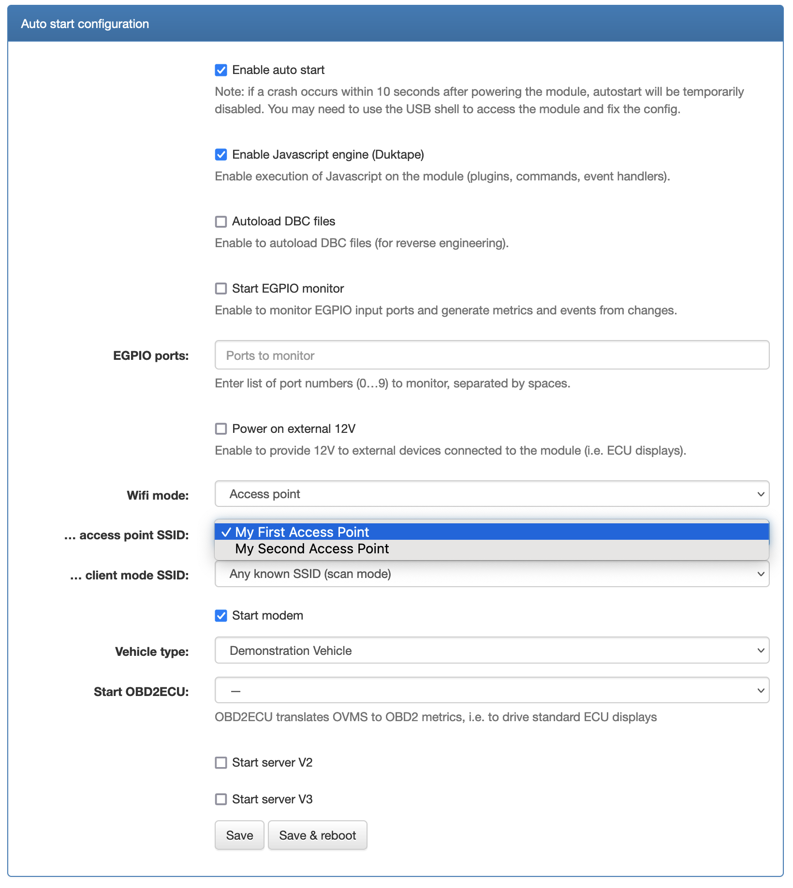

.. highlight:: none

===============================
Access Point Mode Configuration
===============================

----------------
Using the Web UI
----------------

First you need to configure the SSID and passphrase for the Wifi Access point networks you would like to
create in Config → Wifi:

(you can enter multiple Wifi Access point networks, however only one will be active at a time)

Then you enable the access point mode by choosing a Wifi mode of either "Access point mode" or
"Access point + Client" (preferred) in Config → Autostart, field ``Wifi mode``:

Finally you need to choose which one of these Wifi Access point networks will be active (even if you only defined
one in the first step) - in Config → Autostart,
field ``... access point SSID``:

---------------
Using the shell
---------------

You can also configure all those parameters with the shell.

To configure the **SSID and passphrase** for the defined Wifi Access point networks, use the ``config set`` command::

  OVMS# config set wifi.ap <ssid> <passphrase>

(you may use this command multiple time to enter multiple SSID information, however only one will be active at a time.
You can check the defined ones with ``config list wifi.ap``)

To enable the **access point mode**, you will need to chose ``ap`` (or preferably ``apclient``) using
the ``config set`` command on the configuration item ``auto wifi.mode``::

  OVMS# config set auto wifi.mode ap

You set the **active** Wifi Access point network in the configuration item ``auto wifi.ssid.ap``::

  OVMS# config set wifi.ssid.ap "My First Access Point"

.. warning:: All three steps (setting **SSID and passphrase** with ``config set wifi.ap <ssid> <passphrase>``, enabling
  the **access point mode** with ``config set auto wifi.mode ap`` or ``config set auto wifi.mode apclient``, and setting
  the **active** access point with ``config set wifi.ssid.ap <ssid>``) are necessary for proper operation of the access point mode.

.. note:: This configuration of the Wifi mode will only be applied on the next reboot. To force a mode
  change immediately, you need to use the ``wifi mode`` command::

    wifi mode ap "My First Access Point"
