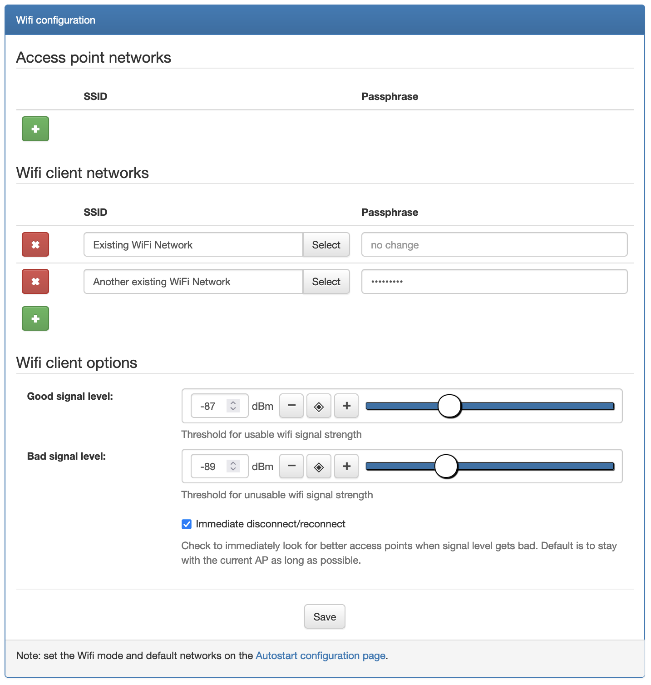
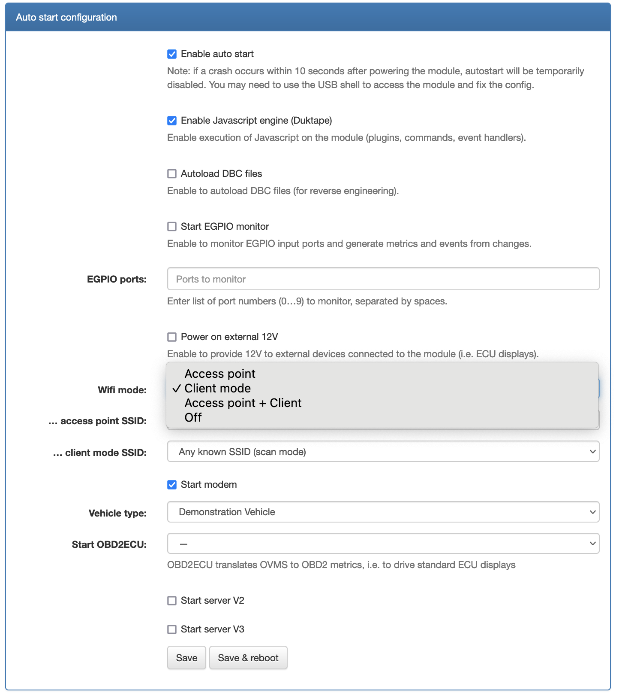
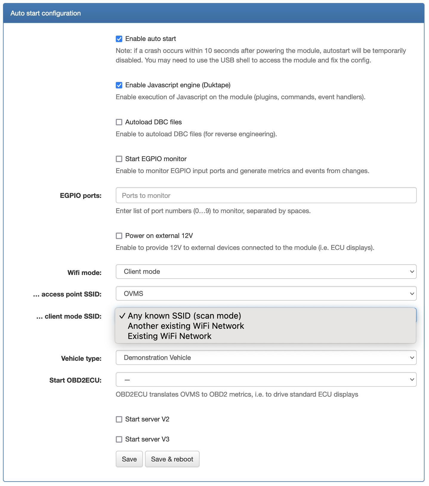

.. highlight:: none

=========================
Client Mode Configuration
=========================

----------------
Using the Web UI
----------------

First you need to configure the SSID and passphrase for the known Wifi networks you would like to
connect the module to in Config → Wifi:

(you can enter multiple Wifi networks)

Then you enable the client mode by choosing a Wifi mode of either "Client mode" or
"Access point + Client" (preferred) in Config → Autostart, field ``Wifi mode``:

Finally you will choose between two behaviours for the module - in Config → Autostart,
field ``... client mode SSID``:

- choose the best one to connect to : ``Any known SSID (scan mode)``
- connect to only one of the previously defined Wifi networks ("normal mode")

---------------
Using the shell
---------------

You can also configure all those parameters with the shell.

To configure the **SSID and passphrase** for the known Wifi networks, use the ``config set`` command::

  OVMS# config set wifi.ssid <ssid> <passphrase>

(you may use this command multiple time to enter multiple SSID information. You can check
the defined ones with ``config list wifi.ssid``)

To enable the **client mode**, you will need to chose ``client`` (or preferably ``apclient``) using
the ``config set`` command on the configuration item ``auto wifi.mode``::

  OVMS# config set auto wifi.mode client

To have the module connect to the best Wifi network and continuously monitor the signal quality
("scan mode"), you need to ensure that the configuration item ``auto wifi.ssid.client`` is empty::

  OVMS# config set auto wifi.ssid.client ""

While if you prefer that the module always connects to a specific Wifi network ("normal mode"), you
set the SSID of this network in the configuration item ``auto wifi.ssid.client``::

  OVMS# config set auto wifi.ssid.client "My Wifi Network"

.. warning:: All three steps (setting **SSID and passphrase** with ``config set wifi.ssid <ssid> <passphrase>``, enabling
  the **client mode** with ``config set auto wifi.mode client`` or ``config set auto wifi.mode apclient``, and choosing
  between "scan mode" or a specific Wifi Network with ``config set wifi.ssid.client <ssid>``) are necessary for proper operation
  of the client mode.

.. note:: This configuration of the Wifi mode will only be applied on the next reboot. To force a mode
  change immediately, you need to use the ``wifi mode`` command.
  If you want to use the "scan mode" (i.e. able to switch from one known SSID to another), you just
  enter the mode without any following parameter::

    wifi mode client

  While if you want that the module always connects to a specific Wifi network ("normal mode"), you
  add the SSID of this network just after the mode::

    wifi mode client "My Wifi Network"
