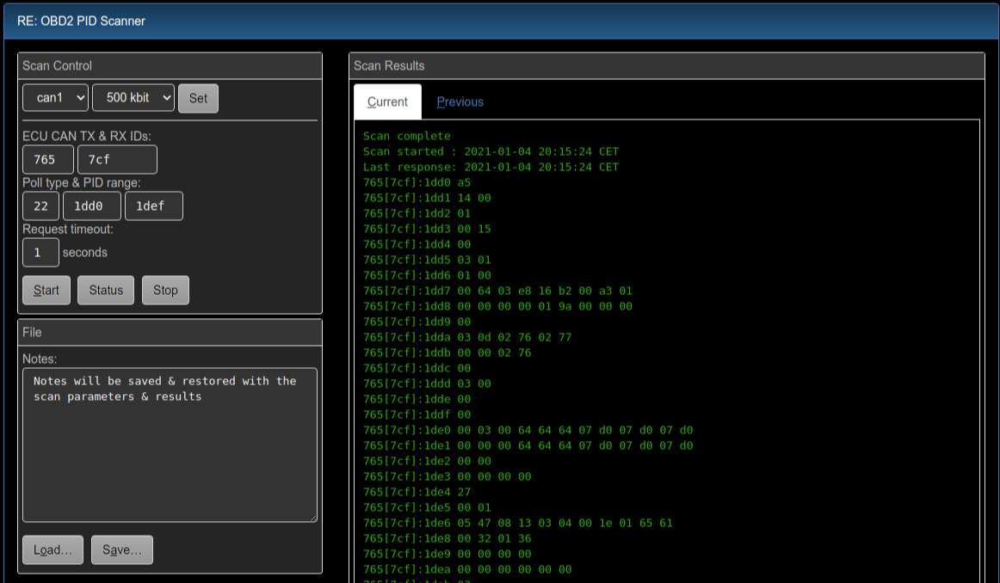

==============================
REPIDScan: OBD2 PID Scanner UI
==============================

**Web UI for the OVMS3 RE toolkit's OBD2 PID scanner**

Version 2.1 by Michael Balzer <dexter@dexters-web.de>

- ``1.0``: Initial release
- ``2.0``: Highlight differences between scan results
- ``2.1``: PID step support

This is a web frontend for the ``re obdii scan`` commands.

Some basic usage notes are included, but you really should have some knowlegde of how accessing 
ECU and other onboard devices via OBD-II/UDS works. Some pointers to get started:

- https://en.wikipedia.org/wiki/OBD-II_PIDs
- https://en.wikipedia.org/wiki/Unified_Diagnostic_Services

You will need OVMS firmware release 3.2.015-324 or higher to be able to use all features.

The UI allows to easily define and keep multiple scans along with notes. Scan results of two 
successive runs can be compared directly. The UI checks if vehicle ``NONE`` is loaded and
shows a button to switch to that otherwise. The CAN buses can be started from the UI as
well.

Scan results are shown in plain text form as delivered by the underlying commands.

Feel free to improve and extend (and submit your results).

------------
Installation
------------

1. Install :download:`repidscan.htm` web plugin, recommended setup:

  - Type:    Page
  - Page:    ``/usr/repidscan``
  - Label:   RE PID Scanner
  - Menu:    Tools
  - Auth:    Cookie

-----
Usage
-----

.. warning:: **The scanner allows to use any poll type!** Requests will be sent with
  PIDs only though, but some devices may fail to validate the request length, so be careful 
  not to use any write or control poll types.

The OBD2 PID scanner performs a series of OBD/UDS requests for a range of PIDs and displays the 
results. Only PIDs with positive results (responses) will be shown in the results.

Enter all values hexadecimal (case irrelevant). Default RXID is TXID+8, try RXID range 500-7FF if 
you don't know the responding ID. To send broadcast requests, set TXID to 7DF and RXID to 7E8-7EF. 
The PID range must match the poll type PID constraints (8/16 bit).

Click "Start" to run a scan. Only one scan can be active at a time, but you don't need to stop 
a scan to start another run.

Scan results will be shown automatically when the scan has been completed. Scanning a large range of 
PIDs may take some time, to get intermediate results, click "Status". You can also start the scan, 
do something else and return to the tool later.

Differences between two scans are highlighted in both result tabs, with added PIDs being marked 
green (yellow in night mode), and byte value changes being marked red. No highlighting is applied 
if the scans don't share any PIDs.

On the next scanner start, the previous results (if any) will be copied to the "Previous" tab. You 
can switch tabs by the mouse or keyboard to compare them and look for differences, e.g. after having 
changed some control on the car.

All inputs and outputs can be saved to and loaded from files on the module or SD card. Use this to 
define your areas of interest, so you can easily re-run a previously defined scan the next day. File 
format is plain readable JSON, so you can continue analysis or prepare scans offline.

Notes: to avoid clashing of scan polls with vehicle polls, use the scanner only with the vehicle 
module NONE. The CAN bus to use needs to have been started in active mode. The scanner does not send 
session or tester presence messages, if you need these, use the ``re obdii tester`` tool or the 
``obdii canX request`` command.

