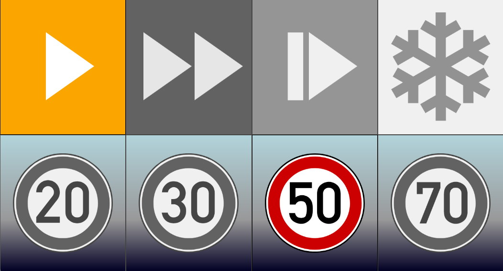

============
Page-Command
============

**only command options as UI**

Version 0.2  Matthias Greiling <matthias@greiling.de>

**Details:**

This view only presents commands to OVMS. While driving you can choose between different drive modes. The coloured area indicates the active drive mode. Activate an other mode by touching or clicking the grey bordered area. To change again simply click or touch again the same or another ares. 
Furthermore you can limit the speed online to predefined values. The speed limit signs are common in germany and display km/h. Just activate the sign you want to be limited to - another touch will deactivates the limit of the chosen one.

------------
Installation
------------

1. Install :download:`page-command.html` web plugin, recommended setup:
    - Type:    Page
    - Page:    ``/usr/command``
    - Label:   ⚡
    - Menu:    Main
    - Auth:    Cookie

-------
History
-------

  - V0.2 -- Simplfy backgrounds/ icons of command row
  - V0.1 -- Initial release
