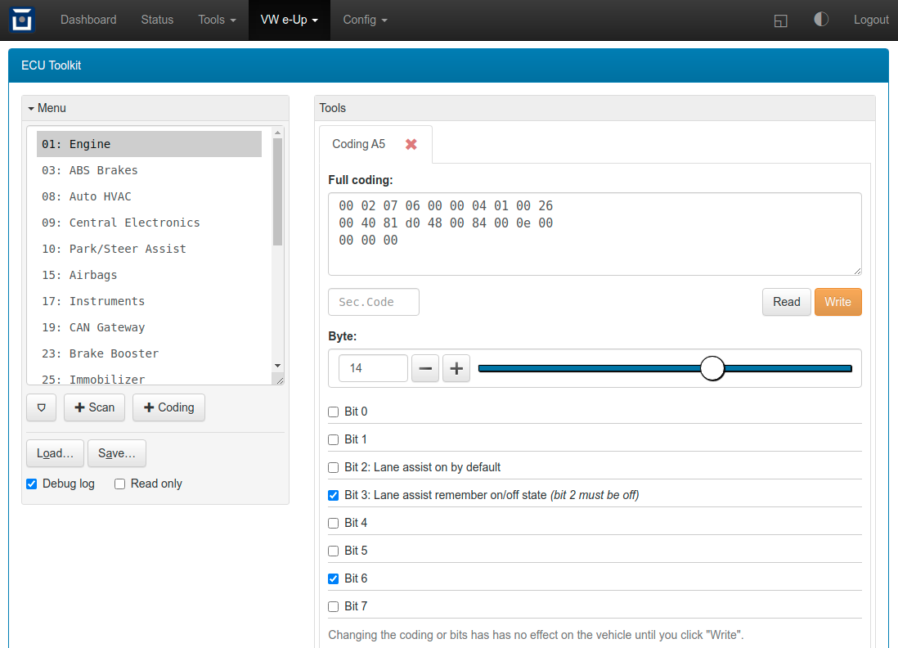

==============================
ECUToolkit: VW e-Up ECU Access
==============================

**Library and web UI for diagnostics and configuration of the e-Up / Mii / Citigo ECUs**

- Library version 0.5 by Michael Balzer <dexter@dexters-web.de>
- Web UI version 0.1 by Michael Balzer <dexter@dexters-web.de>

.. image:: ecutoolkit-scan.png

You will need OVMS firmware release 3.2.016-226 or higher to be able to use this.

The library is meant as a general tool to access the VW ECUs. It provides means to simplify
sending OBD/UDS commands to ECUs by ID and to automate diagnostic session login/logout. It
provides methods to set the workshop code (WSC), do security authorization, do scans and
codings.

The web UI allows to open multiple tools for different ECUs and save/load the current setup
including the tool states.

Feel free to improve and extend (and submit your results).

-------
Warning
-------

.. warning:: **Use at your own risk!** This ECU toolkit is based on reverse engineering,
  I haven't had access to any official documentation. It's only been used and tested on few
  vehicles, chances are there will be issues with other vehicle configurations.

.. note:: If you're interested in a **fully featured VW ECU tool**, consider buying the
  excellent third party tools **VCDS** (https://www.ross-tech.com/vag-com/)
  or **OBDeleven** (https://obdeleven.com/), which fully support all VW vehicles
  including of course the e-Up. These tools also can decode most DTCs and provide
  detailed information on fault conditions.

------------
Installation
------------

1. Save :download:`xvu-ecu.js` as ``/store/scripts/lib/xvu-ecu.js``

  - Add to ``/store/scripts/ovmsmain.js``:

    - ``xvu = { ecu: require("lib/xvu-ecu") };``
    - …or in case you already have the ``xvu`` namespace object, just add the ``ecu:…`` part

  - Issue ``script reload`` or evaluate the ``require`` line

2. Install :download:`xvu-ecu-tool.htm` web plugin, recommended setup:

  - Type:    Page
  - Page:    ``/xvu/ecutoolkit``
  - Label:   ECU Toolkit
  - Menu:    Vehicle
  - Auth:    Cookie

-----
Usage
-----

You can use the toolkit without ignition on if you just want to review some stored backup
or dry run some coding tests.

The web UI shows the list of known ECUs on the left side (or upper side on mobile devices).
The list can be filtered to only show ECUs installed in the car by clicking the "⛉" button,
this will need ignition on so the library can access the CAN gateway.

Open a tool by selecting the ECU to investigate, then clicking the tool button below the list.
To switch between tools, click on the tool tab title. To close a tool, click the cross mark
on the tool tab's title.

You can save the toolkit state (i.e. all open tools including their data) to a file on
the OVMS SD card or store partition. Loading replaces the current toolkit state by the
one loaded, so discards any unsaved content.

Click the menu box title to collapse or expand the box. Loading will automatically collapse
the menu box on mobile devices.

Enable the debug log messages to see which OBD/UDS commands are performed. The log will
be shown in the panel footer. The read only mode inhibits OBD/UDS commands doing
PID changes, DTC clearing or security accesses. They will still be logged so you can
see what would be done.

If you encounter issues, send me a debug log.

^^^^^^^^^
Scan tool
^^^^^^^^^

The Scan tool is considered to be safe, as no write operations are involved.

Scan results include the current hardware & software versions, the codings and DTCs,
so are useful as a backup for later reference.

To do a scan, turn the ignition on, select the ECU to scan and click the Scan button.
A new tab will open and the scan will start immediately. Scans take from 5 - 15 seconds
depending on the number of subsystems and other system activity. The results will be
shown in the tab.

^^^^^^^^^^^
Coding tool
^^^^^^^^^^^

The Coding tool allows to change the ECU configuration. ECUs may accept invalid codings
that possibly can cause hardware damage, so be cautious. ECUs will record all your write
operations. Even though the toolkit reuses the last workshop code found in the ECU by
default, there still will be a log entry carrying the date of the change.

Use the full coding input field to copy & paste codings for backups & restores, e.g.
from a former scan result. After pasting, click outside the field to validate the coding
and update the bits.

Subsystem codings are included in the ECU coding, other than in the scan result, where
they are shown at the respective subsystem. You can paste & write only the main coding,
the subsystem will then not be changed.

Select a byte position to view and change the individual bits of that byte. Only labels
for bits known to work on the VW e-Up models have been added up to now, source of this
is the german GoingElectric forum & wiki (https://www.goingelectric.de/).

To submit a changed coding to the ECU, click "Write". Most codings don't need a security
code, so leave the field empty unless "Write" aborts with a security clearance error.
Security codes can be found in the forums and official repair manuals.

-----------
Library API
-----------

Documentation on the API methods is in preparation.

As this is currently an alpha release, the API is work in progress and likely to change.

If you're interested in using what's considered stable now, or possibly even contribute,
please read the source and contact me.
