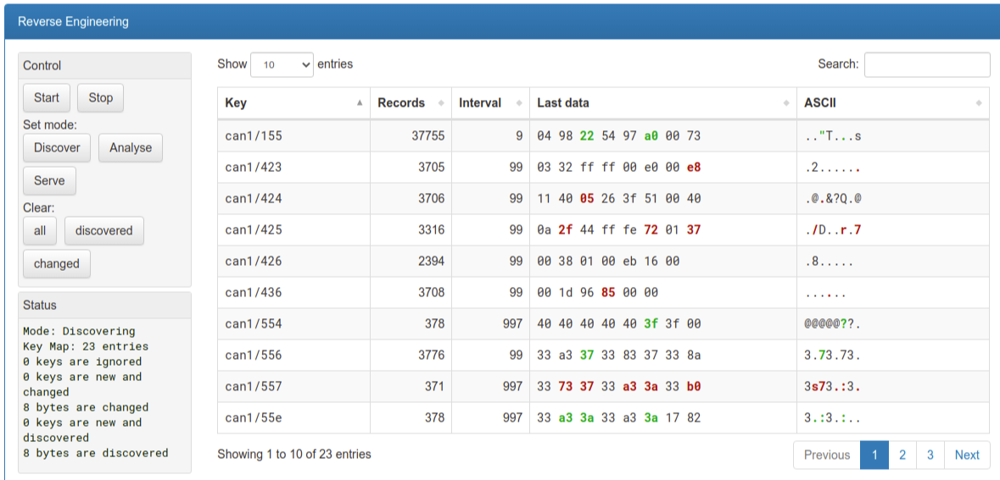

===============================
REtools: Reverse Engineering UI
===============================

**Preliminary web UI for the OVMS3 RE toolkit**

Version 0.1 by Michael Balzer <dexter@dexters-web.de>

This is a first implementation of a web frontend for the ``re`` commands.

You'll need some understanding of the ``re`` system, the UI lacks user guidance.
You can read about the ``re`` system on the developer list.

Feel free to improve and extend (and submit your results ;-)).

------------
Installation
------------

1. Install :download:`retools.htm` web plugin, recommended setup:

  - Type:    Page
  - Page:    ``/usr/retools``
  - Label:   RE Toolkit
  - Menu:    Tools
  - Auth:    Cookie

