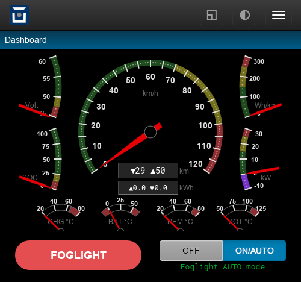

Example: Foglight
=================

This is an example for combining a script module implementing some functional extension
with a web plugin to provide a user interface.

The plugin realizes a fog light with automatic speed adaption, i.e. the light will be turned off
above a configurable speed and on again when the vehicle slows down again. It also switches off
automatically when the vehicle is parked.

The plugin shows how to…

  - read custom config variables
  - use module state variables
  - react to events
  - send custom events
  - read metrics
  - execute system commands
  - provide new commands
  - provide a web UI

Installation
------------

  - Save :download:`foglight.js <foglight/foglight.js.txt>` as ``/store/scripts/lib/foglight.js``
    (add the ``lib`` directory as necessary)
  - Add :download:`foglight.htm <foglight/foglight.htm.txt>` as a web hook type plugin
    at page ``/dashboard``, hook ``body.pre``
  - Execute ``script eval 'foglight = require("lib/foglight")'``

Optionally:

  - To test the module, execute ``script eval foglight.info()`` -- it should print config and state
  - To automatically load the module on boot, add the line
    ``foglight = require("lib/foglight");`` to ``/store/scripts/ovmsmain.js``

Commands / Functions
--------------------

The module provides two public API functions:

============================= ============================================
Function                      Description
============================= ============================================
``foglight.set(onoff)``       …switch fog light on (1) / off (0)
``foglight.info()``           …output config & state in JSON format
============================= ============================================

To call these from a shell, use ``script eval``. Example:

  - ``script eval foglight.set(1)``

Configuration
-------------

We'll add the configuration for this to the ``vehicle`` section:

========================= ========= ======================================
Config                    Default   Description
========================= ========= ======================================
``foglight.port``         1         …EGPIO output port number
``foglight.auto``         no        …yes = speed automation
``foglight.speed.on``     45        …auto turn on below this speed
``foglight.speed.off``    55        …auto turn off above this speed
========================= ========= ======================================

.. note::
  You can add arbitrary config instances to defined sections
  simply by setting them: ``config set vehicle foglight.auto yes``

To store the config for simple & quick script access and implement the defaults, we
introduce an **internal module member object** ``cfg``:

.. code-block:: javascript
  :caption: Module Plugin
  :lineno-start: 28

  var cfg = {
    "foglight.port":      "1",
    "foglight.auto":      "no",
    "foglight.speed.on":  "45",
    "foglight.speed.off": "55",
  };

By ``foglight = require(…)``, the module is added to the global name space as a javascript object.
This object can contain any internal standard javascript variables and functions.
Internal members are hidden by default, if you would like to expose the ``cfg`` object, you would simply
add a reference to it to the ``exports`` object as is done below for the API methods.

**Reading OVMS config variables from a script** currently needs to be done by executing ``config list``
and parsing the output. This is done by the ``readconfig()`` function:

.. code-block:: javascript
  :lineno-start: 42
  :emphasize-lines: 3,4,6,7

  function readconfig() {
    var cmdres, lines, cols, i;
    cmdres = OvmsCommand.Exec("config list vehicle");
    lines = cmdres.split("\n");
    for (i=0; i<lines.length; i++) {
      if (lines[i].indexOf("foglight") >= 0) {
        cols = lines[i].substr(2).split(": ");
        cfg[cols[0]] = cols[1];
      }
    }

Note that future OVMS releases will eventually add an OvmsConfig script API for direct
access to the config store.

Listen to Events
----------------

The module needs to listen to three events:

  - ``config.changed`` triggers reloading the configuration
  - ``ticker.1`` is used to check the speed once per second
  - ``vehicle.off`` automatically also turns off the fog light

The per second ticker is only necessary when the speed adaption is enabled, so we can use this to show
how to dynamically add and remove event handlers through the ``PubSub`` API:

.. code-block:: javascript
  :caption: Module Plugin
  :lineno-start: 52
  :emphasize-lines: 3,5

  // update ticker subscription:
  if (cfg["foglight.auto"] == "yes" && !state.ticker) {
    state.ticker = PubSub.subscribe("ticker.1", checkspeed);
  } else if (cfg["foglight.auto"] != "yes" && state.ticker) {
    PubSub.unsubscribe(state.ticker);
    state.ticker = false;
  }

``state`` is another internal object for our state variables.

Send Events
-----------

Sending custom events is a lightweight method to inform the web UI (or other plugins)
about simple state changes. In this case we'd like to inform listeners when the fog
light actually physically is switched on or off, so the web UI can give visual feedback
to the driver on this.

Beginning with firmware release 3.2.006 there is a native API ``OvmsEvents.Raise()``
available to send events.

Before 3.2.006 we simply use the standard command ``event raise``:

.. code-block:: javascript
  :caption: Module Plugin
  :lineno-start: 61
  :emphasize-lines: 6

  // EGPIO port control:
  function toggle(onoff) {
    if (state.port != onoff) {
      OvmsCommand.Exec("egpio output " + cfg["foglight.port"] + " " + onoff);
      state.port = onoff;
      OvmsCommand.Exec("event raise usr.foglight." + (onoff ? "on" : "off"));
    }
  }

The web plugin subscribes to the foglight events just as to any system event:

.. code-block:: javascript
  :caption: Web Plugin
  :lineno-start: 64
  :emphasize-lines: 3,5

  // Listen to foglight events:
  $('#foglight').on('msg:event', function(e, event) {
    if (event == "usr.foglight.on")
      update({ state: { port: 1 } });
    else if (event == "usr.foglight.off")
      update({ state: { port: 0 } });
    else if (event == "vehicle.off") {
      update({ state: { on: 0 } });
      $('#action-foglight-output').empty();
    }
  });

.. note::
  You can raise any event you like, but you shouldn't raise system events without
  good knowledge of their effects. Event codes are simply strings, so you're free
  to extend them. Use the prefix ``usr.`` for custom events to avoid potential
  conflicts with future system event additions.

Read Metrics
------------

Reading metrics is straight forward through the OvmsMetrics API:

.. code-block:: javascript
  :caption: Module Plugin
  :lineno-start: 74
  :emphasize-lines: 1

  var speed = OvmsMetrics.AsFloat("v.p.speed");

Use ``Value()`` instead of ``AsFloat()`` for non-numerical metrics.

.. note::
  You cannot subscribe to metrics changes directly (yet). Metrics can change thousands of
  times per second, which would overload the scripting capabilities. To periodically check
  a metric, register for a ticker event (as shown here).

Provide Commands
----------------

To add commands, simply expose their handler functions through the ``exports`` object. By this, users will be
able to call these functions using the ``script eval`` command from any shell, or from any script by
referencing them via the global module variable, ``foglight`` in our case.

.. code-block:: javascript
  :caption: Module Plugin
  :lineno-start: 99
  :emphasize-lines: 2

  // API method foglight.info():
  exports.info = function() {
    JSON.print({ "cfg": cfg, "state": state });
  }

``JSON.print()`` is a convenient way to communicate with a web plugin, as that won't need to parse some
potentially ambigous textual output but can simply use ``JSON.parse()`` to read it into a variable:

.. code-block:: javascript
  :caption: Web Plugin
  :lineno-start: 82
  :emphasize-lines: 3,4

  // Init & install:
  $('#main').one('load', function(ev) {
    loadcmd('script eval foglight.info()').then(function(output) {
      update(JSON.parse(output));

.. note::
  Keep in mind commands should always output some textual response indicating their action and result.
  If a command does nothing, it should tell the user so. If a command is not intended for shell use,
  it should still provide some clue about this when called from the shell.

Module Plugin
-------------

:download:`foglight.js <foglight/foglight.js.txt>` (hint: right click, save as)

|clearfix|

.. literalinclude:: foglight/foglight.js.txt
   :language: javascript
   :linenos:

Web Plugin
----------

:download:`foglight.htm <foglight/foglight.htm.txt>` (hint: right click, save as)

|clearfix|

.. literalinclude:: foglight/foglight.htm.txt
   :language: html
   :linenos:

