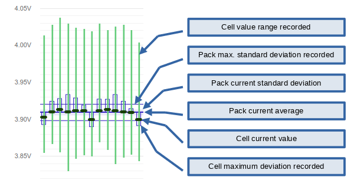

===============
Battery Monitor
===============

.. image:: bms-cell-monitor.png
   :width: 90%
   :align: center

The BMS cell monitor is a **live view** of the battery pack and cell status.
It shows all individual cell voltages and module temperatures recorded
by the BMS, their average values and standard deviations.

The battery monitoring availability and detail depends on the vehicle
adaptor to provide cell voltage and temperature measurements. The BMS
framework takes care of doing the statistics.

The OVMS BMS normally records over a typical usage period, i.e. a full
driving or charging period. You can also issue a reset manually any time
using the button (or command ``bms reset``).

All statistics (min/max values and deviations) relate to the recording
period, so a reset clears these, as well as the warning and alert status
of all cells.

Of course all data shown is also available as metrics, namely the
``v.b.p.`` (vehicle battery pack) and ``v.b.c.`` (vehicle battery cell)
range of metrics.

-----------
Chart Usage
-----------

Voltage and temperature sensors normally differ in number, as voltages
are measured for each cell bundle (cells connected in parallel), while
temperatures only are measured for a cell module (multiple cell bundles
connected in series). Accordingly the monitor is divided into a voltage
and a temperature chart.

Click on the chart series names below the charts to show/hide the
respective series or group of metrics in that chart.

The charts can be zoomed and pinched using the mouse or dual touch finger
gestures as usual. When zoomed, a zoom reset button is shown in the upper
right corner. To move the zoom window, hold the ``Ctrl`` key while clicking,
or tap and move two fingers. Note: horizontal zoom needs an up to date
firmware.

Hovering or clicking on a cell/module chart column will show the actual
values (numbers) in a small overlay window.

Values may change while viewing the chart, that's normal: the chart is
a live view of the actual current measurements. That allows to see how
the cells respond to sudden high loads.

-----------------------
Cell/Module Info Detail
-----------------------

-----------------
Overall Pack Info
-----------------

The table at the bottom shows the overall pack statistics in numbers.

This includes the overall cell/module averages, the maximum and minimum
voltage/temperature readings recorded, and the current and recorded maximum
standard deviation.

**On the cell gradient & max stddev deviation**: voltages are very volatile,
as current battery cells immediately react to load changes. A high discharge
pulse will lead to an instantaneous substantial drop of the cell voltages.

So, depending on how the vehicle's BMS does the measurements, a full series of
voltages may include such a change in between some cells. That would lead to
wrong standard deviations and possibly false alerts, so the BMS framework
analyses the full voltage series for a gradient, and ignores the series
if the configured threshold is exceeded.

The series is also ignored if the standard deviation exceeds the configured
"max stddev deviation" value. Combine both thresholds to filter unusable
series. The vehicle adaptor provides sensible default thresholds, but you
may need to adjust them depending on the age and health of your battery.

------------------------
Cell Alert Configuration
------------------------

Cell voltage and temperature warnings and alerts are triggered by cell
deviation from the current average. Warnings and alerts are detected by
the BMS framework in the background, so you don't need to keep the monitor
open to get them.

Deviations exceeding configured threshold are shown color coded, yellow
for warnings and red for alerts.  Alerts will also trigger text notifications
of type ``alert`` subtype ``batt.bms.alert`` unless disabled.

Click "Alert config" to change the thresholds or control text alert
notifications. Adjust the warning & alert thresholds as needed.

The vehicle adaptor provides reasonable defaults for the warning and alert
thresholds matching the specific type of battery normally built into the
vehicle, but you may need to change the thresholds to adapt to the quality
and age of your battery.

The BMS configuration can also be changed directly via the ``config``
command. The parameters are located under ``vehicle``, issue
``config list vehicle`` and look for parameter names including ``bms``.
In case you don't see any, save some custom values in the UI to create
them.

---------------------
Health Interpretation
---------------------

You generally want your cells to be as close together as possible in terms
of voltages and temperatures. When aging, deviations will rise, as internal
resistances rise.

The weakest cell normally defines the overall discharge and charge limits
of the pack, as the vehicle BMS normally cannot shift load around individual
cells -- current flows through all cells equally (more or less). A weak cell
will reach the safety cutoff limits first, causing the BMS to terminate
discharging or charging or to limit the power levels available.

The higher the pack standard deviation the worse the overall battery
performance. A high standard deviation is a sign for an old battery, or
for a new battery with a very poor cell matching (read: poor build
quality).

A high individual cell voltage deviation is a sign for a defective cell
that should be checked and possibly replaced as soon as possible to avoid
further damage.

A high voltage drop under load implies a high internal resistance and/or
some chemical defect.

A high positive temperature deviation of a cell or module can be a sign for
a chemical defect (e.g. dendrites causing short circuits) or for a bad
connector (e.g. a lose screw). Both not only degrade the overall pack
performance but can lead to battery fires in the worst case, so must be
addressed as soon as possible.

Some temperature & voltage deviation may be normal, caused by the layout
of the cells in your vehicle: cells placed closer to the outside will
have a higher temperature variance than those deep within the pack, and
a cell with higher temperature will have a higher voltage stability.

Also keep in mind, not all deviations may be caused by actual battery
issues. Voltage and temperature sensors can lose their calibration or
become defective as well.

