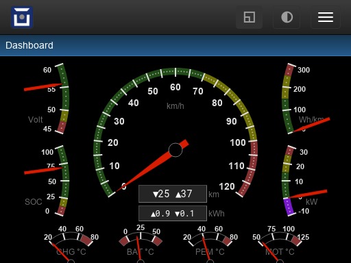

Dashboard
=========

A refined and configurable version of this plugin has been added to the standard
OVMS web UI and gets automatically configured by the vehicle modules with their
respective vehicle parameters.

It's a good example of the Highcharts gauge chart options and shows how to
combine multiple gauge charts into a single container (div ``#gaugeset1``)
and how to style the charts using CSS.

It also includes a simple test data generator so can be tested without actual
vehicle data.

To add a new vehicle parameter set for the standard dashboard, simply override the
``GetDashboardConfig()`` method in your vehicle class. Have a look at the
existing overrides (for example Twizy, Kia Soul, Smart ED, …).

**Install**: not necessary for the standard dashboard. If you're going to build
your own dashboard from this, install it as a ``page`` type plugin.

:download:`dashboard.htm <../dev/dashboard.htm>` (hint: right click, save as)

|clearfix|

.. literalinclude:: ../dev/dashboard.htm
   :language: html
   :linenos:
