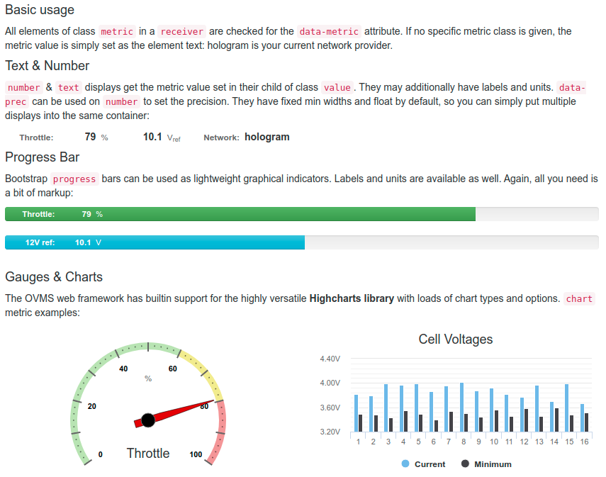
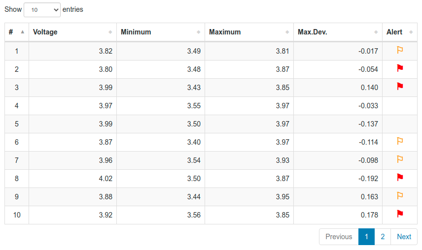

===============
Metric Displays
===============

OVMS V3 is based on metrics. Metrics can be single numerical or textual values or complex values
like sets and arrays. The web framework keeps all metrics in a global object, which can be read
simply by e.g. ``metrics["v.b.soc"]``.

Metrics updates (as well as other updates) are sent to all DOM elements having the
``receiver`` class. To hook into these updates, simply add an event listener for
``msg:metrics``.

Listening to the event is not necessary though if all you need is some metrics
display. This is covered by the ``metric`` widget class family as shown here.

----------------------
Single Values & Charts
----------------------

The following example covers…

- Text (String) displays
- Number displays
- Progress bars (horizontal light weight bar charts)
- Gauges
- Charts

Gauges & charts use the HighCharts library, which is included in the web server. The other widgets
are simple standard Bootstrap widgets extended by an automatic metrics value update mechanism.

Highcharts is a highly versatile charting system. For inspiration, have a look at:

- https://www.highcharts.com/demo
- https://www.highcharts.com/docs

We're using `styled mode <https://www.highcharts.com/docs/chart-design-and-style/style-by-css>`_
so some options don't apply, but everything can be styled by standard CSS.

Install the example as a web page plugin:

:download:`metrics.htm <../dev/metrics.htm>` (hint: right click, save as)

.. literalinclude:: ../dev/metrics.htm
   :language: html
   :linenos:

-------------
Vector Tables
-------------

Some metrics, for example the battery cell voltages or the TPMS tyre health data, may contain 
vectors of arbitrary size. Besides rendering into charts, these can also be displayed by their 
textual values in form of a table.

The following example shows a live view of the battery cell voltages along with their recorded 
minimum, maximum, maximum deviation and current warning/alert state. Alert states 0-2 are translated 
into icons.

The metric table widget uses the DataTables library, which is included in the web server. The 
DataTables Javascript library offers a wide range of options to create tabular views into 
datasets.

Install the example as a web page plugin:

:download:`metrics-table.htm <../dev/metrics-table.htm>` (hint: right click, save as)

.. literalinclude:: ../dev/metrics-table.htm
   :language: html
   :linenos:
