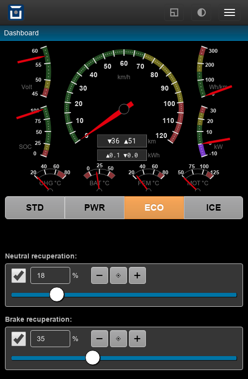

Twizy: Dashboard Tuning Plugin
==============================

This plugin adds two sliders to adjust neutral and braking recuperation levels to the dashboard.

The sliders listen to driving profile changes and update accordingly.

If not yet logged in, the sliders are disabled.

**Install**: add the plugin as a ``hook`` type to page ``/dashboard``, hook ``body.pre``.

:download:`dashboard-tuneslider.htm <../../dev/plugin-twizy/dashboard-tuneslider.htm>` (hint: right click, save as)

|clearfix|

.. literalinclude:: ../../dev/plugin-twizy/dashboard-tuneslider.htm
   :language: html
   :linenos:
