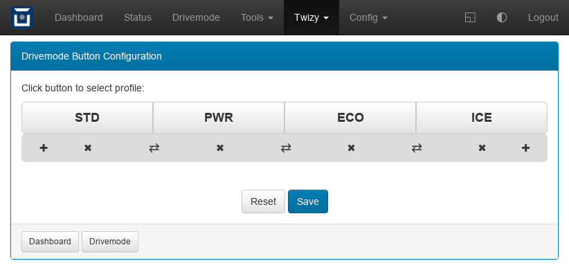

Twizy: Drivemode Button Editor
==============================

This plugin has been added to the Twizy code. It's used here as a more complex
example of what can be done by plugins.

It's an editor for the drivemode buttons the Twizy adds to the dashboard for
quick tuning profile changes. The editor allows to change the layout (number
and order of buttons) and the profiles to use.

It includes a profile selector built with the dialog widget, that retrieves
the available profiles from the OVMS config store.

**Install**: not necessary if vehicle Twizy is configured (see "Twizy" menu). If
you'd like to test this for another vehicle, add as a ``page`` plugin e.g. ``/test/dmconfig``.

:download:`drivemode-config.htm <../../dev/plugin-twizy/drivemode-config.htm>` (hint: right click, save as)

.. literalinclude:: ../../dev/plugin-twizy/drivemode-config.htm
   :language: html
   :linenos:
