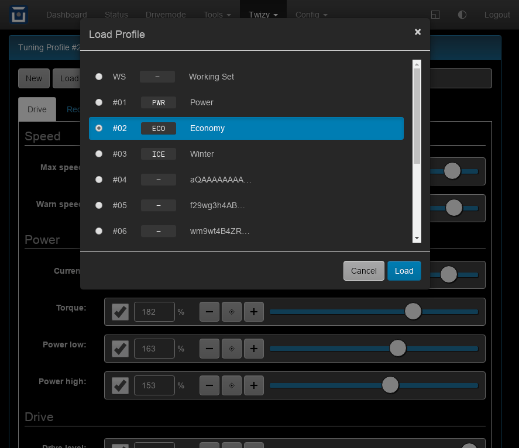

Twizy: Tuning Profile Editor
============================

This plugin has been added to the Twizy code. It's used here as a more complex
example of what can be done by plugins.

It's a full featured SEVCON tuning profile editor including dialogs to load & save
profiles from the OVMS configuration and to create & read base64 profile codes.

See Twizy documentation for details on tuning profiles and capabilities.

**Install**: not necessary if vehicle Twizy is configured (see "Twizy" menu). If
you'd like to test this for another vehicle, add as a ``page`` plugin e.g. ``/test/profed``.

:download:`profile-editor.htm <../../dev/plugin-twizy/profile-editor.htm>` (hint: right click, save as)

|clearfix|

.. literalinclude:: ../../dev/plugin-twizy/profile-editor.htm
   :language: html
   :linenos:
