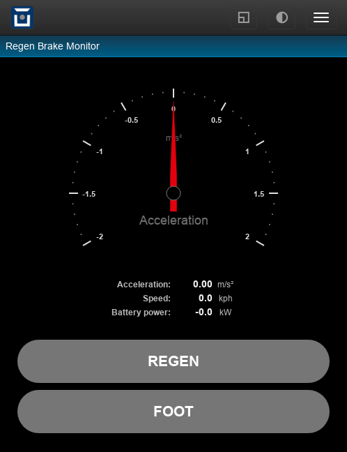

Regen Brake Monitor
===================

This plugin defines a page including an acceleration level gauge chart, number metrics
for the acceleration, speed and battery power and two large indicators for the
regen brake light and the brake pedal state.

It's useful to fine tune the regen brake settings, as you can monitor the actual
deceleration levels while driving and check the smoothing level.

**Install**: add the source as a ``page`` plugin, e.g. ``/dev/regenmon``.

:download:`regenmon.htm <../dev/regenmon.htm>` (hint: right click, save as)

|clearfix|

.. literalinclude:: ../dev/regenmon.htm
   :language: html
   :linenos:
