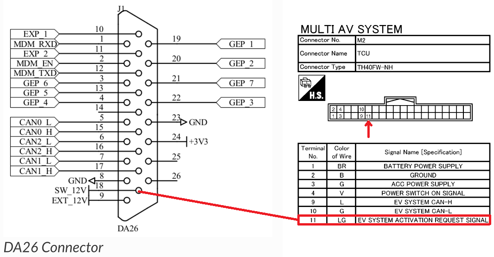
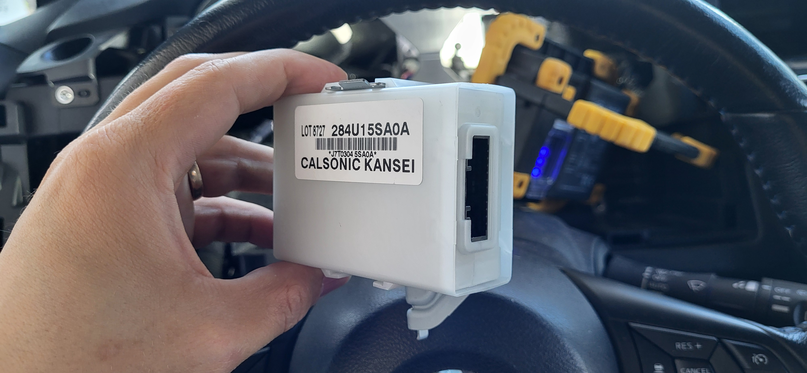
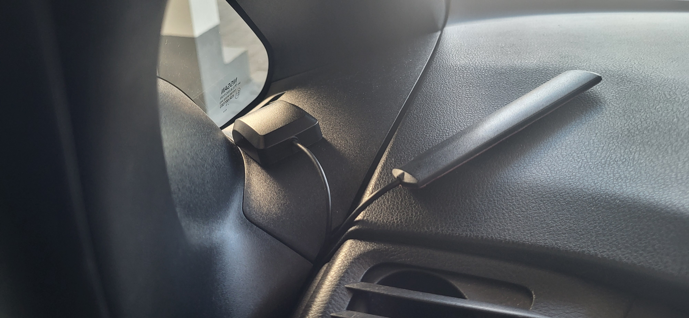
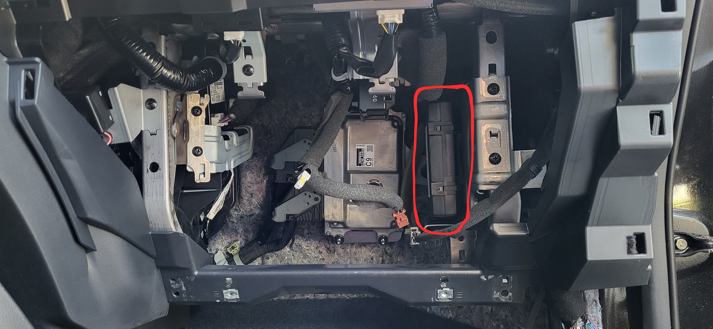
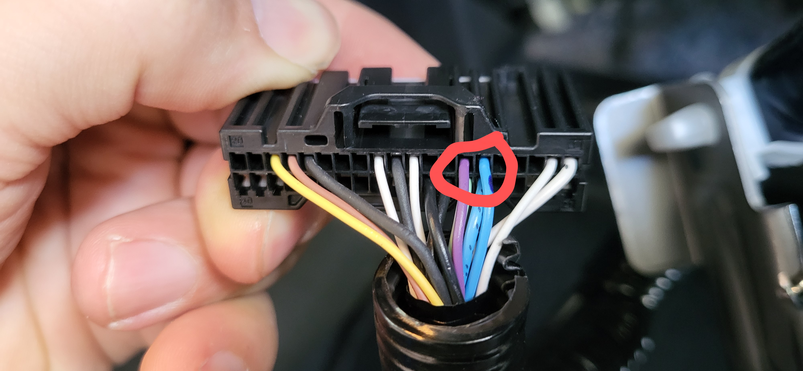
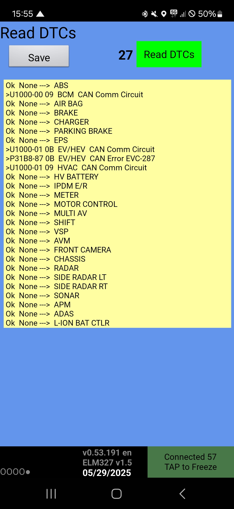
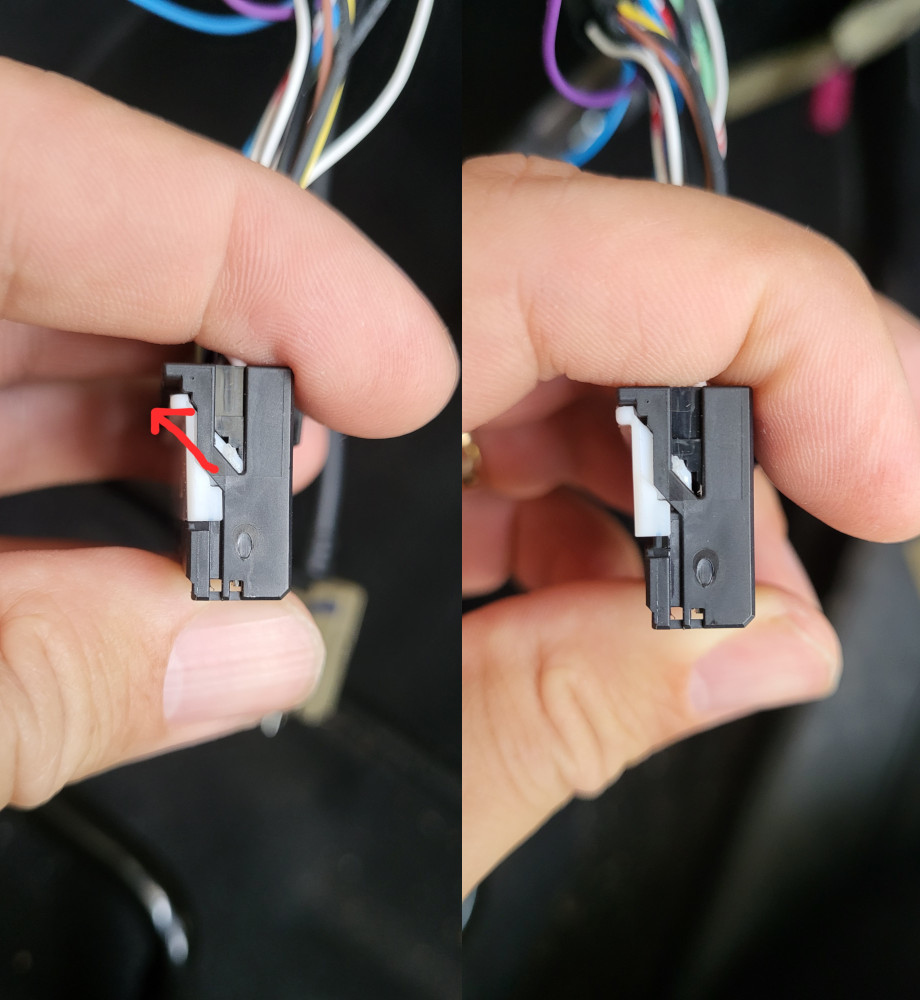
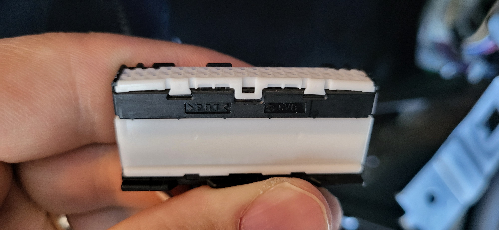
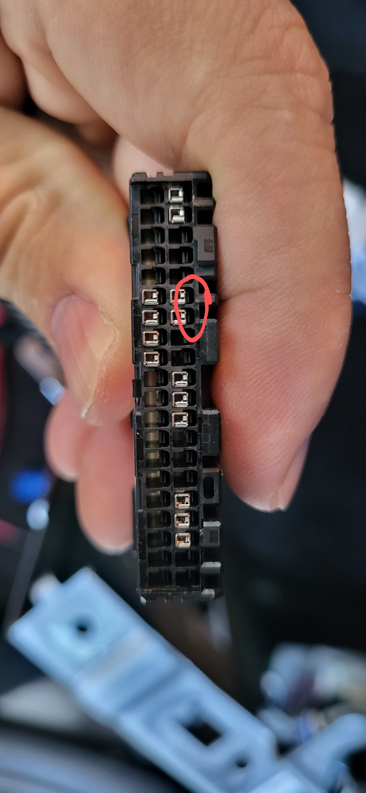
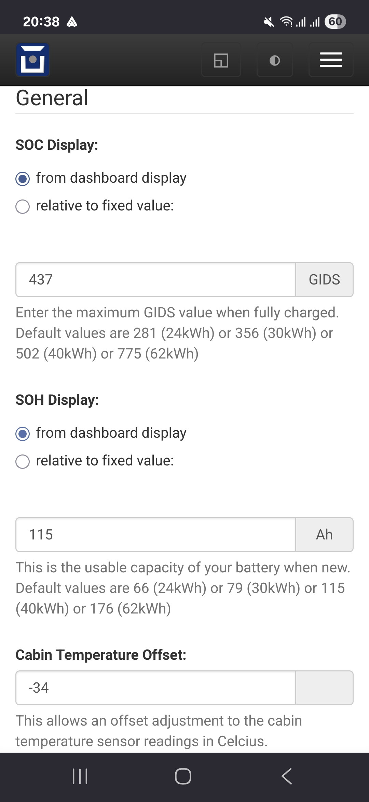

===================
Nissan Leaf/e-NV200
===================

Vehicle Type: **NL**

This vehicle type supports all Nissan Leaf ZE0 and ZE1 models, as well as all Nissan e-NV200 models. Vehicles with custom or upgraded battery packs, such as those from Muxsan, are also supported.

Note that in some regions, ZE0 and ZE1 models may be referred to as AZE0 and AZE1, respectively. For simplicity, this document uses ZE0 and ZE1 throughout.

----------------
Support Overview
----------------

^^^^^^^^
Hardware
^^^^^^^^

=========================== ==============
Item                        Support Status
=========================== ==============
Module                      Any OVMS v3 (or later) module.
Vehicle Cable               1779000 For ZE0 models Nissan Leaf OBD-II to DB9 Data Cable for OVMS. For ZE1 models, separate CAN tapping cable and DB9 connector are required [5]_ (see info below).
GSM Antenna                 1000500 Open Vehicles OVMS GSM Antenna (or any compatible antenna).
GPS Antenna                 1020200 Universal GPS Antenna (SMA Connector) (or any compatible antenna).
=========================== ==============

^^^^^^^^
Controls
^^^^^^^^

=========================== ==============
Function                    Support Status
=========================== ==============
Charge Control              Start and stop charge
Cabin Pre-heat/cool Control Yes [1]_ (see info below)
Lock/Unlock Vehicle         Yes [3]_ (see info below)
Valet Mode Control          Not supported
=========================== ==============

^^^^^^^^^^^^^^^^^^^
Additional Features
^^^^^^^^^^^^^^^^^^^

=========================== ==============
Feature                     Description
=========================== ==============
BMS Cell Monitor            Allows to monitor individual battery cells in a configurable chart. Can be accessed from web user interface accessible over WiFi.
Charge to Limit             Allows to automatically stop the charge when target SOC (state of charge) and/or range is reached. All parameters can be controlled through metrics or web user interface. Meanwhile Range and SOC can be controlled from the app as well, by adjusting fields 10 (SOC) and 11 (range) in feature section accessible through app settings.
=========================== ==============

^^^^^^^
Metrics
^^^^^^^

=========================== ==============
Item                        Support Status
=========================== ==============
SOC                         Yes (by default based on GIDS) [4]_
Range                       Yes (by default based on GIDS)
GPS Location                Yes (from modem module GPS)
Speed                       Yes (from vehicle speed PID)
Cabin Temperature           Yes (from vehicle temperature PIDs)
Ambient Temperature         Yes (from vehicle temperature PIDs)
SetPoint Temperature        Yes (from vehicle HVAC PIDs) [2]_
HVAC Fan Speed              Yes (from vehicle HVAC PIDs) [2]_
HVAC Heating/Cooling Status Yes (from vehicle HVAC PIDs) [2]_
HVAC On Status              Yes (from vehicle HVAC PIDs) [2]_
HVAC Temperature Setpoint   Yes (from vehicle HVAC PIDs) [2]_
HVAC Ventilation Mode       Yes (from vehicle HVAC PIDs) [2]_
BMS v+t                     Yes
TPMS                        Yes (If hardware available)
Charge Status               Yes
Charge Interruption Alerts  Yes
=========================== ==============

.. [1] OVMS currently supports all models of Nissan LEAF and all models of Nissan e-NV200

.. [2] Some HVAC Status Items have been only verified with 2013-2016 cars and will only work if the year is set in configuration. Also HVAC needs to be in ON position before powering down the vehicle for the metrics to work during pre-heat.

.. [3] Lock/Unlock will work if CAR can bus is awake, this can be activated by turning on A/C. Locking only appears to work for models 2016 onwards or 30kWh models. `GitHub issue <https://github.com/openvehicles/Open-Vehicle-Monitoring-System-3/issues/231>`_

.. [4] For ZE0 (2011-2013) vehicles, select the "relative to fixed value" option for SOC display, as the "from dashboard display" method is not supported on these models. For ZE1 (2018+) vehicles, use the "from dashboard display" option for SOC. For further details, see the troubleshooting section :ref:`soc-and-soh-values-showing-0`.

.. [5] For ZE1 models, a separate 8-wire CAN tap cable and DB9 connector are required. The standard OBD-II to DB9 cable supplied with OVMS cannot be used, as it only has 6 wires. Additionally, the OBD-II port itself cannot be used because the vehicle’s CAN gateway module powers down when the ignition is off, isolating the port from the rest of the vehicle. Instead, you need to build an adapter cable to tap into the CAN buses going to the CAN gateway module located behind the instrument cluster. See the :ref:`2018+ models (ZE1)` for more details.

----------------------
Remote Climate Control
----------------------

^^^^^^^^^^^^^^^^^^^^^^^^
2014-2022 e-NV200 models
^^^^^^^^^^^^^^^^^^^^^^^^

OVMS remote climate support will 'just work' on e-Nv200 Visia/Acenta which don't have a Nissan satnav headunit.
For Tekna models which are fitted with a Nissan satnav headunit, follow the instructions below for a 2013-2016 LEAF to unplug the TCU

IMPORTANT: for remote climate to work on the e-NV200, the model year in OVMS should be set to 2015 regardless of the the actual model year of the vehicle. CAN writing also needs to be enabled.

The model year can be set in the web interface or via the command:

``config set xnl modelyear 2015``

^^^^^^^^^^^^^^^^^^^^^^^^^^^
2011-2012 LEAF models (ZE0)
^^^^^^^^^^^^^^^^^^^^^^^^^^^

Gen1 LEAFs (ZE0, 2011-2012) require a hardware modification to enable remote climate control if the vehicle is not plugged in and charging. If you are ok with this, you don't need to do anything further.

If you want to to enable remote climate control once the charge has finished, or if the vehicle is not plugged in, you need to do the following hardware modification. A cable wired to the pin 11 of Nissan TCU (Telematics Control Unit) needs to receive +12V so that "EV System Activation Request Signal" can be generated, which in turn allows to trigger climate control independently. This can be achieved by wiring the pin 18 (Ext 12V) from the OVMS DA26 socket to the cable going to pin 11 of the TCU by using a standard single conductor wire. The connection on the OVMS DA26 side can be made by using dedicated DA26 connector or a standard round 1mm jumper cable. Here's how to wire it up:

Meanwhile on the TCU side the cable can be soldered or spliced in to by using a connector of your choice. When done, the original TCU can be left unplugged. `See this page for additional pictures <https://www.mynissanleaf.com/viewtopic.php?f=37&t=32935>`_.

.. image:: images/TCU.png
    :width: 700px

If you have a "smart" EVSE (or one connected to a "smart" outlet, you can sometimes wake up the EV system by turning it off, then back on. This obviously only helps if your vehicle is plugged in, but may be useful for some users.

^^^^^^^^^^^^^^^^^^^^^^^^^^^^^^^
2013-2016 LEAF models (ZE0-0/1)
^^^^^^^^^^^^^^^^^^^^^^^^^^^^^^^

To use OVMS to activate remote climate the Nissan TCU (Telematics Control Unit) module must be unplugged if fitted e.g. satnav headunit (only on Acenta and Tekna models). The TCU is located behind the glovebox on LHD cars or on the right hand side of the drivers foot well on RHD cars. The large white plug on the rear of the TCU should be unplugged, push down tab in the middle and pull to unplug, `see video for RHD cars <https://photos.app.goo.gl/MuvpCaXQUjbCdoox6>`_ and `this page for LHD cars <http://www.arachnon.de/wb/pages/en/nissan-leaf/tcu.php>`_.

Note: Unplugging the TCU will disable Nissan EV connect / CARWINGS features e.g. Nissan mobile app. All other car functions will not be effected e.g. GPS, maps, radio, Bluetooth, microphone all work just the same as before. OVMS can be used to more than substitute the loss of Nissan Connect features. The TCU can be plugged back in at any point in the future if required.

OVMS remote climate support will 'just work' on LEAF Visia models and Visia/Acenta e-NV200 since these models do not have a TCU fitted. In the US these base models are called S.

Note: If you prefer not to unplug the Nissan TCU, all OVMS functions appart from remote climate will function just fine alongside the Nissan TCU.

^^^^^^^^^^^^^^^^^^^^^^^^^^^^^
2016-2017 LEAF models (ZE0-2)
^^^^^^^^^^^^^^^^^^^^^^^^^^^^^

**Remote climate control will only work when plugged in and actively charging on LEAF 2016-2017 models.** This is because in 2016 Nissan moved the TCU from the EV CAN bus to the CAR CAN bus.

Set the model year as follows and if necessary configure 30 kWh model:

``config set xnl modelyear 2016``

or

``config set xnl modelyear 2017``

*Note: in latest OVMS fimware version model year and battery size can be set via the web config interface.*

.. _2018+ models (ZE1):

^^^^^^^^^^^^^^^^^^
2018+ models (ZE1)
^^^^^^^^^^^^^^^^^^

With all ZE1 models, The OBD-II port cannot be directly used because it is isolated from the rest of the vehicle by a CAN gateway module. The module will power down when the ignition is off and it will isolate the port from the rest of the vehicle. Meaning that you cannot send messages to the CAN bus anymore. Instead, you need to tap the CAN busses going to the CAN gateway behind the instrument cluster. You will need to build an adapter cable to plug into the CAN gateway port. The OBD-II cable coming with the OVMS module is not suitable for this purpose, as it only has 6 wires and the ZE1 models require an 8-wire CAN tap cable. This also means you cannot re-use the DB9 connector from the cable as all the needed wires are not connected. In other words this means you need to build the whole cable yourself.

Making the CAN tap cable
^^^^^^^^^^^^^^^^^^^^^^^^

It is easiest if you source pre made parts and modify them to suit your needs. The parts you need are:

* DB9 female connector to connect to the CAN tap cable, e.g.: https://www.aliexpress.com/item/1005006083154220.html
* 24 pin male and female connector to connect in between the CAN gateway and the original 24 pin male connector going into the CAN gateway, e.g.: https://www.aliexpress.us/item/3256805736323340.html

Detailed wiring instructions can be seen in :download:`this pdf<images/Leaf-ZE1-CAN-Tap-Wiring.pdf>`.
These instructions are taken from `this GitHub issue comment <https://github.com/openvehicles/Open-Vehicle-Monitoring-System-3/issues/323#issuecomment-2227069811>`_, thanks to @samr037. The example uses an intermediate CAT5 cable connector, but you can also wire the DB9 connector directly. `Here <https://nissanleaf.carhackingwiki.com/index.php/M101_(6CH_CAN_Gateway)>`_ is the CAN gateway 24 pin connector pinout for reference.

The final cable should look like the one in the image below.

.. image:: images/Leaf-CAN-Tap.jpg
    :width: 700px

Installing the CAN tap cable
^^^^^^^^^^^^^^^^^^^^^^^^^^^^

Once you have the cable, you will need to remove the instrument cluster to access the CAN gateway module behind it. Before you start disassembling the car, remove the 12V battery connection to avoid generating any error codes! If you have Leaf Spy Pro available, you can clear the error codes after the installation is complete.

Removing the instrument cluster may sound difficult at first, but in reality, it's quite easy to do. A step-by-step video guide for removing the instrument cluster is available here: https://www.youtube.com/watch?v=gkA1WDu8cq0&si=kII9XvEiAaXgggma. Once the instrument cluster is removed, the module is the one circled in the image below.

.. image:: images/ze1-can-gateway-behind-instrument-cluster.jpg
   :width: 700px

The CAN gateway is shown in the image below and can be removed by loosening a single screw.

After removing the instrument cluster, you need to connect the CAN tap cable between the module and the original 24-pin male header. Then, you can easily route the DB9 cable from behind the cluster to the area behind the driver's footwell cover, where you can conveniently access the OVMS module.

At this point, you can also route and connect the GPS and GSM antennas to the OVMS module. Both antennas can be placed on the dashboard on the left, as shown in the image below, and the wires can be tucked between the plastic panels. You can also place them elsewhere, as long as they have good signal reception.

Disabling the TCU for remote climate control
^^^^^^^^^^^^^^^^^^^^^^^^^^^^^^^^^^^^^^^^^^^^

If your car is equipped with a TCU (Telematics Control Unit), OVMS remote climate control will not work. If you do not have this module, then your installation is complete, as all other supported OVMS functions will work.

This module is used by the Nissan Connect app to connect to your car over the network. More information about the module is available here: `Telematics Control Unit (TCU) <https://nissanleaf.carhackingwiki.com/index.php/Telematics_Control_Unit_(TCU)>`_. This module will override the remote climate control CAN messages that OVMS is trying to send.

To get the remote climate control working. You need to unpin or cut the 2 CAN wires from TCU and leave the rest of the module connected. You could also unplug the whole TCU, which would do the same thing, but then the hands-free microphone will not work anymore. The reason is that the microphone line is running through same TCU connector for some reason. That's why it's recommended to leave the TCU connected and just unpin or cut the CAN wires.

The TCU is located behind the glovebox on LHD cars or on the right hand side of the drivers foot well on RHD cars. On the LHD cars how to remove the glovebox, watch this video https://www.youtube.com/watch?v=qHyt0eoKNOc.
After removing the glovebox, the TCU module is the one circled in the image below. The image is from an LHD car.

After this you need to unpin or cut these two wires 2 circled in the image below. Before doing this double check the wiring and pin information from the `TCU wikipage <https://nissanleaf.carhackingwiki.com/index.php/Telematics_Control_Unit_(TCU)#M67_(NAM)>`_. To see how to unpin the wires, see the section :ref:`unpinning-the-tcu-wires`.

An important consequence of doing this is that the car will permanently report error codes, and even after clearing them, they will reappear. These should not have any negative effects on the car, but you should be aware of this. See the error codes read by Leaf Spy Pro in the image below.

.. _unpinning-the-tcu-wires:

Unpinning the TCU wires
^^^^^^^^^^^^^^^^^^^^^^^

Unpinning the wires may vary between models, but the following steps worked for the 2018 ZE1 model. This method is better than cutting the wires, because if you later decide to remove the OVMS from the vehicle, you can simply push the pins back into the connector and it will look like the original.

First, lift the white plastic cover on the connector in the direction of the arrow shown in the image on the left. The plastic cover will then move to the position shown on the right.

Then you need to remove the top white plastic cover by prying it off with something small. In the image, the plastic cover appears slightly bent due to the removal process.

After removing it, use a very small metal piece, such as a needle or a very small flat screwdriver, to push into the hole circled in the image below and gently pull the wire out from the other side. The wire should come out easily. If it does not, you may need to push the needle a bit further in to release the pin lock. Be careful not to damage the wire while doing this.

Other TCU disconnection methods
^^^^^^^^^^^^^^^^^^^^^^^^^^^^^^^

Some people have also successfully disconnected the whole TCU, as discussed in the following thread: https://www.openvehicles.com/node/3809. However, this involves soldering a 5V regulator and connecting the microphone lines together. If tested successfully, the information could be updated here.

^^^^^^^^^^^^^^^^^^^^^^^^
Specific battery configs
^^^^^^^^^^^^^^^^^^^^^^^^

For models with a 30 kWhr battery pack, set the capacity manually with:

``config set xnl maxGids 356``
``config set xnl newCarAh 79``

For models with a 40 kWhr battery pack, set the capacity manually with:

``config set xnl maxGids 502``
``config set xnl newCarAh 115``

For models with a 62 kWhr battery pack, set the capacity manually with:

``config set xnl maxGids 775``
``config set xnl newCarAh 176``

*Note: In latest OVMS firmware version, model year and battery size can be set via the web config interface. This is easier and also the preferred method.*

*Note 2: OVMS fully supports battery upgraded LEAFs, just set the capacity according to what battery is currently installed.*

-----------------
Range Calculation
-----------------

The OVMS uses two configuration options to calculate remaining range, whPerGid (default 80Wh/gid) and kmPerKWh (default 7.1km/kWh). The range calculation is based on the remaining GIDS reported by the LBC and at the moment does not hold 5% in reserve like Leaf Spy. Feedback on this calculation is welcomed.

-----------------
Troubleshooting
-----------------

.. _soc-and-soh-values-showing-0:

^^^^^^^^^^^^^^^^^^^^^^^^^^^^
SOC and SOH values showing 0
^^^^^^^^^^^^^^^^^^^^^^^^^^^^

If your SOC (State of Charge) and SOH (State of Health) values for ZE1 (2018+) models are showing 0. You may need to change the SOC and SOH display settings to "relative to fixed value" in the web interface and adjust the GIDS value to match the battery capacity you have when fully charged.

-----------------
Resources
-----------------

- GitHub issue for adding the Leaf ZE1 support https://github.com/openvehicles/Open-Vehicle-Monitoring-System-3/issues/323.
- Nissan LEAF support added by Tom Parker, see `his wiki <https://carrott.org/emini/Nissan_Leaf_OVMS>`_ for lots of documentation and resources. Some info is outdated e.g. climate control now turns off automatically.
- Nissan LEAF features are being added by Jaunius Kapkan, see `his github profile <https://github.com/mjkapkan/Open-Vehicle-Monitoring-System-3>`_ to track the progress.
- `MyNissanLEAF thread for Nissan CANbus decoding discussion <http://www.mynissanleaf.com/viewtopic.php?f=44&t=4131&hilit=open+CAN+discussion&start=440>`_
- Database files (.DBC) for ZE0, ZE0 & ZE1 Leaf can be found here: `Github LEAF Canbus database files <https://github.com/dalathegreat/leaf_can_bus_messages>`_
- Polling information for ZE1 can be found here: https://drive.google.com/file/d/1jH9cgm5v23qnqVnmZN3p4TvdaokWKPjM/view
- `Nissan Leaf Car Hacking Wiki <https://nissanleaf.carhackingwiki.com>`_ - a great resource for information on the Nissan Leaf and it's components.
- Discord server related to the firmware releases here https://discord.gg/BDDMzr86dh. Taken from the GitHub comment here https://github.com/openvehicles/Open-Vehicle-Monitoring-System-3/issues/323#issuecomment-2720235567.
- A blog post how to integrate Nissan Leaf ZE1 with Home Assistant https://blog.jingo.uk/notes-on-integrating-a-nissan-leaf-ze1-and-home-assistant/.
- Repo about TCU reverse engineering https://github.com/developerfromjokela/nissan-leaf-tcu/.
