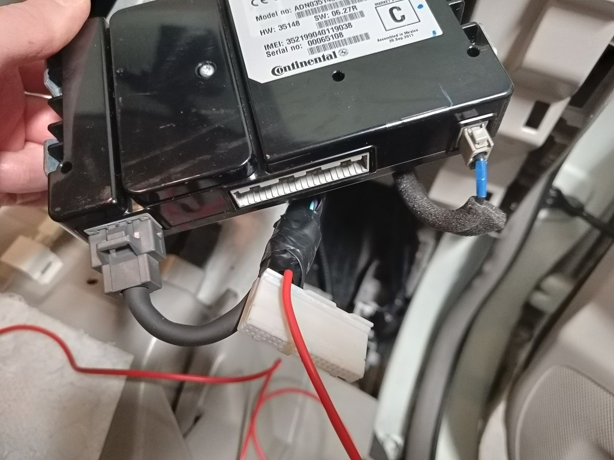

===================
Nissan Leaf/e-NV200
===================

Vehicle Type: **NL**

This vehicle type supports the Nissan Leaf (24kWh & 30kWh) and Nissan e-NV200 (24kWh & 40kWh).

----------------
Support Overview
----------------

^^^^^^^^^^^^^^^^
Hardware
^^^^^^^^^^^^^^^^

=========================== ==============
Item                        Support Status
=========================== ==============
Module                      Any OVMS v3 (or later) module. Vehicle support: 2011+ (24,30, 40, 62kWh LEAF, 24kWh & 40KWh e-Nv200 & custom battery e.g. Muxsan)
Vehicle Cable               1779000 Nissan Leaf OBD-II to DB9 Data Cable for OVMS, CAN tap cable for AZE1 models.
GSM Antenna                 1000500 Open Vehicles OVMS GSM Antenna (or any compatible antenna)
GPS Antenna                 1020200 Universal GPS Antenna (SMA Connector) (or any compatible antenna)
=========================== ==============

^^^^^^^^^^^^^^^^
Controls
^^^^^^^^^^^^^^^^

=========================== ==============
Function                    Support Status
=========================== ==============
Charge Control              Start and stop charge
Cabin Pre-heat/cool Control Yes [1]_ (see info below)
Lock/Unlock Vehicle         Yes [3]_ (see info below)
Valet Mode Control          Not currently supported
=========================== ==============

^^^^^^^^^^^^^^^^^^^
Additional Features
^^^^^^^^^^^^^^^^^^^

=========================== ==============
Feature                     Description
=========================== ==============
BMS Cell Monitor            Allows to monitor individual battery cells in a configurable chart. Can be accessed from web user interface accessible over WiFi.
Charge to Limit             Allows to automatically stop the charge when target SOC (state of charge) and/or range is reached. All parameters can be controlled through metrics or web user interface. Meanwhile Range and SOC can be controlled from the app as well, by adjusting fields 10 (SOC) and 11 (range) in feature section accessible through app settings.
=========================== ==============

^^^^^^^^^^^^^^^^
Metrics
^^^^^^^^^^^^^^^^

=========================== ==============
Item                        Support Status
=========================== ==============
SOC                         Yes (by default based on GIDS) [4]_
Range                       Yes (by default based on GIDS)
GPS Location                Yes (from modem module GPS)
Speed                       Yes (from vehicle speed PID)
Cabin Temperature           Yes (from vehicle temperature PIDs)
Ambient Temperature         Yes (from vehicle temperature PIDs)
SetPoint Temperature        Yes (from vehicle hvac PIDs) [2]_
HVAC Fan Speed              Yes (from vehicle hvac PIDs) [2]_
HVAC Heating/Cooling Status Yes (from vehicle hvac PIDs) [2]_
HVAC On Status              Yes (from vehicle hvac PIDs) [2]_
HVAC Temperature Setpoint   Yes (from vehicle hvac PIDs) [2]_
HVAC Ventilation Mode       Yes (from vehicle hvac PIDs) [2]_
BMS v+t                     Yes
TPMS                        Yes (If hardware available)
Charge Status               Yes
Charge Interruption Alerts  Yes
=========================== ==============

.. [1] OVMS currently supports all models of Nissan LEAF and all models of Nissan e-NV200

.. [2] Some HVAC Status Items have been only verified with 2013-2016 MY cars and will only work if the year is set in configuration. Also HVAC needs to be in ON position before powering down the vehicle for the metrics to work during pre-heat.

.. [3] Lock/Unlock will work if CAR can bus is awake, this can be activated by turning on A/C. Locking only appears to work for models 2016 onwards or 30kWh models. `GitHub issue <https://github.com/openvehicles/Open-Vehicle-Monitoring-System-3/issues/231>`_

.. [4] ZE0 (2011-2013) vehicles are required to choose SoC display from "relative to fixed value", "dashboard display" SoC method does not work with these vehicles. AZE1 (2018+) models need to choose the "dashboard display" SoC method.

----------------------
Remote Climate Control
----------------------

^^^^^^^^^^^^^^^^^^^^^^^^
2014-2022 e-NV200 models
^^^^^^^^^^^^^^^^^^^^^^^^

OVMS remote climate support will 'just work' on e-Nv200 Visia/Acenta which don't have a Nissan satnav headunit. 
For Tekna models which are fitted with a Nissan satnav headunit, follow the instructions below for a 2013-2016 LEAF to unplug the TCU

IMPORTANT: for remote climate to work on the e-NV200, the model year in OVMS should be set to 2015 regardless of the the actual model year of the vehicle. CAN writing also needs to be enabled.  

The model year can be set in the web interface or via the command: 

``config set xnl modelyear 2015``

^^^^^^^^^^^^^^^^^^^^^^^^^^^
2011-2012 LEAF models (ZE0)
^^^^^^^^^^^^^^^^^^^^^^^^^^^

Gen1 LEAFs (ZE0, 2011-2012) require a hardware modification to enable remote climate control if the vehicle is not plugged in and charging. If you are ok with this, you don't need to do anything further.

If you want to to enable remote climate control once the charge has finished, or if the vehicle is not plugged in, you need to do the following hardware modification. A cable wired to the pin 11 of Nissan TCU (Telematics Control Unit) needs to receive +12V so that "EV System Activation Request Signal" can be generated, which in turn allows to trigger climate control independently. This can be achieved by wiring the pin 18 (Ext 12V) from the OVMS DA26 socket to the cable going to pin 11 of the TCU by using a standard single conductor wire. The connection on the OVMS DA26 side can be made by using dedicated DA26 connector or a standard round 1mm jumper cable. Here's how to wire it up:

.. image:: SchematicLEAF.png
    :width: 480px

Meanwhile on the TCU side the cable can be soldered or spliced in to by using a connector of your choice. When done, the original TCU can be left unplugged. `See this page for additional pictures <https://www.mynissanleaf.com/viewtopic.php?f=37&t=32935>`_.

    
If you have a "smart" EVSE (or one connected to a "smart" outlet, you can sometimes wake up the EV system by turning it off, then back on. This obviously only helps if your vehicle is plugged in, but may be useful for some users.

^^^^^^^^^^^^^^^^^^^^^^^^^^^^^^^^
2013-2016 LEAF models (AZE0-0/1)
^^^^^^^^^^^^^^^^^^^^^^^^^^^^^^^^

To use OVMS to activate remote climate the Nissan TCU (Telematics Control Unit) module must be unplugged if fitted e.g. satnav headunit (only on Acenta and Tekna models). The TCU is located behind the glovebox on LHD cars or on the right hand side of the drivers foot well on RHD cars. The large white plug on the rear of the TCU should be unplugged, push down tab in the middle and pull to unplug, `see video for RHD cars <https://photos.app.goo.gl/MuvpCaXQUjbCdoox6>`_ and `this page for LHD cars <http://www.arachnon.de/wb/pages/en/nissan-leaf/tcu.php>`_.

Note: Unplugging the TCU will disable Nissan EV connect / CARWINGS features e.g. Nissan mobile app. All other car functions will not be effected e.g. GPS, maps, radio, Bluetooth, microphone all work just the same as before. OVMS can be used to more than substitute the loss of Nissan Connect features. The TCU can be plugged back in at any point in the future if required.

OVMS remote climate support will 'just work' on LEAF Visia models and Visia/Acenta e-NV200 since these models do not have a TCU fitted. In the US these base models are called S.

Note: If you prefer not to unplug the Nissan TCU, all OVMS functions appart from remote climate will function just fine alongside the Nissan TCU.

^^^^^^^^^^^^^^^^^^^^^^^^^^^^^^
2016-2017 LEAF models (AZE0-2)
^^^^^^^^^^^^^^^^^^^^^^^^^^^^^^

**Remote climate control will only work when plugged in and actively charging on LEAF 2016-2017 models.** This is because in 2016 Nissan moved the TCU from the EV CAN bus to the CAR CAN bus.

Set the model year as follows and if necessary configure 30 kWh model:

``config set xnl modelyear 2016``

or

``config set xnl modelyear 2017``

*Note: in latest OVMS fimware version model year and battery size can be set via the web config interface.*

^^^^^^^^^^^^^^^^^^
2018+ models (ZE1)
^^^^^^^^^^^^^^^^^^

OVMS works on ZE1 models however the factory TCU (Telematics Control Unit) must be bypassed to enable remote climate control, this (the TCU) is only installed in selected models. The TCU cannot be just unplugged as this will disconnect the handsfree microphone.  

The OBD port cannot be used because of the CAN gateway that powers down when the ignition is off that isolates the port. Rather you need to tap the CAN busses from behind the instrument cluster. You will need to build an adaptor to plug into the M101 port.  It is easiest if you source pre made parts and modify them to suit.  The parts you need are:

https://www.aliexpress.com/item/1005006083154220.html (DB9 female)

https://www.aliexpress.com/item/1005007018521989.html (24pin male and female)

Wiring instructions are taken from here https://github.com/openvehicles/Open-Vehicle-Monitoring-System-3/issues/323#issuecomment-2227069811, thanks @samr037.  Note: in this document @samr037 used a intermediate cat5 cable but this can be bypassed and the DB9 wired directly.

`Leaf ZE1 CAN Tap Wiring.pdf <Leaf%20AZE1%20CAN%20Tap%20Wiring.pdf>`_

.. image:: Leaf%20CAN%20Tap.jpg
    :width: 480px
    
The final assembled tap

Dash disassembly instructions are here: https://www.youtube.com/watch?v=gkA1WDu8cq0&si=kII9XvEiAaXgggma.  Access to the M101 port behind the instument cluster is relatively straight forward.

^^^^^^^^^^^^^^^^^^^^^^^^
Specific battery configs
^^^^^^^^^^^^^^^^^^^^^^^^

For models with a 30 kWhr battery pack, set the capacity manually with:

``config set xnl maxGids 356``
``config set xnl newCarAh 79``

For models with a 40 kWhr battery pack, set the capacity manually with:

``config set xnl maxGids 502``
``config set xnl newCarAh 115``

For models with a 62 kWhr battery pack, set the capacity manually with:

``config set xnl maxGids 775``
``config set xnl newCarAh 176``

*Note: In latest OVMS firmware version, model year and battery size can be set via the web config interface. This is easier and also the preferred method.*

*Note 2: OVMS fully supports battery upgraded LEAFs, just set the capacity according to what battery is currently installed.*

-----------------
Range Calculation
-----------------

The OVMS uses two configuration options to calculate remaining range, whPerGid (default 80Wh/gid) and kmPerKWh (default 7.1km/kWh). The range calculation is based on the remaining gids reported by the LBC and at the moment does not hold 5% in reserve like LeafSpy. Feedback on this calculation is welcomed.

-----------------
Resources
-----------------

- Nissan LEAF support added by Tom Parker, see `his wiki <https://carrott.org/emini/Nissan_Leaf_OVMS>`_ for lots of documentation and resources. Some info is outdated e.g. climate control now turns off automatically.
- Nissan LEAF features are being added by Jaunius Kapkan, see `his github profile <https://github.com/mjkapkan/Open-Vehicle-Monitoring-System-3>`_ to track the progress.
- `MyNissanLEAF thread for Nissan CANbus decoding discussion <http://www.mynissanleaf.com/viewtopic.php?f=44&t=4131&hilit=open+CAN+discussion&start=440>`_
- Database files (.DBC) for ZE0, AZE0 & AZE1 Leaf can be found here: `Github LEAF Canbus database files <https://github.com/dalathegreat/leaf_can_bus_messages>`_
- Polling informaion for AZE1 can be found here: https://drive.google.com/file/d/1jH9cgm5v23qnqVnmZN3p4TvdaokWKPjM/view

Assistance is appreciated as I haven't had time to try to override the TCU using the OVMS or find an alternative solution to prevent the TCU overriding the messages while still allowing the hands free microphone to work.
