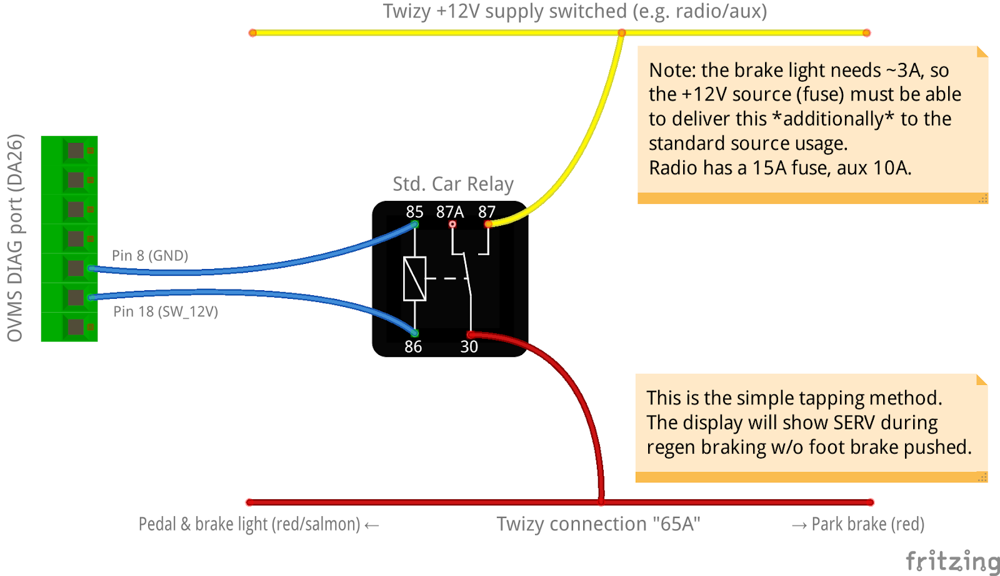
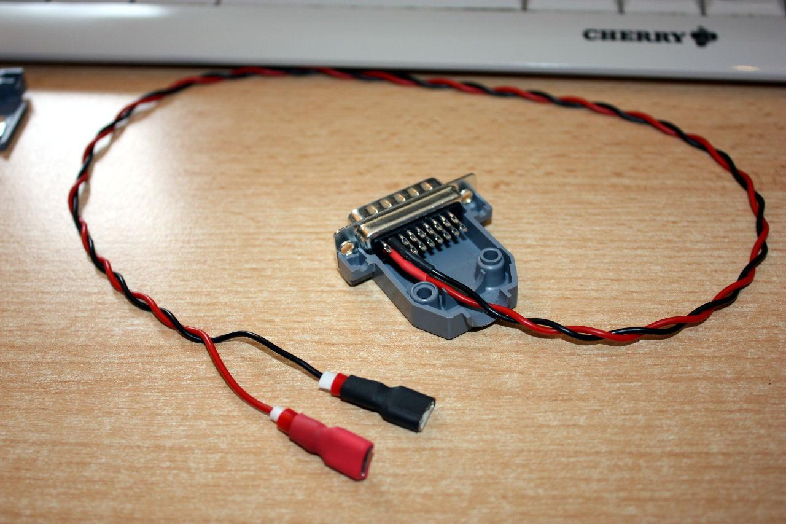
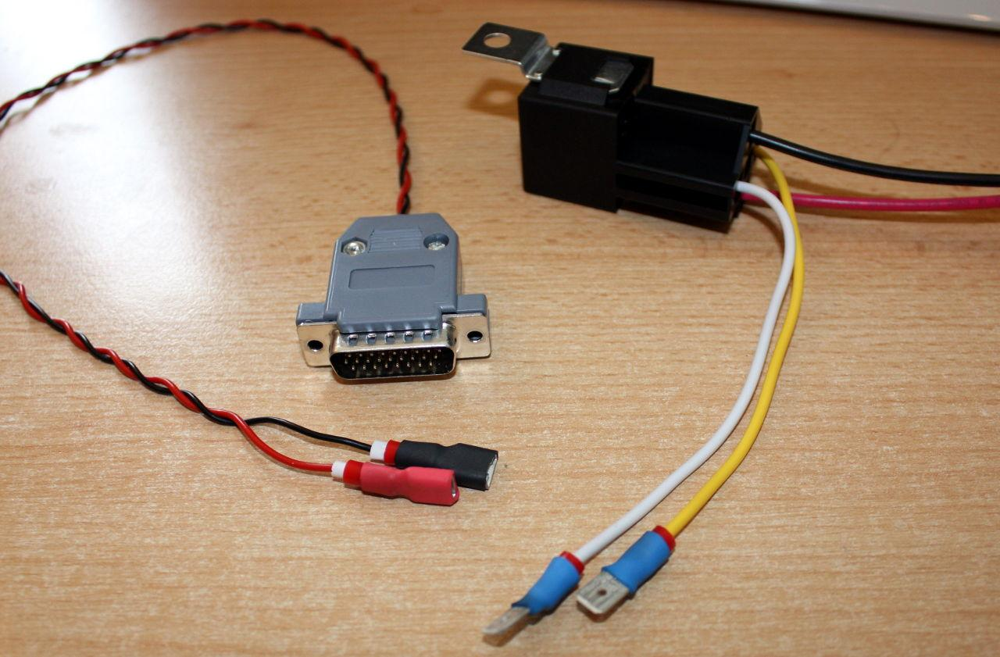
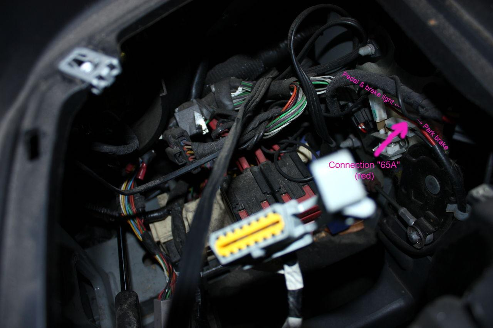
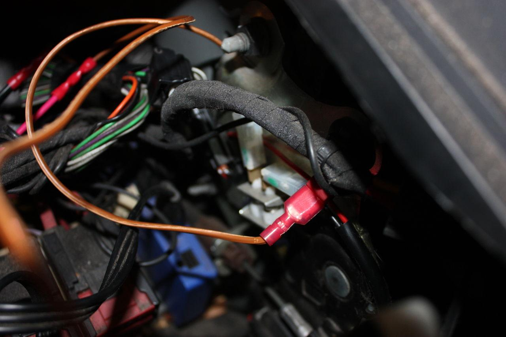
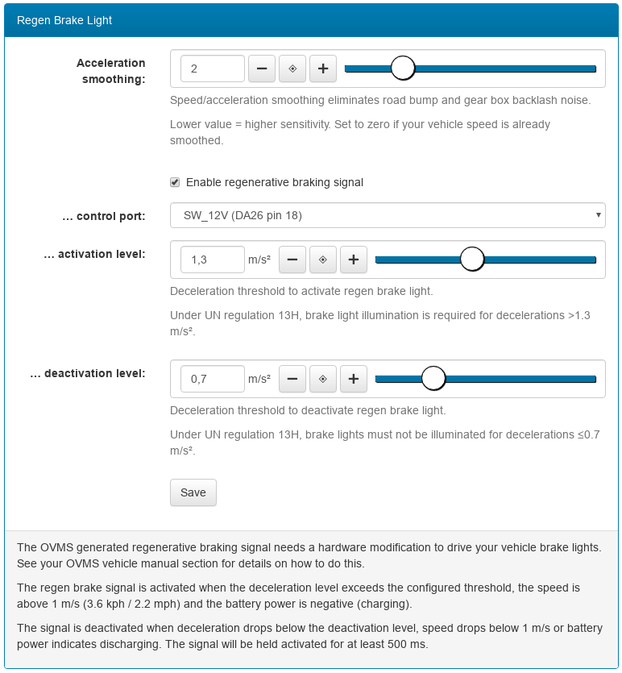

----------------------------
Twizy Regen Brake Light Hack
----------------------------

^^^^
Why?
^^^^

The Twizy recuperation levels are very low by default, regenerative braking is so weak it doesn‘t need to trigger the brake light – so a regen braking indication has been omitted by Renault. The Twizy can be tuned to one pedal driving though with high neutral braking power.

The SEVCON normally can generate a regen braking signal itself. That signal can be configured using the ``xrt cfg brakelight`` tuning command. Pin 11 on the SEVCON main connector will go to GND on activation. The problem is, that pin is not connected on the Twizy, using it needs modification of the connector. To my knowledge this hasn‘t been done successfully up to now, so we don‘t even know if the Twizy SEVCON firmware includes that functionality.

^^^^^^^^^^^^^^^^^
How does it work?
^^^^^^^^^^^^^^^^^

The OVMS generates a secondary regen braking signal itself. That signal is used to control a relay to provide power to the brake light independant of the brake pedal.

Integration is simple and does not require to change the existing connections:

The Twizy UCH/display recognizes the regen brake light activation despite the foot brake being pushed and turns on the SERV indicator. Depending on your preferences you may see this as a problem or as an indicator for the regen braking.

Switching the 65A line does not avoid the SERV indicator (tested). Most probably the brake light is monitored by the current flowing at the fuse box, so the SERV indicator cannot be avoided without changing that system.

^^^^^^^^^^^^^^
Parts required
^^^^^^^^^^^^^^

1. 1x DA26 / Sub-D 26HD Plug & housing

  * Note: housings for Sub-D 15 fit for 26HD
  * e.g. `Assmann-WSW-A-HDS-26-LL-Z <https://www.voelkner.de/products/45955/Assmann-WSW-A-HDS-26-LL-Z-D-SUB-Stiftleiste-180-Polzahl-26-Loetkelch-1St..html>`_
  * `Encitech-DPPK15-BK-K-D-SUB-Gehaeuse <https://www.voelkner.de/products/1043836/Encitech-DPPK15-BK-K-D-SUB-Gehaeuse-Polzahl-15-Kunststoff-180-Schwarz-1St..html>`_

2. 1x 12V Universal Car Relay + Socket

  * e.g. `Song-Chuan-896H-1CH-C1-12V-DC-Kfz-Relais <https://www.voelkner.de/products/37453/Song-Chuan-896H-1CH-C1-12V-DC-Kfz-Relais-12-V-DC-50A-1-Wechsler.html>`_
  * `GoodSky-Relaissockel-1-St.-GRL-CS3770 <https://www.voelkner.de/products/54579/GoodSky-Relaissockel-1-St.-GRL-CS3770.html>`_

3. Car wire-tap connectors, car crimp connectors, 0.5 mm² wires, zipties, shrink-on tube, tools

Note: if you already use the switched 12V output of the OVMS for something different, you can use one of the free EGPIO outputs. That requires additionally routing an EGPIO line to the DA26 connector at the expansion slot (e.g. using a jumper) and using a relay module (relay shield) with separate power input instead of the standard car relay.

^^^^^
Build
^^^^^

1. Solder ~ 40 cm two-core wire to the DA26 plug pins 8 (GND) and 18 (+12V switched), use shrink-on tubes to protect the terminals, mount the housing

2. Crimp 6.3mm sockets to the other ends of the wire, isolate using shrink-on tube, crimp 6.3mm plugs to the relay coil (pins 85 + 86), isolate using shrink-on tube

3. Extend the relay switch terminals by ~ 30 cm wires, crimp on plugs for the tap connectors

4. Unmount the Twizy glovebox; locate the red wire on the right above the parking brake:


5. Crimp a tap connector onto the red wire and connect it to the relay (pin 30):

6. Connect switched +12V likewise to pin 87 of the relay

  * +12V may be taken from the radio or 12V aux socket to simplify things
  * the dedicated brake light supply is fuse no. 23, which is very hard to reach without dismounting the whole fuse holder

7. Place the relay in the free area on the upper left of the fuse holder (not below the door dampener, that may crush the relay), secure the relay using a ziptie

8. Pull the OVMS DIAG cable through the glovebox bottom hole and connect it to the relay inputs (pins 85/86, polarity doesn‘t matter)

9. Do a test: plug in the OVMS (Note: the relay switches on during the first OVMS boot), switch on the Twizy, issue commands:

  * ``egpio output 1 1`` should activate the brakelight
  * ``egpio output 1 0`` should deactivate the brakelight
  * Note: if you‘re using another EGPIO port, use the according port number (3-9) instead

10. Mount the glovebox and you‘re done.

^^^^^^^^^^^^^
Configuration
^^^^^^^^^^^^^

See OVMS web user interface, menu Twizy → Brake Light:

Set the port as necessary and the checkbox to enable the brakelight.

For monitoring and fine tuning, use the *regenmon* web plugin:

https://github.com/openvehicles/Open-Vehicle-Monitoring-System-3/blob/master/vehicle/OVMS.V3/components/ovms_webserver/dev/regenmon.htm
