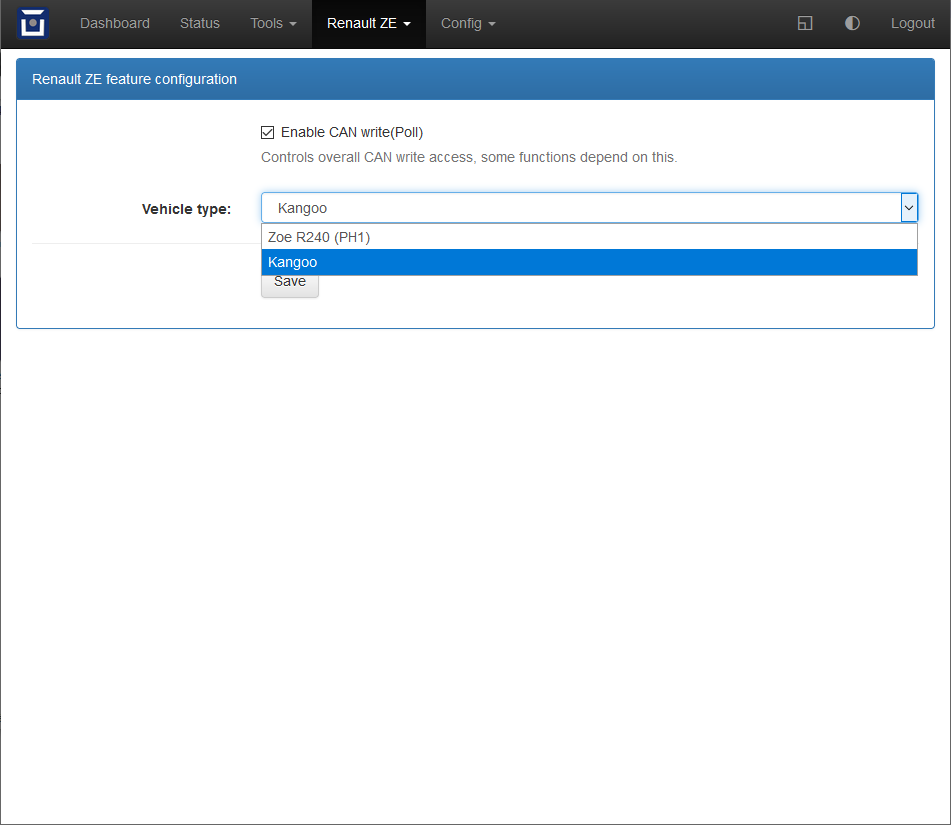

=======================
Renault Zoe
=======================

Vehicle Type: **RZ**

This vehicle type supports the Renault Zoe(PH1) 22kWh-40kWh (2012 - 2019) and Kangoo 22kWh-33kWh (2011 - ~2019).

----------------
Support Overview
----------------

=========================== ==============
Function                    Support Status
=========================== ==============
Hardware                    OVMS v3 (or later)
Vehicle Cable               OBD-II to DB9 Data Cable for OVMS (1441200 right, or 1139300 left)
GSM Antenna                 1000500 Open Vehicles OVMS GSM Antenna (or any compatible antenna)
GPS Antenna                 1020200 Universal GPS Antenna (SMA Connector) (or any compatible antenna)
SOC Display                 Yes
Range Display               Yes
GPS Location                Yes (from modem module GPS)
Speed Display               Yes
Temperature Display         Yes (External Temp and Battery)
BMS v+t Display             Yes
TPMS Display Zoe            Yes (pressure only)
TPMS Display Kangoo         No
Charge Status Display       Yes
Charge Interruption Alerts  No
Charge Control              No
Cabin Pre-heat/cool Control Yes
Lock/Unlock Vehicle         No
Valet Mode Control          No
Others
=========================== ==============

After selecting the Renault Zoe/Kangoo vehicle module, the corresponding settings have to be made in the web interface via the "Renault Zoe/Kangoo" menu under "Features":

-------------------------
Using Cabin Pre-heat/cool
-------------------------

Climate control on is only supported. It starts the 5 minute booster. After 5 minutes it switches off automatically. For IOS users it is started via Homelink 1
