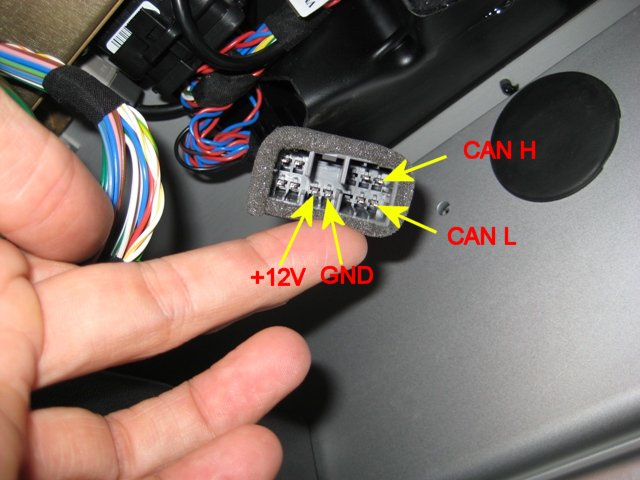

==============
Tesla Roadster
==============

Vehicle Type: **TR**

The Tesla Roadster support in OVMS is perhaps the most mature in the project. All versions (1.x, 2.x, and 3.x) are supported, for both North American and other variants.

----------------
Support Overview
----------------

=========================== ==============
Function                    Support Status
=========================== ==============
Hardware                    Any OVMS v3 (or later) module. Vehicle support: 1.x, 2.x, and 3.0 roadsters (all markets).
Vehicle Cable               9665972 OVMS Data Cable for Early Teslas
GSM Antenna                 1000500 Open Vehicles OVMS GSM Antenna (or any compatible antenna)
GPS Antenna                 None, not required
SOC Display                 Yes
Range Display               Yes
GPS Location                Yes (from car's built in GPS)
Speed Display               Yes
Temperature Display         Yes
BMS v+t Display             Not currently supported
TPMS Display                Yes
Charge Status Display       Yes
Charge Interruption Alerts  Yes
Charge Control              Yes
Cabin Pre-heat/cool Control Not currently supported
Lock/Unlock Vehicle         Yes
Valet Mode Control          Yes
Others                      Adhesive velcro strips useful for vehicle attachment
=========================== ==============

----------------------------------
Module Installation in the vehicle
----------------------------------

The OVMS module is connected to your Roadster via the CAN bus diagnostic port connector, which is located in the passenger footwell. It is made of plastic that is wrapped in grey foam, as shown in the photo. Typically, the connector is wedged into the front wall near the center console so it won't rattle. Pull the connector out and note the orientation of the pins, especially the void above the +12V and Ground pins.

The OVMS Data Cable for Tesla Roadster can then be plugged in, connecting the car to the OVMS module. Make sure to tighten the screws holding the module-side DB9 connector.

At this point, check the car. Tap on the VDS in the centre console and make sure it turns on. Insert the key, turn on the car, and make sure everything works as expected. If you see any problems at all with the car, disconnect the OVMS module and contact Open Vehicles support for assistance.

| **Warning!**
| If, when you plug the OVMS into the car, you see any interference to, or strange behaviour of, car systems immediately unplug the module and contact Open Vehicles for assistance. Never leave a module connected in such circumstances.

The OVMS Module is best secured to the front wall of the passenger footwell using adhesive velcro tape. With the module connected to the car diagnostics port connector, experiment with various placements until you find a suitable spot. For the velcro attachment to work, you'll want to choose a spot on the front wall that's flat for the entire size of the module (hint: avoid the big round black plastic plug).

Mounting is straightforward:

#. Ensure that both velcro strips are fixed together.
#. Remove the adhesive backing from one side; fasten it to the back of the OVMS module.
#. Using a clean dry cloth, clean the area of the car passenger footwell wall to which you are going to attach the module.
#. Remove the adhesive backing from the side of the velcro strip facing the car, and then firmly push the OVMS module into place - holding it still for a few seconds to allow the adhesive to work.
#. You can then remove and reinstall the OVMS module as desired via the velcro.

--------------------
Antenna Installation
--------------------

You will find the performance of this antenna fantastic - and much better than even your cellphone, but proper placement is essential. Since it has a very long cable, you can place the antenna just about wherever you want, but please ensure it is high-up on the car and away from any metal objects that might interfere with the signal.

Possible areas include the bottom of the windscreen/windshield on the passenger side, the top of the windscreen on the passenger side (hidden by the sun visor), behind the passenger on the side pillar, in the rear window, or under the dashboard (for the brave and experienced at dismantling Tesla Roadster dashboards).

The antenna is connected to the port marked GSM on the OVMS v3 module. The GPS port is not used on the Tesla Roadster (as your car already has GPS installed and we can read that positioning information off the CAN bus directly).

^^^^^^^^^^^^^^^^^^^^^^^^^^^^^^^^^^^^^^
Antenna beside rear passenger headrest
^^^^^^^^^^^^^^^^^^^^^^^^^^^^^^^^^^^^^^

The antenna cable is long enough to reach back to the area around the left side seat head. This approach is generally easiest. The module is placed in the left seat footwell, near the diagnostic port connector. From there, the antenna cable is routed through the base of the waterfall, under the door sill, and up the side of the door frame. 

The door sill is held in place by velcro and is easily removed. You may have to loosen the *waterfall* (held in place by four screws around the fuse box area). The antenna cable can then be placed on top of the metal of the chassis sill, between the velcro strips, and routed up through the existing plastic trunking. At this point, the door sill can then be put back in place.

^^^^^^^^^^^^^^^^^^^^^^^^^^^^^^^^
Antenna on windshield/windscreen
^^^^^^^^^^^^^^^^^^^^^^^^^^^^^^^^

To route the antenna cable up to the front windshield/windscreen, you will need to remove the fuse-box cover (one screw that needs to be turned 90 degrees), then two screws from the box below the fuse box (these screws should be completely removed in order to be able to remove the box and access the compartment beneath). You do not need to adjust anything in the fuse box - you only need the cover removed to make it easier to route the cable.

Start with the cable at the windscreen/windshield and route it down the side of the left side door front pillar. The plastic corner can be pulled back slightly, and you can push the cable through into the open bottom compartment. Pull the cable through there so that the antenna is where you want it and there is no loose cable outside the box. The antenna itself can be mounted to the windscreen/windshield by first cleaning the area with a clean dry cloth, removing the adhesive backing tape, then firmly pushing the antenna against the glass and waiting a few seconds for the adhesive to stick.

Now for the tricky bit. You need to get the cable through to the passenger footwell, but it is tight.  It is much easier to get a guide wire up into the fuse box compartment than to get the antenna cable down into the passenger footwell. So, we recommend you use a small (12 inches / 30 cm or so) piece of stiff wire to use as a guide and push it up from the area marked by the green arrow on the bottom right of the picture below. Once the guide wire is in the fuse box, push it down into the lower compartment you opened and wrap it around the antenna cable. You can then pull the guide wire back down into the passenger footwell, bringing the antenna cable with it.

The antenna cable can then be screwed in to the OVMS module. You can then tidy up any loose cable, and screw-back the lower compartment box (two screws) and fuse box cover (one screw 90 degrees to lock).

---------------------
Configuration Options
---------------------

The Tesla Roadster specific configuration options are in configuration parameter **xtr**:

==================== ======= ===========
Instance             Default Description
==================== ======= ===========
digital.speedo       no      Set to *yes* to enable digital speedometer (2.x cars only)
digital.speedo.reps  3       Number of CAN bus repeat transmissions
cooldown.timelimit   60      Number of minutes after which cooldown is stopped
cooldown.templimit   31      Temperature (in Celcius) after which cooldown is stopped
protect.lock         yes     Refuse to lock vehicle when switched on
==================== ======= ===========

--------------------
Tesla Roadster Notes
--------------------

#. In general, the OVMS module in a Tesla Roadster acts exactly like the little VDS screen. We should be able to do anything that screen can do, but no more. Here are some notes:
#. The lock/unlock and valet functions rely on a PIN code. This is the same PIN code you enter into the vehicle using the VDS screen when activating valet mode. If you don't know the PIN code, either try the default 1234 or contact Tesla for assistance.
#. While OVMS can lock/unlock the doors of all Tesla Roadster models, cars outside North America are fitted with an immobiliser and neither OVMS nor the VDS will disarm/arm that. The OVMS lock/unlock functionality only applies to the doors, not the alarm in vehicles sold outside North America.
#. OVMS v3 can calculate an overall battery health metric. This metric is calculated using our own algorithm and is in no way approved by Tesla. Battery health is dependent on many factors, and hard to bring down to just one simple number.
#. The Tesla Roadster requires the ignition key to be on, and manual switches turned, to cool/heat the cabin. It is not technically possible to do this remotely via OVMS.

The digital speedometer function replaces the AMPS display in the dashboard instrument cluster with the vehicle speed. It is only supported on v2.x cars (not v1.5). This is an experimental feature, and works 99% of the time, but sometimes the car *wins* and displays AMPS for a split second. A better solution is to use the HUD functionality of OVMS v3 and install an external Heads Up Display in the car.

------
Thanks
------

There are so many people to thank for Tesla Roadster support in OVMS. W.Petefish for sourcing the car connector, Fuzzylogic for the original hardware and software design and demonstration of it working, Scott451 for figuring out many of the Roadster CAN bus messages, Tom Saxton for v1.5 Roadster testing, Michael Thwaite for pictures of antenna installation, Bennett Leeds for wordsmithing the manual, Mark Webb-Johnson for CAN bus hacking and writing the vehicle module support, Sonny Chen for beta testing and tuning, and many others for showing that this kind of thing can work in the real world.

