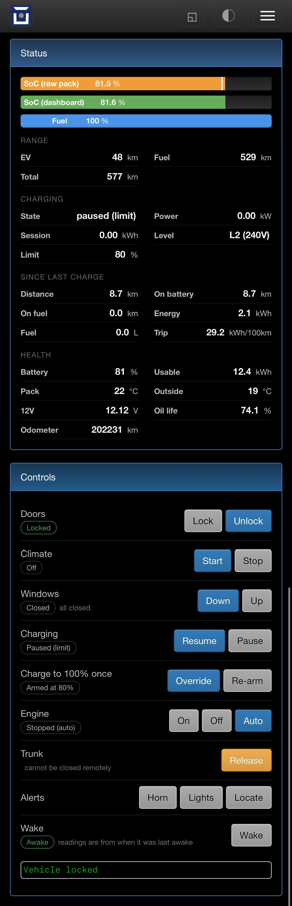
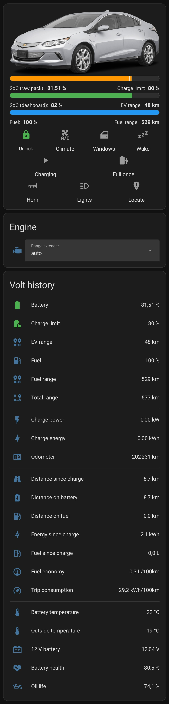

=====================
Chevrolet Volt/Ampera
=====================

Vehicle Type: **VA**

This vehicle type supports the Chevrolet Volt and the Opel/Vauxhall Ampera. Pack constants and default rated ranges are held for model years 2011 to 2019. The model year is decoded from the VIN.

I did the recent work on a 2017 Gen 2 Volt. The single wire decoding predates it. It was written against a Gen 1 Volt and a MY2014 Ampera, so both generations are covered. Anything added since comes from a Gen 2 DBC, and a Gen 1 may report it differently or not at all. On a Gen 1 I would check EV range against the cluster, since its decode was replaced.

The charge limit and the vehicle controls are both off by default. Each has its own section below, with the warnings that go with them.

----------------
Support Overview
----------------

=========================== ==============
Function                    Support Status
=========================== ==============
Hardware                    Any OVMS v3 (or later) module. Full support needs the SWCAN expansion board
Vehicle Cable               The one bundled with the SWCAN board, see below. A plain OVMS OBD-II to DB9 cable does not carry the single wire pin
SOC Display                 Yes (dashboard and raw pack scales, both published)
Range Display               Yes (EV, gasoline and total)
GPS Location                Yes (from GPS module/antenna)
Speed Display               Yes
Temperature Display         Yes (ambient, cabin, battery, motor, power electronics)
BMS v+t Display             Yes (96 cell voltages, 6 pack section temperatures)
TPMS Display                Yes (pressure only, requires SWCAN module)
Charge Status Display       Yes
Charge Interruption Alerts  Yes
Charge Control              Yes (SOC limit and start/stop, off by default, gated only on xva chargelimit.enabled)
Cabin Pre-heat/cool Control Yes (needs the SWCAN bus, the adapter only to wake a sleeping car)
Lock/Unlock Vehicle         Yes (requires SWCAN module)
Valet Mode Control          No
Others                      12V battery, windows, trunk release, engine override, horn and lights
=========================== ==============

------------
SWCAN module
------------

The Volt has 2 buses of interest. OVMS reads the 500 kbps high speed GMLAN bus through the OBD-II cable as can1. It carries the VIN, odometer, speed, gear, throttle, brake, ambient and coolant temperature, motor rpm and every diagnostic poll reply. The 33.3 kbps single wire GMLAN bus (SWCAN) carries almost everything to do with the body: locks, doors, alarm, TPMS, window positions, climate and remote start, the 12V battery sensor, pack voltage and current, and the since-last-charge counters.

OVMS reaches the single wire bus through an external SWCAN adapter (MCP2515 plus TH8056), registered as can4. The adapter has to be declared::

  config set xva use_swcan_adapter yes

Same board the Bolt EV uses. Mine came from `this eBay listing
<https://www.ebay.com/itm/365182274464>`_, which ships with the cable. Get the cable too, the
single wire bus is on a pin a plain OVMS OBD-II to DB9 cable does not carry.

With the option at its default of no, the module registers the second on-board MCP2515 as can3 at 33.3 kbps and reads the single wire bus through it. Received frames are decoded the same way. The commands that test for the adapter refuse outright and return "not implemented": ``wakeup``, ``lock``, ``unlock``, ``xva trunk``, ``xva horn``, ``xva flash`` and ``xva locate``.

Everything else transmits anyway, on whichever bus is registered. It just loses the high voltage wakeup a sleeping bus needs. ``climatecontrol`` carries no adapter test at all, so this setting never refuses it. ``charge current`` is the same shape: it calls the wakeup, ignores whether that worked and writes its frame regardless. The charge limit writes on can1 and gates only on ``xva chargelimit.enabled``, so it is not refused either, though its sequence also opens with the wakeup. None of these can wake a sleeping car without the adapter. They need the car awake already.

Waking a sleeping single wire bus takes the transceiver's high voltage wakeup mode. A plain frame is not enough, and that is why ``wakeup`` takes a few seconds. ``xva extended_wakeup`` widens the sequence from the body control module alone to every known module. It is slower, but it works on cars where remote start or the OnStar functions do not respond to the short sequence.

-------------
Configuration
-------------

All settings live in the ``xva`` config parameter. Edit them from the web UI under Vehicle > Features, or from the shell with ``config set xva <name> <value>``.

======================================== ============== ========= ============================================
Config name                              Default        Unit      Description
======================================== ============== ========= ============================================
xva use_swcan_adapter                    no                       External SWCAN adapter is fitted and used as can4
xva extended_wakeup                      no                       Wake every known module rather than only the body control module, slower but more reliable on some cars
xva control.enabled                      no                       Master switch for the engine, trunk, window, horn and lights commands
xva chargelimit.enabled                  no                       Master switch for every charge control frame, including charge start and stop
xva chargelimit.soc                      80             percent   Charging is paused at this level and resumed once it falls more than 2% below it. Useful range 1 to 99. Anything at 0 or below, or 100 or above, disables enforcement entirely
xva chargelimit.source                   raw                      Scale the limit is measured against, raw or displayed. The default raw scale comes from a PID confirmed on Gen 2 only, so on a car that never answers it the limiter falls back to the displayed scale and logs a warning once
xva chargelimit.location                 (empty)                  Name of an OVMS location. The limit only applies inside it, empty means everywhere
xva chargelimit.maxdefer                 20             attempts  Defer attempts per plug-in session before the limit gives up and alerts
xva chargelimit.notify                   yes                      Notify when charging is paused, and alert when the limit gives up
xva chargelimit.debug                    no                       Log every charge control frame that is sent
xva soc.source                           displayed                Which scale feeds the standard v.b.soc metric, displayed or raw
xva range.km                             0              km        Rated range override for the ideal range calculation, 0 uses the model year default (56 km for 2011-2012, 61 km for 2013-2015, 85 km for 2016 and later)
xva battery.capacity                     0              kWh       Usable capacity override, 0 derives it from the capacity the car reports so it follows the pack as it ages
xva preheat.override_bcm                 no                       OVMS drives remote start itself instead of letting the body control module do it, needed on cars where the OnStar emulation does not work
xva preheat.max_time                     20             minutes   Longest remote start run, 1 to 30, only used when BCM overriding is enabled
xva notify_va_metrics                    no                       Send the fuel level as a data notification: on wake, every 300s while the car is on, and whenever the polled level changes. Despite the name this is the only notification it gates
xva modelyear                            (from VIN)               Written by the module when it decodes the VIN, so the pack constants are available after a reboot while the car sleeps
======================================== ============== ========= ============================================

The car reports 2 genuinely different states of charge and the module publishes both. ``xva.v.b.soc.displayed`` is the dashboard number. ``xva.v.b.soc.raw`` is the pack's own high resolution figure. They are different scales rather than different precisions, and the difference varies with charge level. I measured these pairs on a MY2017 (dashboard, raw): 20.0/32.4, 50.2/56.8, 78.8/79.4, 95.3/92.7, 99.6/99.9. ``xva soc.source`` picks which one feeds ``v.b.soc``, and so the app, the server and the low charge alert. ``xva chargelimit.source`` is a separate setting, so you can display the dashboard number while the limit still caps the real pack level. The engine stop safeguard reads the raw scale directly rather than going through either setting. It falls back to ``v.b.soc`` when the raw PID has never answered, which is the case on a Gen 1.

``v.b.soh`` and ``v.b.capacity`` are derived from the amp-hour capacity the car reports in ``v.b.cac``, against a healthy pack for the decoded model year. Both track the pack as it ages.

------
Web UI
------

The module adds 2 web pages. Vehicle > Features holds the settings in the table above. Controls lives at ``/xva/controls``, in the main menu rather than under Vehicle.

Controls opens with a live status block fed over the websocket: both state of charge scales and the fuel level as bars. The charge limit is marked on whichever bar ``xva chargelimit.source`` selects, so the marker always sits on the scale the limit is actually measured against. Below the bars come 4 groups of readouts: range, charging, since last charge, and health. Then one row per control: lock and unlock, climate start and stop, windows down and up, charge pause and resume, charge limit override and re-arm, engine on, off and auto, trunk release, horn, lights and locate, and wake. Where a control has 2 directions both buttons are always present. State decides which one is highlighted, not whether a button exists, because the car stops reporting the moment it sleeps.

Every button fires the same console command documented below and shows the reply. The master switches and the safeguards apply exactly as they do in the shell.

Charging is paused at the limit in that capture. The marker on the raw bar is the 80% target, sitting a little left of the 81.5% the pack actually reached.

------------
Charge limit
------------

The Volt has no single shot stop charge command. Instead the module flips the charging module into departure based charging, with a target far enough ahead that charging does not start. The Voltage app does it the same way. The car resumes charging on its own, so this is a loop rather than a one-shot. Enforcement runs every 10 seconds and re-applies the defer each time the car resumes above the target. Below the target minus 2% the module writes the pair of frames that puts the car back into immediate charging.

Charge control is off by default. Nothing is written to the bus until it is enabled::

  config set xva chargelimit.enabled yes
  config set xva chargelimit.soc 80

While it is disabled the standard ``charge start`` and ``charge stop`` commands refuse too, since they use the same sequences. Once it is enabled the target is published as ``v.c.limit.soc``.

Points worth knowing:

- Set ``xva chargelimit.location`` to an OVMS location and the limit only applies inside that geofence, so a public or destination charger is never capped. Without a reliable GPS fix the limit is not applied at all, since home cannot then be told apart from a public charger.
- ``xva chargelimit override`` charges to full this once and resumes charging immediately. It clears itself after the car has been driven 0.2 km away, or on leaving the configured location if no odometer reading is available. ``xva chargelimit resume`` re-arms the limit by hand.
- If the car resumes charging more times than ``xva chargelimit.maxdefer`` in one plug-in session, the module stops fighting it, sends an alert and lets the charge finish.
- While the car is switched on the charge flags do not mean what they usually do. At most one defer is applied, and it is never retried until the car is off again.
- ``xva.v.c.deferred`` is read back from the car rather than remembered, so a defer left behind by a module reboot is spotted and resumed.
- The defer sequence briefly sets the car's clock to 12:00, then restores the real time. That is what makes the departure time stick. The clock is only touched when the module's own clock is set, so there is always a real time to restore.
- ``xva chargelimit.source`` defaults to raw, and the raw scale comes from a PID confirmed on Gen 2 only. On a car that never answers it, the limiter falls back to the displayed scale rather than silently never enforcing, and logs a warning once. That fallback moves the real cut-off: the 2 scales only agree closely around 80%. On a Gen 1, set the source to displayed deliberately or check the log.

``xva chargelimit`` with no subcommand is the status command. ``xva chargelimit status`` reports the target, the scale it is measured on, the current value on that scale, the location, the defer count and, separately, what the car itself reports. The last 2 disagreeing is the interesting case.

----------------
Vehicle controls
----------------

The engine, trunk, window, horn and lights commands are off by default::

  config set xva control.enabled yes

^^^^^^
Engine
^^^^^^

``xva engine on`` and ``xva engine off`` hold a diagnostic override, and ``xva engine auto`` releases it. It only works with the car switched on or climate running, since that is when the engine node is powered. A forced state holds until it is released or the car powers down.

Near a full pack the car may accept a force on and still decline to run the generator, which no keep-alive can override.

^^^^^^^
Windows
^^^^^^^

``xva windows up`` and ``xva windows down`` move all 4 windows. The command goes to the body control module on can1, while the positions come back on the single wire bus. The module wakes the car first, repeats the request 4 more times at 1 second intervals, then holds the bus awake for 15 seconds so the final resting position is broadcast. The repeats are needed because the driver window frequently ignores a single request. It behaves as though the request has to be sustained, the way holding the switch would.

^^^^^^^^^^^^^^^^^^^^^^
Trunk, horn and lights
^^^^^^^^^^^^^^^^^^^^^^

``xva trunk`` releases the trunk or hatch. It cannot be closed again remotely. ``xva horn``, ``xva flash`` and ``xva locate`` use the OnStar telematics alerts. Locate is the horn and lights together. All 4 need the SWCAN adapter and wake the bus themselves.

--------
WARNINGS
--------

^^^^^^^^^^^^^^^^^^^^^^^^^^^^^^^^^^^^^^
Window position cannot be read at rest
^^^^^^^^^^^^^^^^^^^^^^^^^^^^^^^^^^^^^^

The body control module only reports real window positions while the glass is moving. At rest it broadcasts a fixed idle pattern that carries no position at all. It sends that same pattern whatever the windows are actually doing. I confirmed that on-car with all 4 windows down. The module therefore ignores the idle pattern and keeps the last position seen during travel, which is where the window came to rest. After a module reboot the aggregate state seeds to closed until something moves.

^^^^^^^^^^^^^^^^^^^^^^^^^^^^^^^^^^^^^^^^^^^
Gasoline range needs the car switched on
^^^^^^^^^^^^^^^^^^^^^^^^^^^^^^^^^^^^^^^^^^^

``xva.v.e.range.fuel`` is not published until the car is switched on. The engine does not have to run, the car only has to be on. A bus wake and a remote climate run both leave it at 0, because neither powers the engine controller far enough up to compute it, and the car's own validity bit never asserts. A zero is treated as "no figure yet" and nothing is published. ``xva.v.range.total`` only appears once both halves are known.

^^^^^^^^^^^^^^^^^^^^^^^^^^^^^^^^^^^^
Engine stop is refused at low charge
^^^^^^^^^^^^^^^^^^^^^^^^^^^^^^^^^^^^

Forcing the engine off is refused at or below 16% raw state of charge, and the refusal sends an alert. That is where the car starts the engine by itself anyway, so the refusal only avoids fighting it and running the pack below what GM designed for. The test reads the raw scale directly, not the one ``xva soc.source`` steers, because the same number off the dashboard means a different amount of charge down there.

The raw PID is Gen 2 only. Where it never answers the test falls back to ``v.b.soc``, so on a Gen 1 the threshold lands on whichever scale is configured instead.

^^^^^^^^^^^^^^^^^^^^^^^^^^^^^^^^^
12V drain when overriding the BCM
^^^^^^^^^^^^^^^^^^^^^^^^^^^^^^^^^

``xva preheat.override_bcm`` does not enable the 14V auxiliary module. Remote start driven that way can flatten the 12V battery unless the charge cable is connected.

--------------
Shell commands
--------------

Precede all vehicle specific commands with ``xva``, for example ``xva chargelimit status``.

=============================  =
``engine on``                  Force the engine on, held by a keep-alive
``engine off``                 Force the engine off, refused at or below 16% raw SOC
``engine auto``                Release the override, the car's own control resumes (``engine release`` is an alias)
``trunk``                      Release the trunk/hatch
``horn``                       Sound the horn
``flash``                      Flash the exterior lights
``locate``                     Horn and lights together (OnStar vehicle locate)
``windows up``                 Close all windows
``windows down``               Open all windows
``chargelimit``                Same as ``chargelimit status``
``chargelimit status``         Show the limit, its scale, the defer count and what the car reports
``chargelimit override``       Charge to full this time and resume charging now
``chargelimit resume``         Cancel the override and re-arm the limit
=============================  =

The standard OVMS commands are wired up as follows.

==================================  =
``wakeup``                          Wake the car over the single wire bus
``lock`` / ``unlock``               OnStar lock and unlock emulation, the PIN argument is not used
``climatecontrol on|off``           Remote start, heating or cooling the cabin
``homelink 1|2|3``                  1 starts climate control, 2 stops it, 3 wakes the car
``charge start`` / ``charge stop``  Resume or pause charging, needs ``xva chargelimit.enabled``
``charge current <amps>``           Select the highest charge level the car offers at or below the given current
==================================  =

``lock``, ``unlock`` and ``wakeup`` refuse without the SWCAN adapter. ``climatecontrol`` and ``charge current`` do not test for it. Both transmit regardless and only lose the high voltage wakeup, so they need the car awake already. ``charge start`` and ``charge stop`` gate on ``xva chargelimit.enabled`` alone. The OnStar lock and unlock emulation is not known to work on a MY2014 Ampera.

--------------
Custom metrics
--------------

======================================== ======================== ============================================
Metric name                              Example value            Description
======================================== ======================== ============================================
xva.v.ac.active                          no                       The car's own A/C status, so it reads yes whenever the A/C is running, whoever started it. Upstream claims one exception, that it stays no when OVMS drives remote start itself with preheat.override_bcm. That is untested on a Gen 2. If you run with that option on and find it stuck at no, use xva.v.ac.front_blower_fan_speed instead
xva.v.ac.compressor_rpm                  4500                     A/C compressor speed
xva.v.ac.evap_temp                       4.5°C                    Evaporator outlet air temperature
xva.v.ac.front_blower_fan_speed          39%                      Front blower fan speed, the most reliable sign that remote start is actually running
xva.v.ac.preheat                         0                        Remote start state: 0 stopped, 1 starting, 2 switch on, 3 started, 4 stopping, 5 error, 6 relinquished
xva.v.ac.preheat_timer                   0                        Seconds the current remote start has been running
xva.v.b.12v.soc                          82%                      12V battery state of charge, from the car's battery sensor
xva.v.b.12v.voltage                      12.19V                   12V battery voltage at the car's battery sensor, separate from the module's own reading
xva.v.b.chargecycle_econ                 33kWh/100km              Electric economy since the last charge
xva.v.b.charging_limits                  12,8                     Charge current levels the car offers, in amps
xva.v.b.heater.pct                       0%                       HV battery heater duty
xva.v.b.heater.pwr                       0                        HV battery heater power
xva.v.b.power.disp                       -4.5kW                   Pack power as the driver display shows it, negative is regen
xva.v.b.soc.displayed                    78.8%                    State of charge as the dashboard shows it
xva.v.b.soc.raw                          79.4%                    True pack state of charge, a different scale from the dashboard
xva.v.c.deferred                         no                       The car is in departure (deferred) charging mode, read back from the car
xva.v.c.energy.input                     10.9kWh                  AC energy taken from the wall for the last or current charge, so it includes charging losses
xva.v.c.energy.lifetime                  2841kWh                  Lifetime charge energy
xva.v.c.inhibit                          0                        Charge inhibit reason reported by the car
xva.v.c.level                            L2 (240V)                Supply level: L1 (120V), L2 (240V), DC fast or unplugged
xva.v.c.limit.override                   no                       Charge to full this once, see the charge limit section
xva.v.dc.batt.ratio                      87%                      Share of the distance since the last charge driven on battery
xva.v.dc.dist.batt                       35.9km                   Distance driven on battery since the last charge
xva.v.dc.dist.fuel                       5.3km                    Distance driven on gasoline since the last charge
xva.v.dc.dist.total                      41.2km                   Total distance since the last charge
xva.v.dc.distance.own                    41.2km                   The module's own distance tally since the last charge, kept independently of the car
xva.v.dc.eff.batt                        72%                      Drive cycle efficiency, battery, as the car reports it
xva.v.dc.eff.cabin                       11%                      Drive cycle efficiency, cabin
xva.v.dc.eff.drive                       81%                      Drive cycle efficiency, driving
xva.v.dc.eff.total                       76%                      Drive cycle efficiency, total
xva.v.dc.energy.own                      8.1kWh                   The module's own energy tally since the last charge, kept independently of the car
xva.v.dc.energy.pct1                     41%                      Energy split behind the dash usage bar graph, slice 1. Which slice is which is not documented, so they keep their DBC ordinals
xva.v.dc.energy.pct2                     24%                      Energy split, slice 2
xva.v.dc.energy.pct3                     20%                      Energy split, slice 3
xva.v.dc.energy.pct4                     15%                      Energy split, slice 4
xva.v.dc.energy.used                     8.4kWh                   Energy drawn from the pack since the last charge, the car's own counter
xva.v.dc.fuel.econ                       5.9                      Gasoline economy since the last charge, L/100km
xva.v.dc.fuel.used                       1.5                      Gasoline burned this drive cycle, liters. The same signal as xva.v.e.fuel.used, decoded twice from the same frame, so the 2 always carry the same figure
xva.v.e.cmd.pending                      windows up               Command currently in flight, for a busy indicator
xva.v.e.coolant_heater_pwr               2.4kW                    Cabin coolant heater power
xva.v.e.coolant_temp                     38°C                     Engine coolant temperature
xva.v.e.fuel                             62%                      Fuel level
xva.v.e.fuel.used                        1.5                      Gasoline burned this drive cycle, liters. Identical to xva.v.dc.fuel.used, see there
xva.v.e.heatercore_temp                  45°C                     Heater core inlet coolant temperature, the clearest sign that preheat reached the cabin
xva.v.e.mode                             auto                     Engine override state: auto, forced-on or forced-off
xva.v.e.oil.life                         87%                      Remaining engine oil life, read only, the module cannot reset it
xva.v.e.range.fuel                       471km                    Range left on gasoline, see the warnings below
xva.v.e.window.driver                    0%                       Driver window position, 0 shut to 100 fully open
xva.v.e.window.passenger                 0%                       Passenger window position
xva.v.e.window.rearleft                  0%                       Rear left window position
xva.v.e.window.rearright                 0%                       Rear right window position
xva.v.e.windows                          closed                   Aggregate window state: closed, open, opening or closing
xva.v.m.temp.mga                         32°C                     Motor-generator A temperature, the hotter of the two also feeds v.m.temp
xva.v.m.temp.mgb                         30°C                     Motor-generator B temperature
xva.v.p.trip.ev                          35.9km                   The same figure as xva.v.dc.dist.batt, not a second source: both are decoded from the same frame, this one at 0.125km resolution against 0.015625km, so they can differ by up to 0.11km. Kept because the name is already in use
xva.v.range.total                        556km                    EV range plus gasoline range, the combined figure the dash shows
======================================== ======================== ============================================

-------------
Custom events
-------------

============================== ============================================
Event                          Fired when
============================== ============================================
vehicle.preheat.starting       A remote start has been requested and the start sequence is running
vehicle.preheat.start_retry    The start got no response within the timeout and is being repeated
vehicle.preheat.started        The car confirmed the climate run is up
vehicle.preheat.stopping       A stop has been requested and the stop sequence is running
vehicle.preheat.stopped        The climate run has ended
vehicle.preheat.error          A start ran out of retries, or a stop did not take
vehicle.alarm.armed            The content theft sensor reports the alarm armed
vehicle.alarm.unarmed          The alarm is disarmed
============================== ============================================

----------
Car status
----------

The car is only readable while it is awake. Broadcast traffic on either bus marks it awake and starts polling. After 10 seconds without traffic the module treats the car as asleep, clears the instantaneous readings that would otherwise sit frozen, and stops polling. ``v.e.awake`` tells you which state it is in.

A deferred or scheduled AC charge never wakes the buses, so there is nothing to hear. The 12V rail gives it away. The car holds it well above resting voltage while charging. The module watches for 13.1 V held for 15 seconds while asleep, then probes the battery and charger modules directly. They answer diagnostic requests throughout a charge even with both buses silent. If nothing answers for 60 seconds it goes back to sleep and waits 5 minutes before probing again.

The polling state is visible as the poll state in ``vehicle status``:

==== ================================================
Mode Meaning
==== ================================================
   0 Asleep, no polling
   1 On and ready to drive
   2 Wake sweep: one pass including all 96 cell voltages, then state 1
   3 Asleep but AC charging, battery and charger modules polled only
==== ================================================

Cell voltages are read in state 2 only, when the car is awake but the powertrain is off, so they are not distorted by load.

----------------
Home Assistant
----------------

OVMS publishes every metric to MQTT but emits no Home Assistant discovery, so nothing appears in
HA on its own. My setup for the Volt is at `lululombard/Chevrolet-Volt-Hacking
<https://github.com/lululombard/Chevrolet-Volt-Hacking/tree/main/home-assistant>`_: a script that
generates the discovery configs from the module's own ``metrics list``, a mapping of every metric
to its entity, and 2 dashboard cards. It is not part of OVMS and is not maintained with it.

-------
Credits
-------

Marko Juhanne wrote the original Volt/Ampera support in 2019: the single wire bus decoding, remote start, lock and unlock and the web configuration page. Alexander Kiiashko added the diagnostic polling, cell level battery monitoring and the notification support in 2021.

I added the Gen 2 telemetry, the charge limit and the vehicle controls against a 2017 Volt, and wrote this page. The pack capacity constants, the charge deferral sequence and the body control frames came from the Voltage app (``io.tripovan.voltage``).
