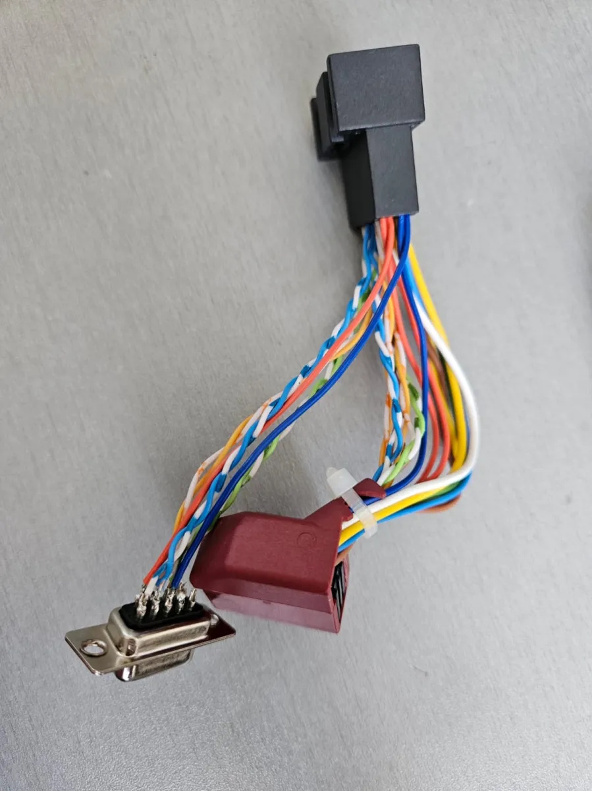
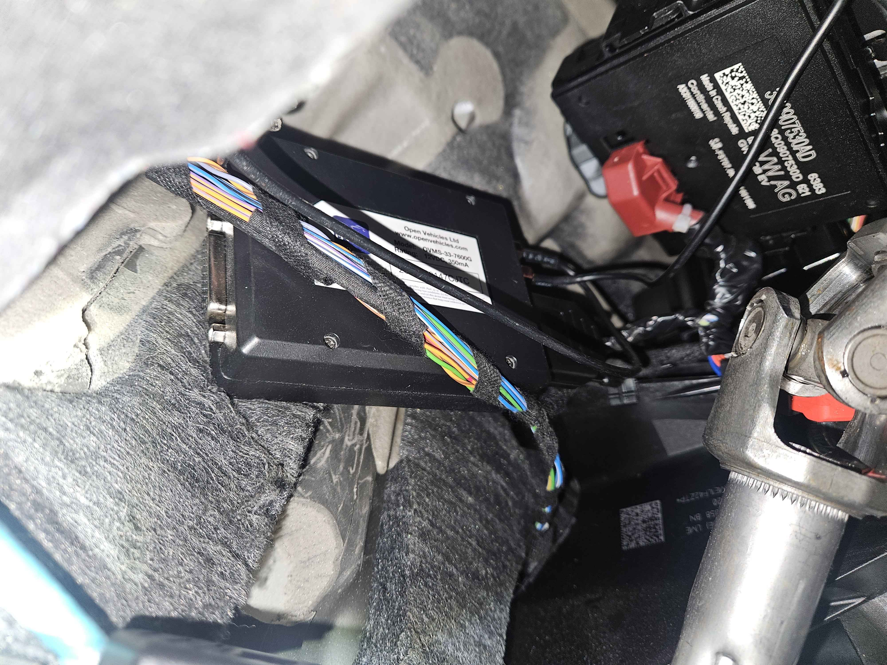

========
VW e-Golf
========

Vehicle Type: **VWEG**

This vehicle type supports the VW e-Golf
Connection is made by connecting to the car's Comfort CAN bus at Gateway (J553) module, prefferably by making adatper, that plugs in car harness.
At the moment only reading from CAN bus is realized.

----------
Adapter
----------

Described adapter connects to three of CAN buses available at the Gateway module, but only CAN3 (Comfort CAN) is used for read/write access to the car.
This allows to implement some functionality in future, via OBDII port, without the need to change the adapter, or for simpler installation by connecting only to OBDII port (but with limited functionality).

Adapter is basically extension of car harness, with power and can buses spliced to connect OVMS module.
Connectors used for adapter can be found in online stores by VW part number 8E0972420, just have to be careful to buy kit of both parts - male and female.

Pinout if the adapter is pretty straightforward - Pins from one connector are connected to the corresponding pins of the other connector, only pins 5 and 15, 6 and 16, 7 and 17, 8 and 18, 9 and 19, 10 and 20 should be connected using twisted pair cable, e.g. from CAT6 cable
Splicing for OMVS connection is done at one of the connectors, by pinout described in table below.

=== ==== ================================
DB9 J533 Meaning
=== ==== ================================
3   11  Ground
2   9   OBD port CAN Low
7   19  OBD port CAN High
4   6   Powertrain CAN Low
5   16  Powertrain CAN High
6   5   Comfort CAN Low
8   15  Comfort CAN High
9   1   +12V Power
=== ==== ================================

----------
Installation
----------

Installation is pretty quick, as it does not require removal of any trim pieces.
Gateway module is located under steering wheel, above pedals. 
To install adapter, you must position yourself in way, that you are laying face up, looking up at the bottom of the dashboard, from there you should be able to see Gateway module with red connector.

.. image:: installing_position.png
    :width: 480px
    

Then you can unplug the red connector, and plug in the adapter, then connect OVMS module to the adapter and tuck it somewhere in the dashboard.

-------------------
Basic Configuration
-------------------

After selecting the VW e-Golf vehicle module, data should start flowing in, if car is awake.

----------------
Support Overview
----------------

=========================== ==============
Function                    Support Status
=========================== ==============
Hardware                    Any OVMS v3 (or later) module. Vehicle support: 2013- 
Vehicle Cable               Connection adapter for Gateway module (see installation instructions above)
GSM Antenna                 1000500 Open Vehicles OVMS GSM Antenna (or any compatible antenna)
GPS Antenna                 1020200 Universal GPS Antenna (or any compatible antenna)
SOC Display                 Yes
Range Display               Yes
Cabin Pre-heat/cool Control No
GPS Location                Yes (from modem module GPS)
Speed Display               Yes
Temperature Display         Yes (see list of metrics below)
BMS v+t Display             No
TPMS Display                No
Charge Status Display       Yes
Charge Interruption Alerts  No
Charge Control              No
Lock/Unlock Vehicle         No 
Valet Mode Control          No 
Others                      
=========================== ==============