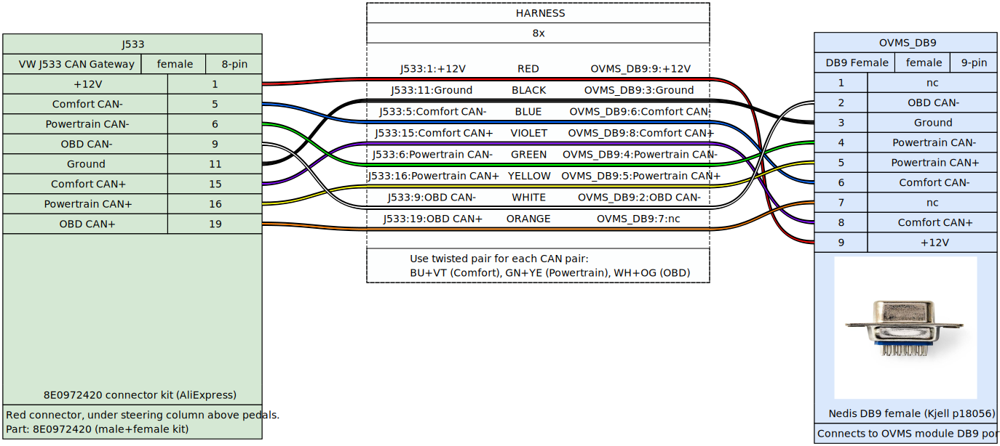
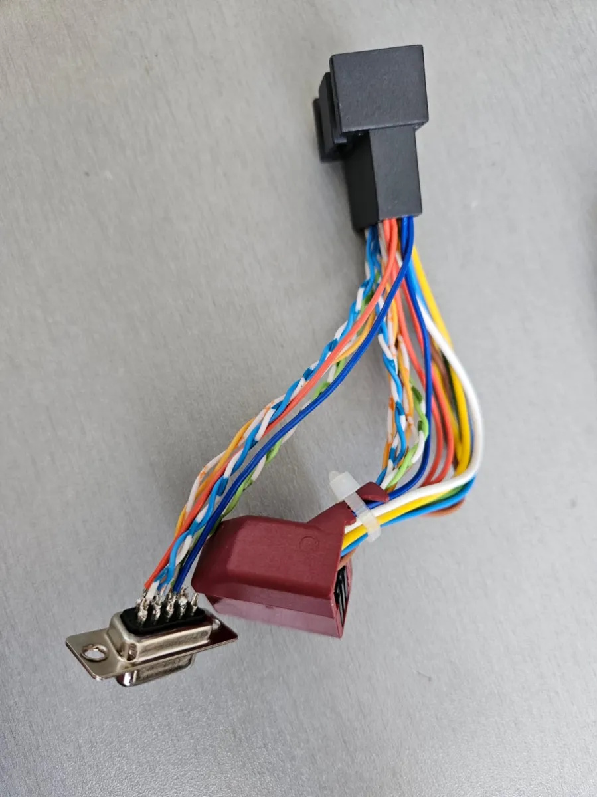
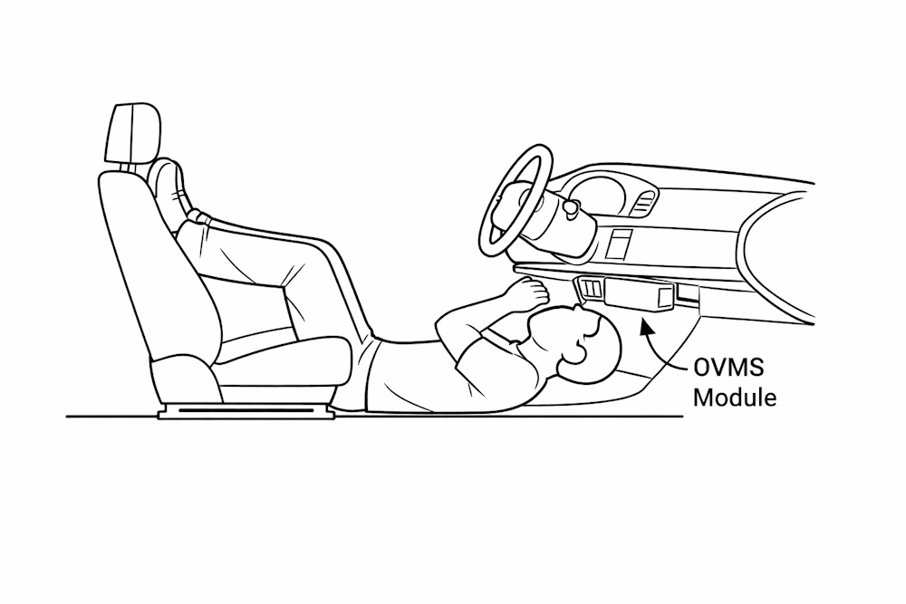
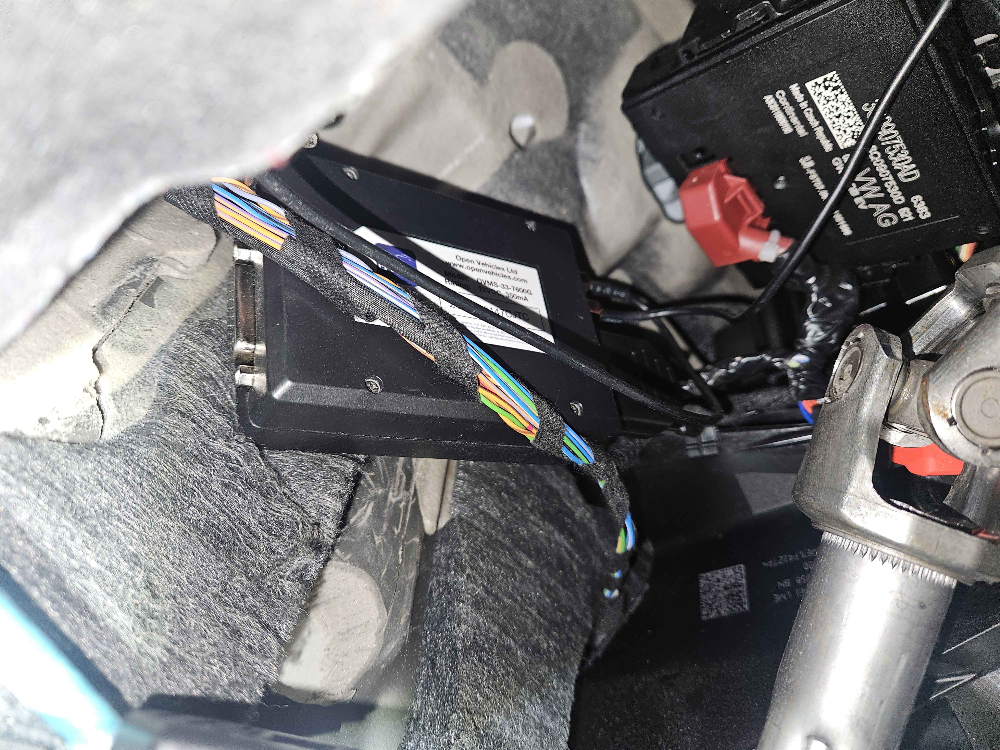

=========
VW e-Golf
=========

Vehicle Type: **VWEG**

This vehicle type supports the VW e-Golf.
Connection is made via the J533 gateway module, preferably using a harness
adapter that plugs into the existing connector.

-------
Adapter
-------

The adapter connects to the J533 gateway harness connector, giving access to
the Comfort CAN (KCAN) and Powertrain CAN (FCAN) buses.  KCAN carries the
majority of metric data.  FCAN carries the VIN and a small number of
powertrain frames; the J533 also bridges KCAN traffic onto FCAN, so both
buses are registered by the module.

The adapter extends the car harness — pins are connected straight through,
with the CAN pairs run as twisted pair (e.g. from CAT6 cable).  The
connector part number is VW 8E0972420 (buy both male and female).

------------
Installation
------------

Installation does not require removal of any trim pieces.
The J533 gateway module is located under the steering wheel, above the pedals.
Position yourself face-up under the dashboard — you should see the gateway
module with its red connector from there.

Unplug the red connector, plug in the adapter, connect the OVMS module to the
adapter, and tuck it somewhere in the dashboard.

-------------------
Basic Configuration
-------------------

After selecting the VW e-Golf vehicle module, data should start flowing in
once the car is awake.

----------------
Support Overview
----------------

=========================== ==============
Function                    Support Status
=========================== ==============
Hardware                    Any OVMS v3 (or later) module. Vehicle support: 2014–2020
Vehicle Cable               Harness adapter for J533 gateway module (see above)
GSM Antenna                 1000500 Open Vehicles OVMS GSM Antenna (or compatible)
GPS Antenna                 1020200 Universal GPS Antenna (or compatible)
SOC Display                 Yes
Range Display               Yes
Cabin Pre-heat/cool Control No
GPS Location                Yes (decoded from KCAN frame 0x486)
Speed Display               Yes
Temperature Display         Yes (see list of metrics below)
BMS v+t Display             No
TPMS Display                No
Charge Status Display       Yes
Charge Interruption Alerts  No
Charge Control              No
Lock/Unlock Vehicle         No
Valet Mode Control          No
Others
=========================== ==============
