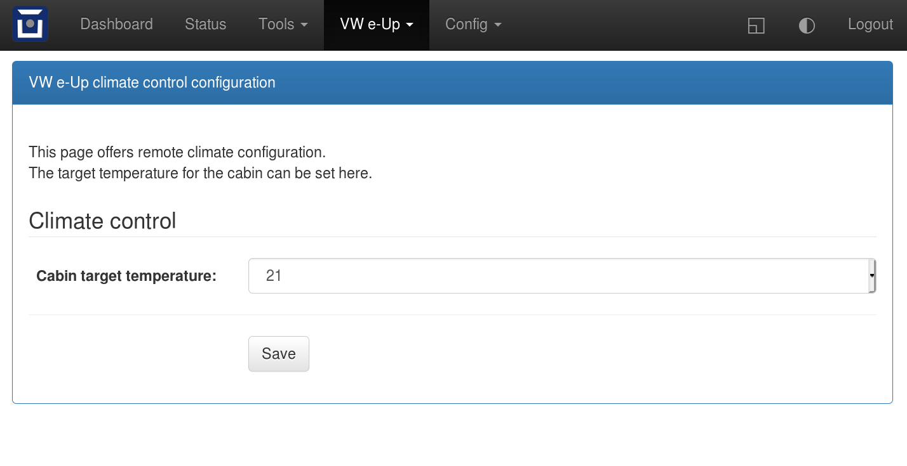

==============
VW e-Up (T26A)
==============

Vehicle Type: **VWUP.T26**

This vehicle type supports the VW e-UP (2013-, 2020-), Skoda Citigo E IV and the Seat MII electric (2020-) directly connected to the comfort can bus through the 'T26A' socket.

----------------
Support Overview
----------------

=========================== ==============
Function                    Support Status
=========================== ==============
Hardware                    Any OVMS v3 (or later) module. Vehicle support: 2020- (2013- VW e-Up as well)
Vehicle Cable               Comfort CAN T26A (OCU connector cable, located under front passenger seat) to DB9 Data Cable for OVMS using pin 6 and 8 for can3
GSM Antenna                 T4AC - R205 with fakra_sma adapter cable or 1000500 Open Vehicles OVMS GSM Antenna (or any compatible antenna)
GPS Antenna                 T4AC - R50 with fakra_sma adapter cable or 1020200 Universal GPS Antenna (or any compatible antenna)
SOC Display                 Yes
Range Display               Yes
Cabin Pre-heat/cool Control Yes
GPS Location                Yes (from modem module GPS)
Speed Display               Yes
Temperature Display         Yes (outdoor, cabin)
BMS v+t Display             No
TPMS Display                No
Charge Status Display       Yes
Charge Interruption Alerts  Yes (per notification on the charging state)
Charge Control              tba
Lock/Unlock Vehicle         No
Valet Mode Control          No
Others                      Odometer, VIN, status of lock, plug, lights, doors, trunk and bonnet
=========================== ==============

----------------------------------
Pinout OCU T26A - OVMS DB9 adapter
----------------------------------

For the T26A approach we directly tap into the comfort can bus via the original OCU cable.

The OCU connector is located under the passenger seat.

.. image:: location.png
    :width: 640px

Advantage is the direct write access to the comfort can bus.

Disadvantage is that we won't be able to access all control units of the car.

======= ======= ===========================
OCU	DB9-F	Signal
======= ======= ===========================
26	3	Chassis / Power GND
.	2	can1 L (Can Low, not used)
.	7	can1 H (Can High, not used)
.	4	can2 L (Can Low, not used)
.	5	can2 H (Can High, not used)
2	6	can3 L (Comfort-can Low)
14	8	can3 H (Comfort-can High)
1	9	+12V Vehicle Power
======= ======= ===========================

For confectioning the T26A adapter cable you can use a standard 26 pin ribbon cable (2x13 pins, 2,54mm grid dimension) and a DB9 female D-Sub connector. You will need to grind down the rim of the socket of the ribbon cable.

To make a GSM/GPS adapter cable to connect to the original VW fakra socket you can use a double fakra male connector with two SMA male connectors attached. 

.. image:: grinded_ribbon.png
    :height: 200px

.. image:: fakra_sma.png
    :height: 200px

----------
User notes
----------

* Remove the passenger seat (on right hand drive cars the driver's seat).
* Open the carpet lid.
* Disconnect the T26A cable and the fakra cable from the OCU (online communication unit).
* Remove the OCU.
* Connect the confectioned T26A adapter DB9 cable attached to the OVMS to the VW T26A connector of the car.
* Connect your GMS/GPS fakra adapter to the VW fakra cable.
* Fit OVMS in the compartment.
* Close the carpet lid.
* Reinstall the passenger seat.
* Configure OVMS as described in the OVMS user manual.
* Configure 'Model year' and 'Can write access' under VW e-Up (Komfort CAN) -> Features.
* 'Model year' and 'Can write access' can also be set from within the app (FEATURES 20 and 15).
* Register and connect OVMS to a server (as guided within the OVMS setup).
* Turn the ignition in the car on and off to receive initial values (also needed after updates).
* Install the OVMS app on your smartphone or tablet and configure it to connect to the server.
* Enjoy :-)

.. image:: app_eup.png
    :width: 640px

---------------
Climate control
---------------

Climate control works, as long as write access to the comfort can has been enabled in the app or in the OVMS webinterface (VW e-Up (Komfort CAN) -> Features).

To turn on or off the AC from within the Android app just press the "A/C" button. Within the iOS app press "Homelink 1" for AC on and "Homelink 2" for AC off.

Once the AC is turned on by the app there will be a delay of about 15 seconds untill the AC actually starts in the car. Further 10 seconds all communication from the app to the car is blocked.

The communication from the app to the car is also blocked for 10 seconds after the "AC off" command from the app to the car. There is no delay between the "AC off" signal of the app and the actually turning off in the car.

In rare cases 'AC off' does not respond. There will be a delay of 40 seconds before you can try again.

The cabin target temperature can be set from the OVMS webinterface (VW e-Up (Komfort CAN) -> Climate control) or via the app under FEATURES 21.

----------------------
IDs on Comfort CAN Bus
----------------------

======= ==================== ======= ===========================================
ID	Conversion	     Unit    Function		     	         	
======= ==================== ======= ===========================================
61A	d7/2   		     % 	     State of Charge (relative)	         	
320	(d4<<8+d3-1)/190     km/h    Speed		     	         	
65F	3 Msg d5-7,d1-7,d1-7 String  VIN number		     	         	
571	5+(.05*d0)	     Volt    12 Volt battery voltage 	         	
65D	d3&f<<12|d2<<8|d1    km      Odometer		     	         	
3E3	(d2-100)/2           °C      Cabin temperature      	         	
527	(d5/2)-50	     °C      Outdoor temperature     	         	
531	d0 00		             Headlights off
52D	d0 +255 if d1 41     km	     Calculated range		     
381     d0 02			     Status doors locked
470	d1 1,2,4,8,20,10     Integer Doors, trunk, hood opened or closed	
3E1	d4		     Integer Blower speed? (57,66,7D,98,BB,DE,FA)
575	d0 00 to 0F 	     Integer Key position		         	
569	b07			     "AC"-LED
69C	d1/10+10	     °C      temperature setpoint for remote AC
				     (only in message D2 <d1> 00 1E 1E 0A 00 00)
61C	d2 < 07		     bool    Charging detection				
43D	d1 01 or 11		     TX: Working or sleeping in the ring     	
5A7	d1 16			     TX: OCU AC blocking signal
5A9	all 00			     TX: OCU heartbeat
69E	multiple msg		     TX: AC on / off signals                 	
	d0 C1 d6 xx	     °C      TX: set cabin temperature for 69C       	
======= ==================== ======= ===========================================

-----------------
Development notes
-----------------

Under this vehicle component we use the original T26A approach, which can write to the comfort can and is able to manage the climate control of the car.

Because T26A does not use the OBD socket and has limited access to system information an OBD approach is implemented as a different vehicle component (VWUP.OBD). That component is not covered here.

You will normally use the OVMS binaries provided i.e. `here <https://dexters-web.de/>`_. 

The VWUP.T26 component with working climate control is publicly available within the OVMS binary version 3.2.15 'edge' and upwards ('main', 'eap' and 'edge'). The Android app version has to be 3.17.1 or higher to have access to the climate control functions for this vehicle component.

If you want to compile the binary yourself you will need to read the OVMS development documentation on how to set up the tool chain, check out the repository and the submodules and copy the file

sdkconfig.default.hw31

from the OVMS.V3/support folder to the OVMS.V3 folder and rename it to

sdkconfig

--------------------------
Vehicle log files
--------------------------

To be able to implement the VWUP.T26 vehicle component for OVMS the CAN logging of the VW e-UP provided by 'sharkcow' was of tremendous help.

The implementation of this vehicle component could not have been done without these great files.

They can be found here:

`https://github.com/sharkcow/VW-e-UP-OBD-CAN-logs/ <https://github.com/sharkcow/VW-e-UP-OBD-CAN-logs/>`_
