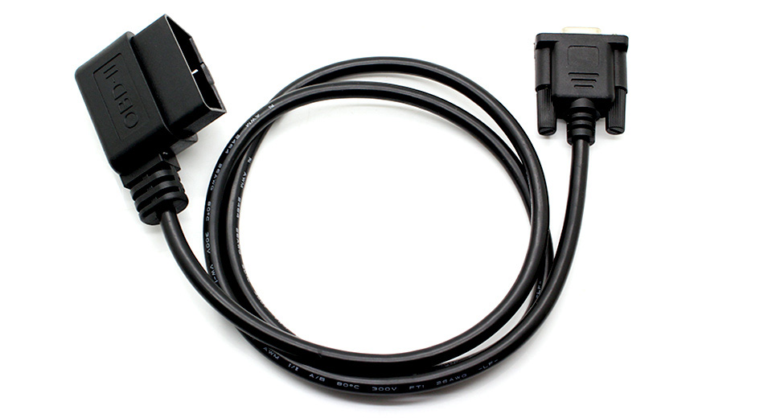
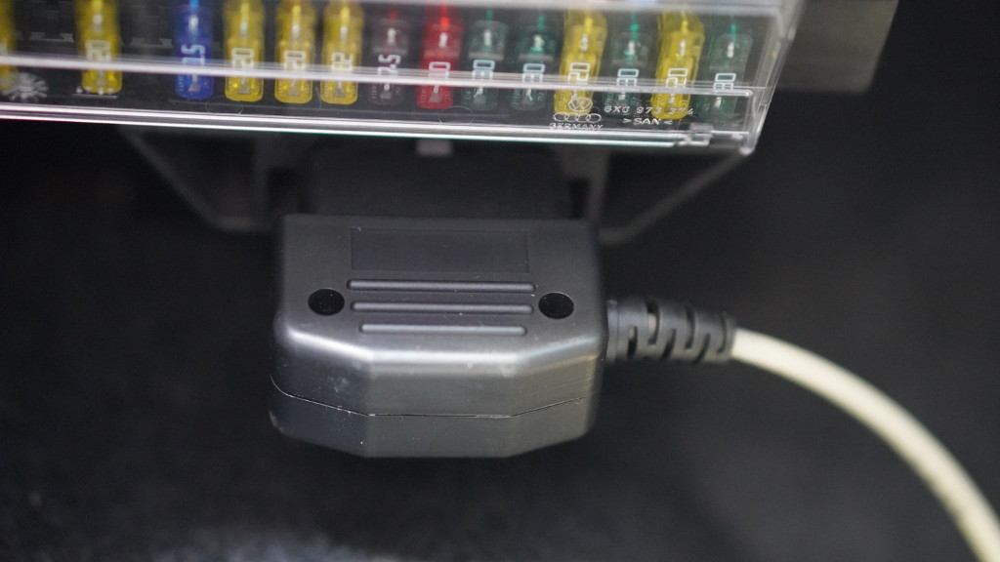
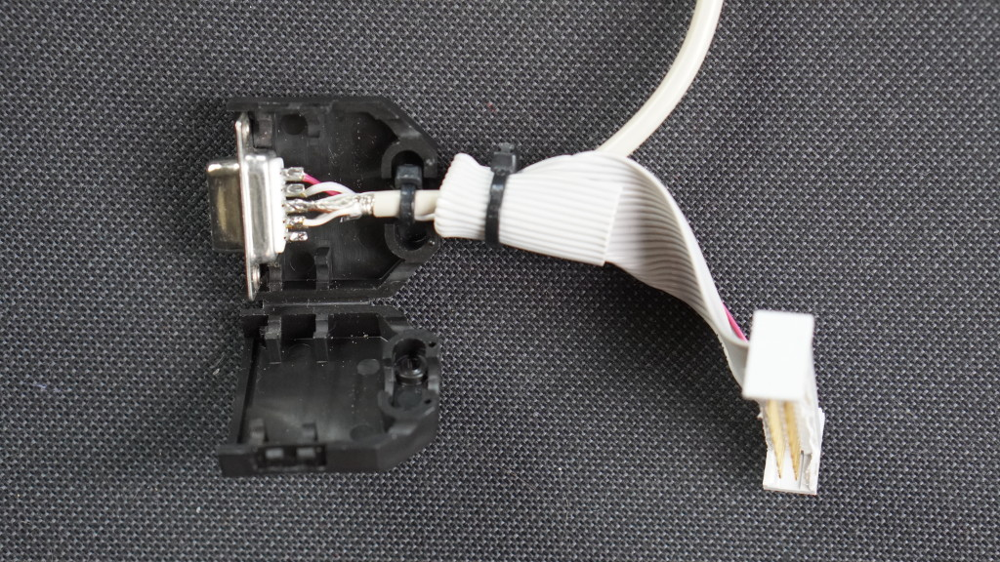
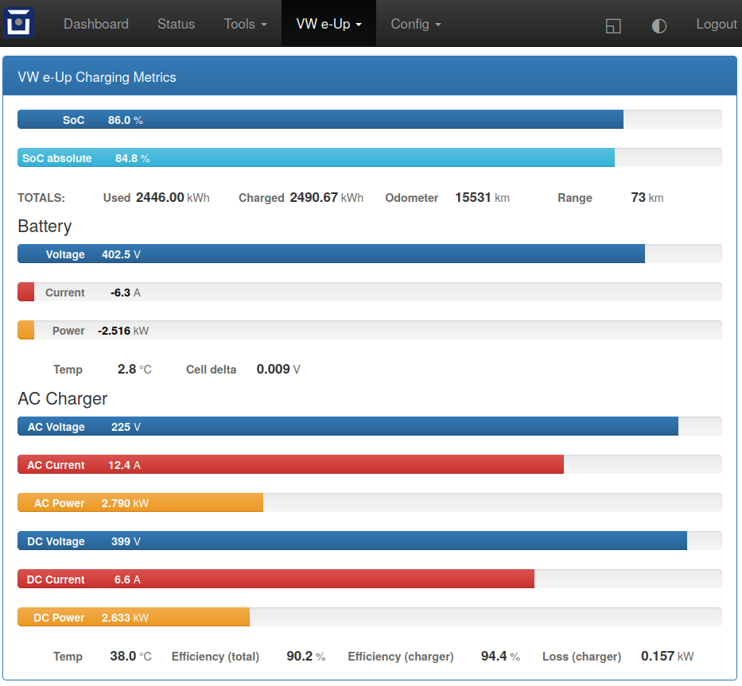
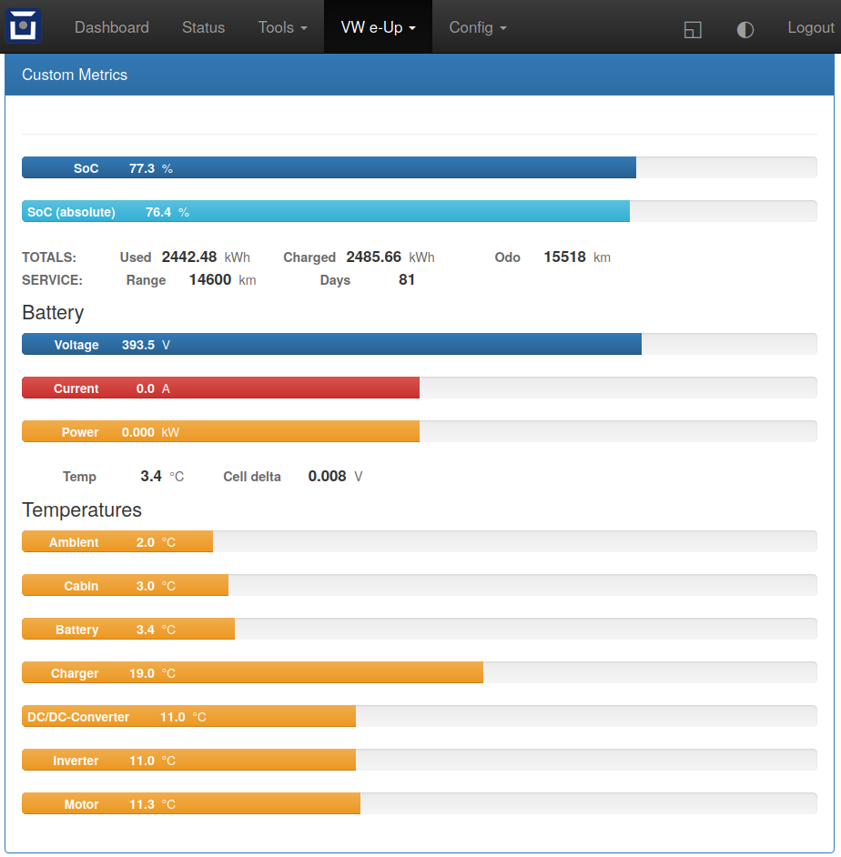

========
VW e-Up
========

Vehicle Type: **VWUP**

This vehicle type supports the VW e-UP (2013-, 2020-), Skoda Citigo E IV and the Seat MII electric (2020-).
Connection can be made via the OBD2 port to the top left of the driving pedals and/or the Comfort CAN bus, e.g. below the passenger seat (T26 connector, instead of the VW OCU there).

The main difference currently is that the OBD connection enables access to way more metrics (e.g. down to cell voltages), while the Comfort CAN connection is necessary if write access is needed, e.g. for remote climate control.
The Comfort CAN also provides data in more cases without turning on the car or charging, as the bus wakes on many events (e.g. opening of doors) and can also be woken via OVMS.

For the full experience, making both connections is recommended.

Connection to OBD2 is done with the standard OVMS OBD2-cable just below the fuses left of the driving pedals:

Connection to Comfort CAN can be done by removing the OCU below the passenger seat using a custom 26-pin adapter cable to the T26A plug (advantage: the connections for the GSM & GPS-antennas of the car can be used using a Fakra-SMA adapter):

.. image:: location.png
    :width: 480px
.. image:: grinded_ribbon.png
    :height: 200px
.. image:: fakra_sma.png
    :height: 200px    

(The passenger seat doesn't have to be removed, it can also be done by fiddling around a bit :))

If both connections are to be made simultaneously, an adapter cable has to be made with the following connections:

The cable used between the OBD plug and the DB9-F plug needs to be twisted to avoid transmission problems. A good cable to use here is a CAT-5 or CAT-6 double shielded network cable. Be shure to not only connect CAN hi and CAN lo, but also connect ground.

=== === ===== ===========================
T26 OBD DB9-F Signal
=== === ===== ===========================
26  4   3	  Chassis / Power GND
.   14  2	  can1 L (Can Low)
.   6   7	  can1 H (Can High)
.   .   4	  can2 L (Can Low, not used)
.   .   5	  can2 H (Can High, not used)
2   .   6	  can3 L (Comfort-can Low)
14  .   8	  can3 H (Comfort-can High)
1   .   9	  +12V Vehicle Power
=== === ===== ===========================

After selecting the VW e-Up vehicle module, the corresponding settings have to be made in the web interface via the "VW e-Up" menu under "Features":

.. image:: Features.png
    :width: 480px

By default, both connections are activated.

For more details on the two connection types, please see the corresponding projects:

:doc:`index_t26`

:doc:`index_obd`

The initial code is shamelessly copied from the original projects for the Comfort CAN by Chris van der Meijden and for the OBD2 port by SokoFromNZ.

List of (possible) metrics via OBD2: `https://www.goingelectric.de/wiki/Liste-der-OBD2-Codes/ <https://www.goingelectric.de/wiki/Liste-der-OBD2-Codes/>`_

If OBD is selected, a sample page with some charging metrics is shown in the web interface:

Beware: obviously, these values have great uncertainties (in my car, the DC output voltage of the charger is always lower than the voltage of the battery...)
But e.g. the internal energy counters are very informative :)

Additional custom web pages (code for the example above is below) can be defined as described here: https://docs.openvehicles.com/en/latest/plugin/README.html?highlight=web%20plugin#installing-web-plugins

----------------
Support Overview
----------------

=========================== ==============
Function                    Support Status
=========================== ==============
Hardware                    Any OVMS v3 (or later) module. Vehicle support: 2013- 
Vehicle Cable               Comfort CAN T26A (OCU connector cable, located under front passenger seat) to DB9 Data Cable for OVMS using pin 6 and 8 for can3 _AND_ OBD-II to DB9 Data Cable for OVMS (1441200 right, or 1139300 left) for can1
GSM Antenna                 T4AC - R205 with fakra_sma adapter cable or 1000500 Open Vehicles OVMS GSM Antenna (or any compatible antenna)
GPS Antenna                 T4AC - R50 with fakra_sma adapter cable or 1020200 Universal GPS Antenna (or any compatible antenna)
SOC Display                 Yes
Range Display               Yes
Cabin Pre-heat/cool Control Yes
GPS Location                Yes (from modem module GPS)
Speed Display               Yes
Temperature Display         Yes (see list of metrics below)
BMS v+t Display             Yes
TPMS Display                tba
Charge Status Display       Yes
Charge Interruption Alerts  Yes (per notification on the charging state)
Charge Control              tba
Lock/Unlock Vehicle         No 
Valet Mode Control          No 
Others                      **See list of metrics below**
=========================== ==============

--------------------------
Supported Standard Metrics
--------------------------

The second column specifies the bus from which the metrics are obtained. Metrics via OBD are only updated when the vehicle is on (ignition started) or some in charging mode.
Metrics via T26 (Comfort CAN) can be updated on demand by waking the Comfort CAN from the OVMS module. During charging, the Comfort CAN automatically wakes every 5% of SoC.

============================= ========== ======================== ============================================
Metric name                   bus        Example value            Description
============================= ========== ======================== ============================================
v.b.12v.voltage               direct     12.9 V                   Current voltage of the 12V battery
v.b.consumption               OBD        0Wh/km                   Main battery momentary consumption
v.b.current                   OBD        23.2 A                   Current current into (negative) or out of (positive) the main battery
v.b.energy.recd.total         OBD        578.323 kWh              Energy recovered total (life time) of the main battery (charging and recuperation)
v.b.energy.used.total         OBD        540.342 kWh              Energy used total (life time) of the main battery
v.b.power                     OBD        23.234 kW                Current power into (negative) or out of (positive) the main battery.
v.b.range.est                 T26        99km                     Estimated range
v.b.range.ideal               T26        48km                     Ideal range
v.b.soc                       OBD, T26   88.2 %                   Current usable State of Charge (SoC) of the main battery
v.b.temp                      OBD        22.5 °C                  Current temperature of the main battery
v.b.voltage                   OBD        320.2 V                  Current voltage of the main battery
v.c.12v.current               OBD        7.8A                     Output current of DC/DC-converter
v.c.12v.power                 OBD        0.123kW                  Output power of DC/DC-converter
v.c.12v.temp                  OBD        34.5°C                   Temperature of DC/DC-converter
v.c.12v.voltage               OBD        12.3V                    Output voltage of DC/DC-converter
v.c.charging                  T26        true                     Is vehicle charging (true = "Vehicle CHARGING" state. v.e.on=false if this is true)
v.c.climit                    fixed      16/32A                   Maximum charger output current
v.c.current 	              OBD        1.25A 	                  Momentary charger output current
v.c.efficiency                OBD        91.3 %                   Charging efficiency calculated by v.b.power and v.c.power
v.c.kwh                       OBD        2.6969kWh                Energy sum for running charge
v.c.mode                      T26        standard                 standard, range, performance, storage
v.c.pilot                     T26        no                       Pilot signal present
v.c.power                     OBD        7.345 kW                 Input power of charger
v.c.state                     T26        done                     charging, topoff, done, prepare, timerwait, heating, stopped
v.c.substate                  T26                                 scheduledstop, scheduledstart, onrequest, timerwait, powerwait, stopped, interrupted
v.c.temp                      OBD        16°C                     Charger temperature
v.c.time                      T26        0Sec                     Duration of running charge
v.c.voltage 	              OBD        0V 	                  Momentary charger supply voltage
v.d.cp                        T26        yes                      yes = Charge port open
v.d.fl                        T26                                 yes = Front left door open
v.d.fr                        T26                                 yes = Front right door open
v.d.hood                      T26                                 yes = Hood/frunk open
v.d.rl                        T26                                 yes = Rear left door open
v.d.rr                        T26                                 yes = Rear right door open
v.d.trunk                     T26                                 yes = Trunk open
v.e.awake                     T26        no                       yes = Vehicle/bus awake (switched on)
v.e.cabintemp                 T26        20°C                     Cabin temperature
v.e.drivetime                 T26        0Sec                     Seconds driving (turned on)
v.e.headlights                T26                                 yes = Headlights on
v.e.hvac                      T26                                 yes = HVAC active
v.e.locked                    T26                                 yes = Vehicle locked
v.e.on                        T26        true                     Is ignition on and drivable (true = "Vehicle ON", false = "Vehicle OFF" state)
v.e.parktime                  T26        49608Sec                 Seconds parking (turned off)
v.e.serv.range                OBD        12345km                  Distance to next scheduled maintenance/service [km]
v.e.serv.time                 OBD        1572590910Sec            Time of next scheduled maintenance/service [UTC]
v.e.temp                      OBD, T26                            Ambient temperature
v.i.temp                      OBD                                 Inverter temperature
v.m.temp                      OBD        0°C                      Motor temperature
v.p.odometer                  OBD, T26   2340 km                  Total distance traveled
v.p.speed                     T26        0km/h                    Vehicle speed
v.vin                         T26        VF1ACVYB012345678        Vehicle identification number
============================= ========== ======================== ============================================

--------------
Custom Metrics
--------------

In addition to the standard metrics above the following custom metrics are read from the car or internally calculated by OVMS using read values.

============================= ========== ======================== ============================================
Metric name                   bus        Example value            Description
============================= ========== ======================== ============================================
xvu.b.cell.delta              OBD        0.012 V                  Delta voltage between lowest and highest cell voltage
xvu.b.soc.abs                 OBD        85.3 %                   Current absolute State of Charge (SoC) of the main battery
xvu.c.soc.norm                OBD        80.5 %                   Current normalized State of Charge (SoC) of the main battery as reported by charge management ECU
xvu.c.ac.i1                   OBD        5.9 A                    AC current of AC charger phase 1
xvu.c.ac.i2                   OBD        7.0 A                    AC current of AC charger phase 2 (only for model 2020+)
xvu.c.ac.p                    OBD        7.223 kW                 Current charging power on AC side (calculated by ECU's AC voltages and AC currents)
xvu.c.ac.u1                   OBD        223 V                    AC voltage of AC charger phase 1
xvu.c.ac.u2                   OBD        233 V                    AC voltage of AC charger phase 2 (only for model 2020+)
xvu.c.dc.i1                   OBD        1.2 A                    DC current of AC charger 1
xvu.c.dc.i2                   OBD        1.2 A                    AC current of AC charger 2 (only for model 2020+)
xvu.c.dc.p                    OBD        6.500 kW                 Current charging power on DC side (calculated by ECU's DC voltages and DC currents)
xvu.c.dc.u1                   OBD        380 V                    DC voltage of AC charger 1
xvu.c.dc.u2                   OBD        375 V                    DC voltage of AC charger 2 (only for model 2020+)
xvu.c.eff.calc                OBD        90.0 %                   Charger efficiency calculated by AC and DC power
xvu.c.eff.ecu                 OBD        92.3 %                   Charger efficiency reported by the Charger ECU
xvu.c.loss.calc               OBD        0.733 kW                 Charger power loss calculated by AC and DC power
xvu.c.loss.ecu                OBD        0.620 kW                 Charger power loss reported by the Charger ECU
xvu.e.serv.days               OBD        78 days                  Time to next scheduled maintenance/service [days]
xvu.m.soc.abs                 OBD        85.3 %                   Current absolute State of Charge (SoC) of the main battery as reported by motor electronics ECU
xvu.m.soc.norm                OBD        80.5 %                   Current normalized State of Charge (SoC) of the main battery as reported by motor electronics ECU
============================= ========== ======================== ============================================

-----------------------------------------------------
Example Code for Web Plugin with some custom metrics:
-----------------------------------------------------

.. code-block:: html

  

   
Custom Metrics

   

    

    

     

      

       

        

         SoC
         ?
         %
        

       

      

      

       

        

         SoC (absolute)
         ?
         %
        

       

      

     

     

      

       TOTALS:&nbsp;&nbsp;&nbsp;&nbsp;&nbsp;&nbsp;&nbsp;&nbsp;&nbsp;&nbsp;&nbsp;&nbsp;Used
       ?
       kWh
      

      

       Charged
       ?
       kWh
      

      

       Odo
       ?
       km
      

      

       SERVICE:&nbsp;&nbsp;&nbsp;&nbsp;&nbsp;&nbsp;&nbsp;&nbsp;&nbsp;&nbsp;&nbsp;&nbsp;Range
       ?
       km
      

      

       Days
       ?
       
      

     

     <h4>Battery</h4>

     

      

       

        

         Voltage
         ?
         V
        

       

      

      

       

        

         Current
         ?
         A
        

       

      

      

       

        

         Power
         ?
         kW
        

       

      

     

     

      

       Temp
       ?
       °C
      

      

       Cell delta
       ?
       V
      

     

     <h4>Temperatures</h4>

     

      

       

        

         Ambient
         ?
         °C
        

       

      

      

       

        

         Cabin
         ?
         °C
        

       

      

      

       

        

         Battery
         ?
         °C
        

       

      

      

       

        

         Charger
         ?
         °C
        

       

      

      

       

        

         DC/DC-Converter
         ?
         °C
        

       

      

      

       

        

         Inverter
         ?
         °C
        

       

      

      

       

        

         Motor
         ?
         °C
        

       

      

     

    

   

  

