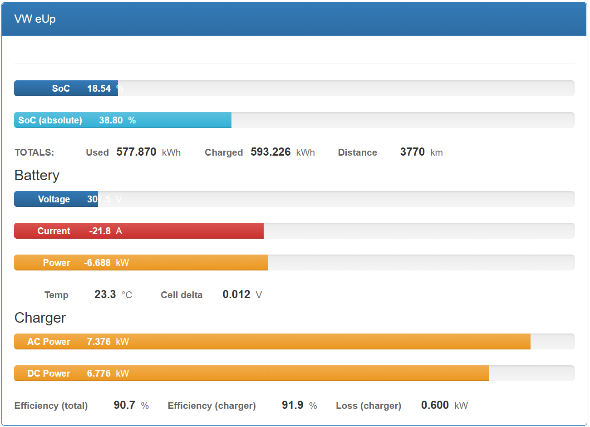

.. _index_obd:

================
VW e-Up via OBD2
================

Vehicle Type: **VWUP.OBD**

This vehicle type supports the VW e-UP (new model from year 2020 onwards). Untested (so far) but probably working: The older models of the e-Up as well as Skoda Citigo E IV and Seat MII electric.

Connection is via the standard OBD-II port (above the drivers left foot):

All communication with the car is read-only. For changing values (i.e. climate control) see the T26A connection to the Comfort CAN bus.

----------------
Support Overview
----------------

=========================== ================================================================
Function                    Support Status
=========================== ================================================================
Hardware                    No specific requirements
Vehicle Cable               OBD-II to DB9 Data Cable for OVMS (1441200 right, or 1139300 left)
GSM Antenna                 1000500 Open Vehicles OVMS GSM Antenna (or any compatible antenna)
GPS Antenna                 1020200 Universal GPS Antenna (SMA Connector) (or any compatible antenna)
SOC Display                 Yes
Range Display               Yes
GPS Location                Yes
Speed Display               Yes
Temperature Display         Yes
BMS v+t Display             Yes (including cell details)
TPMS Display                No
Charge Status Display       Yes
Charge Interruption Alerts  Yes
Charge Control              No
Cabin Pre-heat/cool Control No
Lock/Unlock Vehicle         No
Valet Mode Control          No
Others                      **See list of metrics below**
=========================== ================================================================

--------------
Vehicle States
--------------

.. warning::
  For proper state detection, the **12V calibration is crucial**.
  Calibrate using the OVMS Web UI: Config → Vehicle → 12V Monitor

Three vehicle states are supported and detected automatically:

**Vehicle ON**
  The car is on: It is drivable.

**Vehicle CHARGING**
  The car is charging: The car's Charger ECU is responsive and reports charging activity.

**Vehicle OFF**
  The car is off: It hasn't drawn (or charged) any current into the main battery for a 
  period of time and the 12V battery voltage is smaller than 12.9V.

--------------------------
Supported Standard Metrics
--------------------------

**Metrics updated in state "Vehicle ON" or "Vehicle CHARGING"**

======================================== ======================== ============================================
Metric name                              Example value            Description
======================================== ======================== ============================================
v.e.on                                   true                     Is ignition on and drivable (true = "Vehicle ON", false = "Vehicle OFF" state)
v.c.charging                             true                     Is vehicle charging (true = "Vehicle CHARGING" state. v.e.on=false if this is true)
v.b.12v.voltage [1]_                     12.9 V                   Current voltage of the 12V battery
v.b.voltage                              320.2 V                  Current voltage of the main battery
v.b.current                              23.2 A                   Current current into (negative) or out of (positive) the main battery
v.b.power                                23.234 kW                Current power into (negative) or out of (positive) the main battery.
v.b.energy.used.total                    540.342 kWh              Energy used total (life time) of the main battery
v.b.energy.recd.total                    578.323 kWh              Energy recovered total (life time) of the main battery (charging and recuperation)
v.b.temp                                 22.5 °C                  Current temperature of the main battery
v.p.odometer                             2340 km                  Total distance traveled
======================================== ======================== ============================================

.. [1] Also updated in state "Vehicle OFF"

**Metrics updated only in state "Vehicle ON"**

======================================== ======================== ============================================
Metric name                              Example value            Description
======================================== ======================== ============================================
v.b.soc [2]_                             88.2 %                   Current usable State of Charge (SoC) of the main battery
======================================== ======================== ============================================

.. [2] Restriction by the ECU. Supplied when the ignition is on during charging. Use xvu.b.soc as an alternative when charging with ignition off.

**Metrics updated only in state "Vehicle CHARGING"**

======================================== ======================== ============================================
Metric name                              Example value            Description
======================================== ======================== ============================================
v.c.power                                7.345 kW                 Input power of charger
v.c.efficiency                           91.3 %                   Charging efficiency calculated by v.b.power and v.c.power
======================================== ======================== ============================================

--------------
Custom Metrics
--------------

In addition to the standard metrics above the following custom metrics are read from the car or internally calculated by OVMS using read values.

**Metrics updated in state "Vehicle ON" or "Vehicle CHARGING"**

======================================== ======================== ============================================
Metric name                              Example value            Description
======================================== ======================== ============================================
xvu.b.cell.delta                         0.012 V                  Delta voltage between lowest and highest cell voltage
xvu.b.soc                                85.3 %                   Current absolute State of Charge (SoC) of the main battery
======================================== ======================== ============================================

**Metrics updated only in state "Vehicle CHARGING"**

======================================== ======================== ============================================
Metric name                              Example value            Description
======================================== ======================== ============================================
xvu.c.eff.ecu [3]_                       92.3 %                   Charger efficiency reported by the Charger ECU
xvu.c.loss.ecu [3]_                      0.620 kW                 Charger power loss reported by the Charger ECU
xvu.c.ac.p                               7.223 kW                 Current charging power on AC side (calculated by ECU's AC voltages and AC currents)
xvu.c.dc.p                               6.500 kW                 Current charging power on DC side (calculated by ECU's DC voltages and DC currents)
xvu.c.eff.calc                           90.0 %                   Charger efficiency calculated by AC and DC power
xvu.c.loss.calc                          0.733 kW                 Charger power loss calculated by AC and DC power
======================================== ======================== ============================================

.. [3] Only supplied by ECU when the car ignition is on during charging.

-----------------------------
Custom Status Page for Web UI
-----------------------------

.. note::
  This plugin is obsolete, use the standard page **VW e-Up → Charging Metrics** instead.
  We keep the source here as a base for user customization.

The easiest way to display custom metrics is using the *Web Plugins* feature of OVMS (see :ref:`installing-web-plugins`).

This page plugin content shows the metrics in a compact form which can be displayed on a phone in landscape mode on the dashboard of the car. Best approach is to connect the phone directly to the OVMS AP-WiFi and access the web UI via the static IP (192.168.4.1) of OVMS.

.. code-block:: html

  

    
VW eUp

    

  
    

  
    
  
      

      

        

        

          SoC
          ?
          %
        

        

      

      

        

        

          SoC (absolute)
          ?
          %
        

        

      

      

      

      

        TOTALS:&nbsp;&nbsp;&nbsp;&nbsp;&nbsp;&nbsp;&nbsp;&nbsp;&nbsp;&nbsp;&nbsp;&nbsp;Used
        ?
        kWh
      

      

        Charged
        ?
        kWh
      

      

        Distance
        ?
        km
      

      

  
      <h4>Battery</h4>
  
      

      

        

        

          Voltage
          ?
          V
        

        

      

      

        

        

          Current
          ?
          A
        

        

      

      

        

        

          Power
          ?
          kW
        

        

      

      

      

      

        Temp
        ?
        °C
      

      

        Cell delta
        ?
        V
      

      

  
      <h4>Charger</h4>
  
      

      

        

        

          AC Power
          ?
          kW
        

        

      

      

        

        

          DC Power
          ?
          kW
        

        

      

      
   
      

      

        Efficiency (total)
        ?
        %
      

      

        Efficiency (charger)
        ?
        %
      

      

        Loss (charger)
        ?
        kW
      

      

    

    

  

